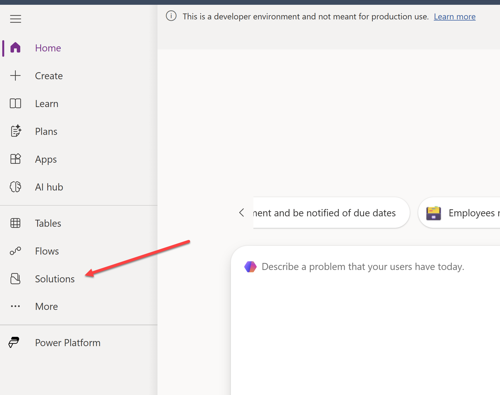

# Lab 0 - Configure Lab Environment

In this lab, you will configure and validate the environment that will be used to complete all subsequent lab exercises.

## Lab Overview

### 🎯 Goal

- Redeem your [Developer plan license for Power Apps](https://learn.microsoft.com/en-us/power-platform/developer/plan), to create an environment to build your solution - this will be your **Development** environment.
- Setup an environment to deploy your solution - this will be your **Production** environment.
- Create a publisher and solution to store your components.
- Prepare your OneDrive for Business folder and upload the required document template.

### ✅ Prerequisites

- A Microsoft 365 account

> [!IMPORTANT]
> Your admin may have disabled the ability to create a Developer environment on your work tenant. If you encounter any error while attempting to create your developer environment, please reach out to them for further assistance or speak to your instructors for further assistance.

### Scenario

Coho Winery is a distributor and exporter of fine wine, within the European Union and North America. The company employees 600 people across different countries, and has been using the Microsoft Power Platform for several years. SharePoint Online is used as the central document repository tool for all regions. The company uses a bespoke Enterprise Resource Planning (ERP) system for the food and beverage industry. The ERP system has a public facing REST API, that allows consumers to retrieve purchase order information from vendors.

You have recently joined Coho Winery as a Power Platform developer, and you have been instructed to configure your initial environments, publishers and solution, to prepare yourself for the first project you will be involved in. You will also prepare and upload a document template to your OneDrive for Business folder in preparation for the later lab steps; this will represent the "mock" default document library for Coho Winery.

### ⌛ Length

This lab will take approximately 15 minutes to complete.

## ✍️ Exercise 1: Create a Developer Environment

[Developer environments](https://learn.microsoft.com/en-us/power-platform/developer/create-developer-environment) allow for any Microsoft 365 user (subject to tenant level restrictions) to create up to three environments for personal development, testing and other non-production purposes. Each developer environment comes with up to 2GB of Dataverse storage, and allows you to create apps, automations and more.

1. Navigate to the [Power Apps Developer Plan page](https://www.microsoft.com/en-us/power-platform/products/power-apps/free) and click on **Start Free**:

2. On the **Build apps with the free Power Apps Developer plan** dialog, enter your email address, tick the consent statement and then click on **Start free**:
    

3. When prompted, sign in using your work / Microsoft 365 credentials.

4. You will be automatically redirected to the [Power Apps Maker Portal](https://make.powerapps.com). This may take several minutes to complete.

5. Once the Maker portal loads, a new development environment will have been created for you automatically and will have loaded. You can validate this by checking the following:
   - A banner message reading **This is a developer environment and not meant for production use** is visible on the screen.
   - When selecting the list of Environments, the current environment is shown as **\<Your Name\>'s Environment**.

> [!IMPORTANT]
> In all future steps, we will refer to this environment as the **Development** environment. You will use this environment to build your solution.

6. Leave this browser tab open, as you will return here in Exercise 3.

## ✍️ Exercise 2: Create a Production Environment

1. Open a new browser tab and navigate to the [Power Platform Admin Center](https://aka.ms/ppac). If prompted, sign-in again using your work / Microsoft 365 credentials.

2. If you are greeted with a **Welcome to the new Power Platform Admin Center** dialog, dismiss it by selecting **X**.

3. In the left navigation pane, select **Manage**.

4. In the **Environments** section, select **+ New**.

5. In the **New environment** dialog, enter the following details. Leave all other settings as default, and then select **Next**:
    - **Name**: Production
    - **Type**: Developer
    

6. In the **Add Dataverse** dialog, select **Save** to begin creating the environment.

7. The environment creation process may take several minutes to complete. Press the **Refresh** button in the top right corner of the screen until the environment status changes from **Preparing** to **Running**.

## ✍️ Exercise 3: Create a Publisher and Solution

1. Navigate to the [Power Apps Maker Portal](https://make.powerapps.com).
2. Ensure your **Development** environment is selected by default; if not, select the current environment name and then click on your **Development** environment:

3. Click on **Solutions**:

4. On the **Solutions** page, select **New solution**:

5. the **Create a solution** pane, enter the following details and then click on the **Create** button:
    - **Display name**: `Coho Winery PP Solution`
    - **Name**: `CohoWineryPPSolution`
    - **Publisher**: Select **New publisher**, enter the following details and then press **Save**. Then, select the newly created publisher in the dropdown:
        - **Display name**: `Coho Winery`
        - **Name**: `CohoWinery`
        - **Description**: `Publisher for Coho Winery Power Platform solutions`
        - **Prefix**: `coh`
        - **Choice value prefix**: `76908`
    - **Version**: `1.0.0.0`

6. You will be taken through automatically to the new Solution. Leave this page open, as we will return here in the next lab.

## ✍️ Exercise 4: Upload Documents to OneDrive for Business

For the purposes of this lab, we will use OneDrive for Business as our document repository. In a real-world scenario, SharePoint Online would typically be used instead.

1. We will first download the document template that will be used to populate the purchase order documents. This file is currently saved in [the Assets folder here in the repository](Assets/Lab0/PO-Request-TEMPLATE.docx). The template resembles the screenshot below. Download and save this file to your local machine

2. Open a new browser tab and navigate to [OneDrive for Business](https://onedrive.live.com/about/en-us/signin/). If prompted, sign-in again using your work / Microsoft 365 credentials.

3. Click on **My files** in the left navigation pane.

4. Click on **Create or upload** and then select **Folder**.

4. In the **Create a folder** dialog, enter the following details and then click on **Create**:
    - **Folder name**: `Beautiful Power Apps for Makers Lab`

5. Open the newly created folder by clicking on its name.

6. Click on **Create or upload** and then select **Files upload**.

7. In the file picker dialog, navigate to the location where you saved the `PO-Request-TEMPLATE.docx` file in step 1, select it and then click on **Open** to upload it to OneDrive for Business.

8. Once the file has uploaded, you will see it listed in OneDrive for Business.

9. As a final step, create a new folder within the **Beautiful Power Apps for Makers Lab** folder, called `Generated Documents`. This will be used later in the lab exercises to store the generated purchase order documents.

## 🌟 Extra Challenges

- If Coho Winery needed an additional environment for User Acceptance Testing (UAT), how would you create this? Keep in mind that each user can have up to three developer environments.
- It's possible to set the **Coho Winery** publisher as the default publisher for your environment. How would you do this?
- Try updating the document template to include a custom logo or additional information. Can you figure out how to add additional dynamic fields to the template? As a small hint, make sure you've enabled the **Developer** tab in Microsoft Word.

**Congratulations, you've finished Lab 0** 🥳