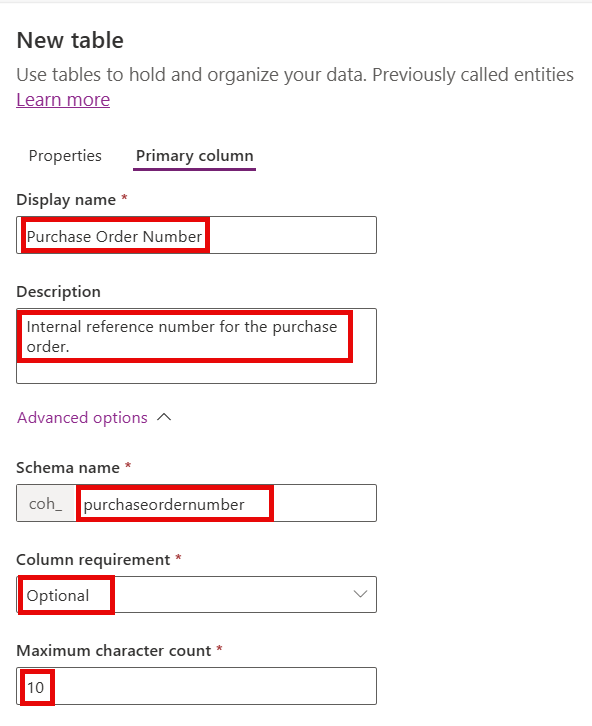

# Lab 1 - Create Model-Driven Power App

In this lab, you will create the Model-Driven App used to display and edit purchase order (PO) information. 

## Scenario

Now that you have prepared your Power Platform development environment, you have been given your first work package. Coho Winery are wanting to improve their internal processes for handling PO's. Currently, all PO's are raised within the company's ERP system. Users need to manually fill out and send a Word document to the finance team every time a new PO is required. Once a PO is raised within the ERP system, the information then needs to be sent via a screenshot to the relevant individuals in the organisation and, on some occasions, directly to the end customer. Only users who have been configured in the ERP system can raise a PO and also view the remaining monetary value. In addition, there are often long delays in the process, due to the manual effort required and the availability of colleagues in the finance team, particularly during busy periods of the month. To assist with year end audits, physical document records of all PO requests must be retained and stored within the organisations document library. Auditors require the ability to search for documents based on their underlying contents.

The aim of the work package is to build an application within the Power Platform that addresses the following key requirements:

- Provide a landing screen for users to easily navigate to internal and external links, and display current data from the ERP system.
- Capture and store all PO request details.
- Allow the finance team to approve or reject PO requests.
- Retrieve and display on-demand the remaining value on a PO, from the ERP system API.
- Automatically generate and store physical PO request documents within the organisations document library. This will be derived from the template you uploaded as part of **Lab 0**.
- Give auditors streamlined access to quickly view and access PO request documents, without having to navigate to different locations.

The diagram below illustrates the process the end solution should follow:

After analysing the requirements in detail, you identify the following platform features that you would like to use to implement the solution:

- [Microsoft Dataverse](https://learn.microsoft.com/en-us/power-apps/maker/data-platform/data-platform-intro), to store the data, leveraging a mixture of custom and [Common Data Model (CDM)](https://learn.microsoft.com/en-us/common-data-model/) tables.
- A [model-driven Power App](https://learn.microsoft.com/en-us/power-apps/maker/model-driven-apps/model-driven-app-overview) to present the data stored in Dataverse
- To handle the landing page and document display requirements, [custom pages](https://learn.microsoft.com/en-us/power-apps/maker/model-driven-apps/model-app-page-overview).
- [Power Automate cloud flows](https://learn.microsoft.com/en-us/power-automate/overview-cloud), to handle the approval process using the [modern flow approvals engine](https://learn.microsoft.com/en-us/power-automate/get-started-approvals) and any other automation requirements.
- A [custom prompt in AI Builder](https://learn.microsoft.com/en-us/ai-builder/prompts-overview) to assist with document contents search.

You begin your work by planning out the data model you will use and all necessary Dataverse customisations to support the solution. You identify that new table, called **Purchase Order**, will be required, alongside the existing **Account** and **Contact** tables. You will complete all necessary steps to build the model-driven Power App, including all required form and view customisations, before then creating some test records. Finally, you will initiate and test the integration with the ERP by connecting to it's API and create the automation to generate the physical request documents.

## Instructions

In this lab, you will do the following:

- Create a new table called **Purchase Order** and customise it accordingly.
- Add in the **Account** and **Contact** tables to your solution and customise accordingly.
- Create and define the configuration for your model-driven app, before testing it further.
- Add some test records into the system.
- Configure the integration with the backend ERP API.
- Create a cloud flow to generate purchase order request documents, and have this available to trigger from the model-driven app.

This lab will take approximately 60 minutes to complete.

## Exercise 1: Create Purchase Order Table

1. Navigate to the [Power Apps Maker portal](https://make.powerapps.com) and ensure you are in the **Developer** environment you created in Lab 0.
2. Select **Solutions** from the left navigation pane.

3. Select the **Coho Winery** solution you created in Lab 0.

4. In the solution, select **New** > **Table** -> **Table (advanced properties)** from the command bar.

5. In the **Create table** dialog, enter the following details. You may need to select **Advanced options** to see all fields:
   - **Display name**: `Purchase Order`
   - **Plural display name**: `Purchase Orders`
   - **Description**: `Table to store purchase order requests.`
   - **Name**: `purchaseorder`
   - **Type**: Standard
   - **Record Ownership**: User or team

6. Select the **Primary column** tab and enter the following details. You may need to select **Advanced options** to see all fields:
   - **Display name**: `Purchase Order Number`
   - **Description**: `Internal reference number for the purchase order.`
   - **Name**: `purchaseordernumber`
   - **Column Requirement**: Business required
   - **Maximum Character Count**: `10`

7. Select **Save** to create the table.

8. Once the table is created, you will be taken to the table designer. Our first step is to enable the autonumbering for the tables primary column, because it's not possible to do this on create. Select **Columns**.

9. In the **Columns** tab, select the **Purchase Order Number** column.

10. On the **Edit columns** pane, change the **Data type** to **Autonumber** and then update the fields as follows. When you are finished, click **Save**:
    - **Autonumber type**: String prefixed number
    - **Prefix**: `PO-`
    - **Minimum number of digits**: `7`
    - **Seed**: `1`

11. We will now proceed to create the additional columns needed for the table. The table below outlines all of the columns we will need:

| Display Name | Name | Data Type | Required | Description |
|-------|-----|-----------|----------|-------------|
| Requested By | requestedby | Lookup (User) | Business Required | The user who requested the purchase order. |
| Requested Date | requesteddate | Date and Time | Business Required | The date the purchase order was requested. |
| Approved By | approvedby | Lookup (User) | Optional | The user who approved the purchase order. |
| Approved Date | approveddate | Date and Time | Optional | The date the purchase order was approved. |
| Value | value | Currency | Optional | The total value of the purchase order. |
| Description | description | Multiple lines of text | Optional | A description of the purchase order. |
| Account | account | Lookup (Account) | Business Required | The account associated with the purchase order. |
| Contact | contact | Lookup (Contact) | Business Required | The contact associated with the purchase order. |
| ERP ID | erpid | Single line of text | Optional | The ID of the purchase order in the ERP system. |

12. Let's begin by creating the **Requested By** column. In the **Columns** page, select **+ Add column**.

13. In the **Add column** pane, enter the following details and then press **Save**. You may need to select **Advanced options** to see all fields:
    - **Display name**: `Requested By`
    - **Description**: `The user who requested the purchase order.`
    - **Data type**: Lookup --> Lookup
    - **Column Requirement**: Business required
    - **Related table**: User
    - **Schema name**: `requestedby`
    - **Relationship name**: `purchaseorder_systemuser_requestedby`

14. Repeat step 13 for the remaining columns. For the following columns, use the following **Relationship name** values:
    - **Approved By**: purchaseorder_systemuser_approvedby
    - **Account**: purchaseorder_account
    - **Contact**: purchaseorder_contact

15. When you are finished, your **Purchase Order** table column list should resemble the below.

16. We will now add some custom status reason values to the **Purchase Order** table. Remaining in the **Columns** tab, select the **Status Reason** column.

17. In the **Edit column** pane, change the **Active** value to **Draft** and then select **+ New choice**.

18. Populate the label for the new choice as **Submitted**.

19. Click on the chevron next to **Active (1 of 2)** and select **Inactive (2 of 2)**.

20. Change the **Inactive** value to **Approved** and then select **+ Add status reason**. Populate the label for the new choice as **Rejected**. Click **Save** to save the changes.

21. Click on **Advanced** -> **Publish table** in the command bar to ensure all column changes are saved and published. The publishing process may take a few minutes to complete.

22. In the **Objects** pane, select **Forms** under the **Purchase Order** table.

23. In the **Forms** tab, select the **Information** main form.

24. In the form designer, drag the **Owner** column into the header to reposition it accordingly.

25. From the **Table columns** list, drag and drop the following columns directly below the **Purchase Order Number** field. Position them as you desire:
    - Requested By
    - Requested Date
    - Approved By
    - Approved Date
    - Value
    - Description
    - Account
    - Contact
    - ERP ID

26. Your form should look similar to the below. When you are finished, click on **Save and publish**. The process may take a few minutes to complete.

27. Once the form is saved and published, click on **Back** to return the **Purchase Order** table designer.

28. We have now finished customizing the **Purchase Order** table. Keep the **Coho Winery PP Solution** solution open, as we will continue to work on it in the next exercise.

## Exercise 2: Customise the Account and Contact Tables

TBC

## Exercise 3: Create the Model-Driven App

TBC

## Exercise 4: Add Test Records

TBC

## Exercise 5: Integrate with ERP API

TBC

## Exercise 6: Create Cloud Flow for Document Creation

TBC