# Lab 1 - Create Model-Driven Power App

In this lab, you will create the Model-Driven App used to display and edit purchase order (PO) information. 

## Lab Overview

### 🎯 Goal

- Create a new table called **Purchase Order** and customise it accordingly.
- Add in the **Account** and **Contact** tables to your solution and customise accordingly.
- Create and define the configuration for your model-driven app, before testing it further.
- Add some test records into the system.
- Configure the integration with the backend ERP API.
- Create a cloud flow to generate purchase order request documents, and have this available to trigger from the model-driven app.

### ✅ Prerequisites

- Completion of [Lab 0 - Configure Lab Environment](Lab0-ConfigureLabEnvironment.md)

### Scenario

Now that you have prepared your Power Platform development environment, you have been given your first work package. Coho Winery are wanting to improve their internal processes for handling PO's. Currently, all PO's are raised within the company's ERP system. Users need to manually fill out and send a Word document to the finance team every time a new PO is required. Once a PO is raised within the ERP system, the information then needs to be sent via a screenshot to the relevant individuals in the organisation and, on some occasions, directly to the end customer. Only users who have been configured in the ERP system can raise a PO and also view the remaining monetary value. In addition, there are often long delays in the process, due to the manual effort required and the availability of colleagues in the finance team, particularly during busy periods of the month. To assist with year end audits, physical document records of all PO requests must be retained and stored within the organisations document library.

The aim of the work package is to build an application within the Power Platform that addresses the following key requirements:

- Provide a landing screen for users that displays current data from the ERP system and to navigate to a specific Dataverse record. This will include the ability to retrieve and display on-demand the remaining value on a PO, from the ERP system API.
- Capture and store all PO request details.
- Allow the finance team to approve or reject PO requests.
- Automatically generate and store physical PO request documents within the organisations document library. This will be derived from the template you uploaded as part of **Lab 0**.
- Give auditors streamlined access to quickly view and access PO request documents, without having to navigate to different locations.

The diagram below illustrates the process the end solution should follow:

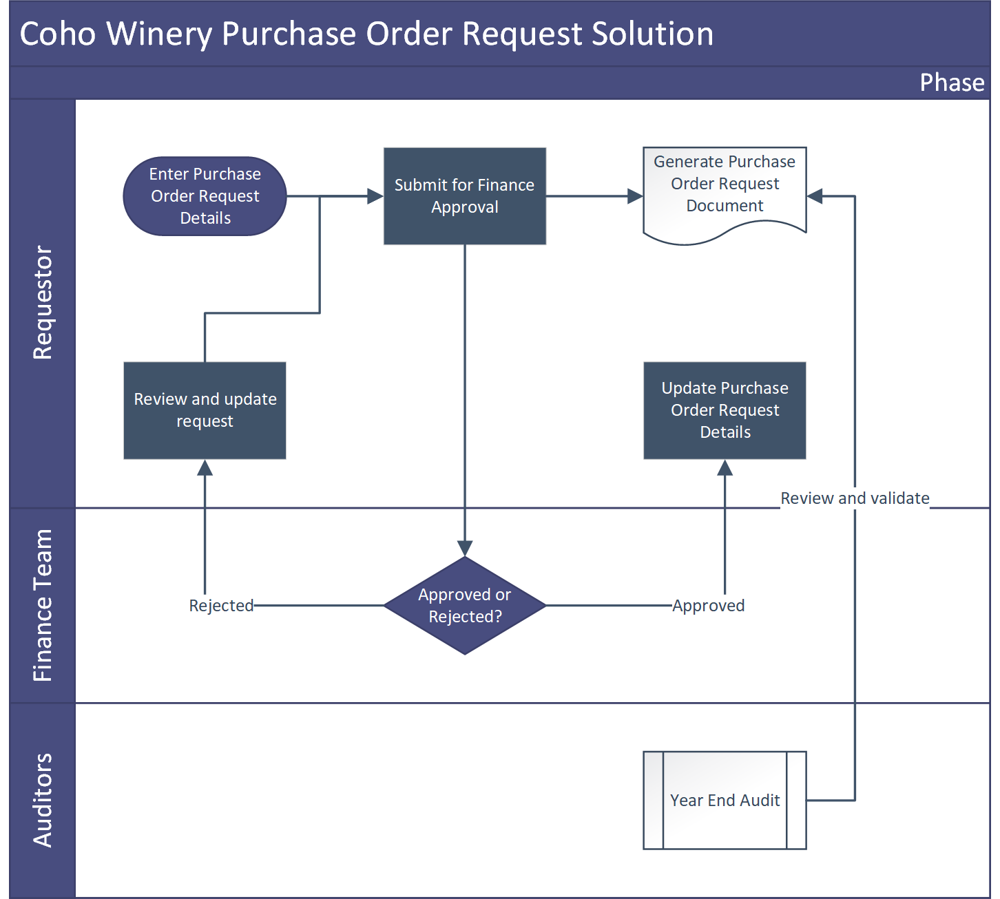

After analysing the requirements in detail, you identify the following platform features that you would like to use to implement the solution:

- [Microsoft Dataverse](https://learn.microsoft.com/en-us/power-apps/maker/data-platform/data-platform-intro), to store the data, leveraging a mixture of custom and [Common Data Model (CDM)](https://learn.microsoft.com/en-us/common-data-model/) tables.
- A [model-driven Power App](https://learn.microsoft.com/en-us/power-apps/maker/model-driven-apps/model-driven-app-overview) to present the data stored in Dataverse
- To handle the landing page and document display requirements, [custom pages](https://learn.microsoft.com/en-us/power-apps/maker/model-driven-apps/model-app-page-overview).
- [Power Automate cloud flows](https://learn.microsoft.com/en-us/power-automate/overview-cloud), to handle the approval process using the [modern flow approvals engine](https://learn.microsoft.com/en-us/power-automate/get-started-approvals) and any other automation requirements.
- A [custom connector](https://learn.microsoft.com/en-us/connectors/custom-connectors/) to connect to the ERP API easily from a cloud flow and the custom page.

You begin your work by planning out the data model you will use and all necessary Dataverse customisations to support the solution. You identify that new table, called **Purchase Order**, will be required, alongside the existing **Account** and **Contact** tables. You will complete all necessary steps to build the model-driven Power App, including all required form and view customisations, before then creating some test records. Finally, you will initiate and test the integration with the ERP by connecting to it's API and create the automation to generate the physical request documents.

### ⌛ Length

This lab will take approximately 60 minutes to complete.

## âœï¸ Exercise 1: Create Purchase Order Table

1. Navigate to the [Power Apps Maker portal](https://make.powerapps.com) and ensure you are in the **Developer** environment you created in Lab 0.
2. Select **Solutions** from the left navigation pane.


3. Select the **Coho Winery** solution you created in Lab 0.

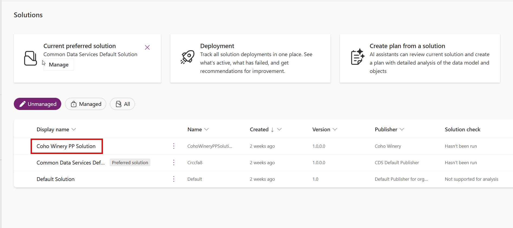

4. In the solution, select **New** -> **Table** -> **Table (advanced properties)** from the command bar.

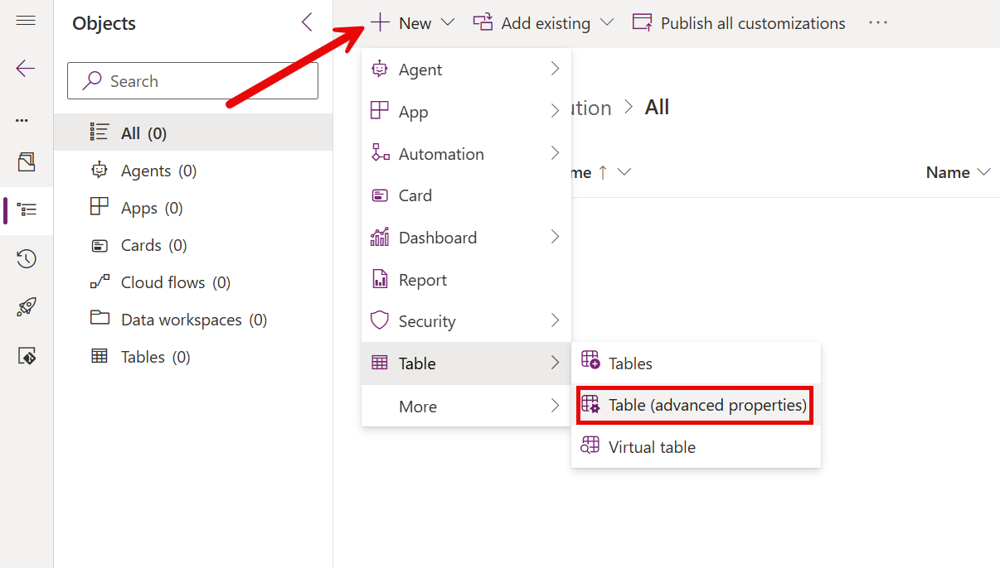

5. In the **Create table** dialog, enter the following details. You may need to select **Advanced options** to see all fields:
   - **Display name**: `Purchase Order`
   - **Plural display name**: `Purchase Orders`
   - **Description**: `Table to store purchase order requests.`
   - **Name**: `purchaseorder`
   - **Type**: Standard
   - **Record Ownership**: User or team

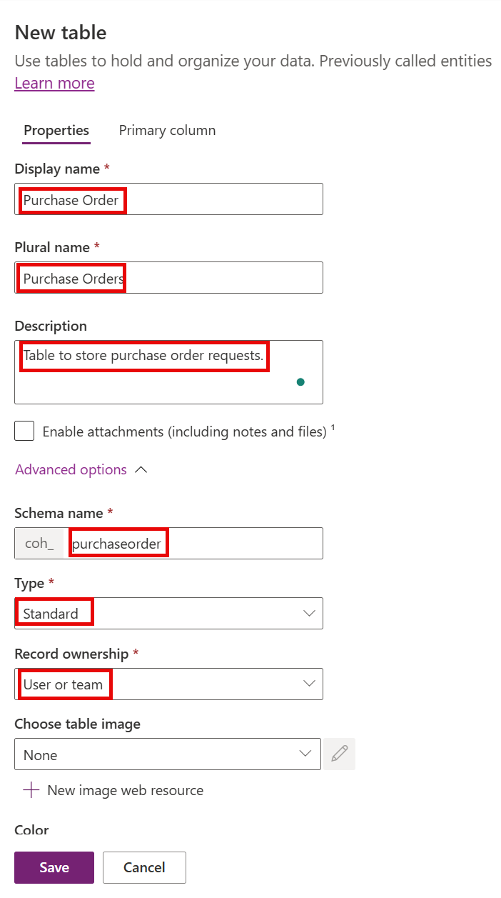

6. Select the **Primary column** tab and enter the following details. You may need to select **Advanced options** to see all fields:
   - **Display name**: `Purchase Order Number`
   - **Description**: `Internal reference number for the purchase order.`
   - **Name**: `purchaseordernumber`
   - **Column Requirement**: Optional
   - **Maximum Character Count**: `10`


7. Select **Save** to create the table.


8. Once the table is created, you will be taken to the table designer. Our first step is to enable the autonumbering for the tables primary column, because it's not possible to do this on create. Select **Columns**.


9. In the **Columns** tab, select the **Purchase Order Number** column.


10. On the **Edit columns** pane, change the **Data type** to **Autonumber** and then update the fields as follows. When you are finished, click **Save**:
    - **Autonumber type**: String prefixed number
    - **Prefix**: Use your initials or another unique 3 character prefix
    - **Minimum number of digits**: `7`
    - **Seed**: `1`


11. We will now proceed to create the additional columns needed for the table. The table below outlines all of the columns we will need:

| Display Name | Name | Data Type | Required | Description |
|-------|-----|-----------|----------|-------------|
| Requested By | requestedby | Lookup (User) | Business Required | The user who requested the purchase order. |
| Requested Date | requesteddate | Date and Time | Business Required | The date the purchase order was requested. |
| Approved By | approvedby | Lookup (User) | Optional | The user who approved the purchase order. |
| Approved Date | approveddate | Date and Time | Optional | The date the purchase order was approved. |
| Value | value | Currency | Optional | The total value of the purchase order. |
| Description | description | Multiple lines of text | Optional | A description of the purchase order. |
| Account | account | Lookup (Account) | Business Required | The account associated with the purchase order. |
| Contact | contact | Lookup (Contact) | Business Required | The contact associated with the purchase order. |
| ERP ID | erpid | Single line of text | Optional | The ID of the purchase order in the ERP system. |

12. Let's begin by creating the **Requested By** column. In the **Columns** page, select **+ Add column**.

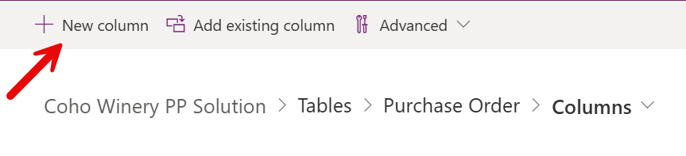

13. In the **Add column** pane, enter the following details and then press **Save**. You may need to select **Advanced options** to see all fields:
    - **Display name**: `Requested By`
    - **Description**: `The user who requested the purchase order.`
    - **Data type**: Lookup -> Lookup
    - **Column Requirement**: Business required
    - **Related table**: User
    - **Schema name**: `requestedby`
    - **Relationship name**: `purchaseorder_systemuser_requestedby`


14. Repeat step 13 for the remaining columns. For the following columns, use the following **Relationship name** values:
    - **Approved By**: purchaseorder_systemuser_approvedby
    - **Account**: purchaseorder_account
    - **Contact**: purchaseorder_contact

15. When you are finished, your **Purchase Order** table column list should resemble the below.


16. We will now add some custom status reason values to the **Purchase Order** table. Remaining in the **Columns** tab, select the **Status Reason** column.


17. In the **Edit column** pane, change the **Active** value to **Draft** and then select **+ New choice**.


18. Populate the label for the new choice as **Submitted**.


19. Click on the chevron next to **Active (1 of 2)** and select **Inactive (2 of 2)**.


20. Change the **Inactive** value to **Approved** and then select **+ Add status reason**. Populate the label for the new choice as **Rejected**. Click **Save** to save the changes.


21. Click on **Advanced** -> **Publish table** in the command bar to ensure all column changes are saved and published. The publishing process may take a few minutes to complete.


22. In the **Objects** pane, select **Forms** under the **Purchase Order** table.

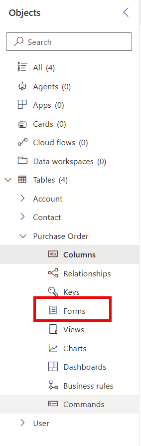

23. In the **Forms** tab, select the **Information** main form.

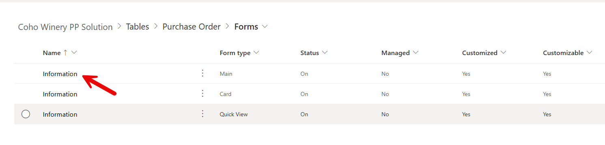

24. In the form designer, drag the **Owner** column into the header to reposition it accordingly.


25. From the **Table columns** list, drag and drop the following columns directly below the **Purchase Order Number** field. Position them as you desire:
    - Requested By
    - Requested Date
    - Approved By
    - Approved Date
    - Value
    - Description
    - Account
    - Contact
    - ERP ID


26. Your form should look similar to the below. When you are finished, click on **Save and publish**. The process may take a few minutes to complete.

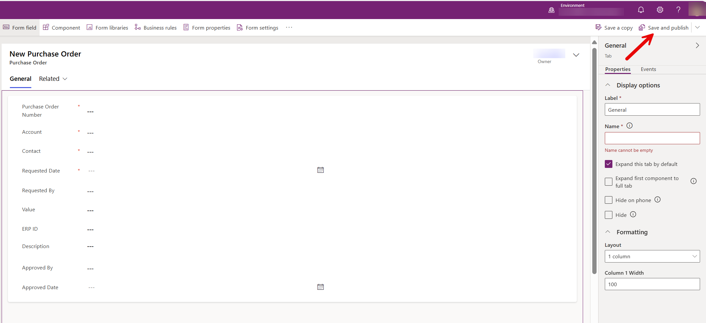

27. Once the form is saved and published, click on **Back** to return the **Purchase Order** table designer.


28. We have now finished customizing the **Purchase Order** table. Keep the **Coho Winery PP Solution** solution open, as we will continue to work on it in the next exercise.

## âœï¸ Exercise 2: Customise the Account and Contact Tables

We want to make it easy for users of our app to see a list of all related purchase orders for a company or individual. To do this, we will add a subgrid to the **Account** and **Contact** forms that displays this data.

1. In the **Coho Winery PP Solution** solution, select the **Account** table from the **Objects** pane. You may need to expand the **Tables** section to see it.

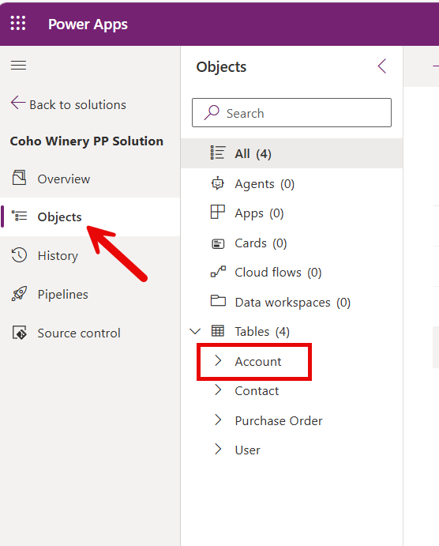

2. Under the **Data experience** section, select **Forms**.

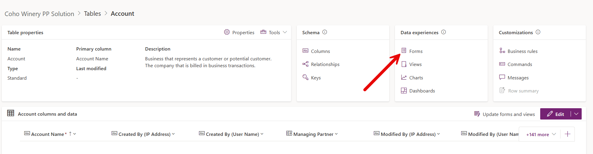

3. On the **Forms** tab, select **Add existing form**.

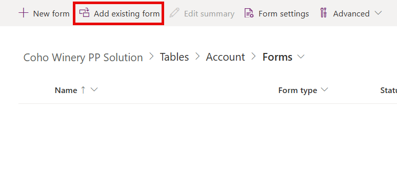

4. In the **Add existing form** dialog, select the **Account** main form and click **Add**.

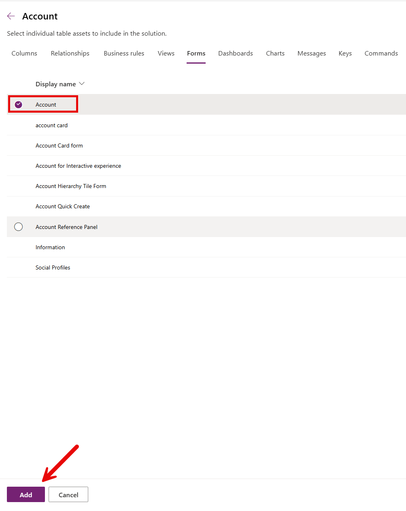

5. In the **Forms** tab, select the **Account** main form.


6. In the form designer, select the **Components** icon in the left pane.

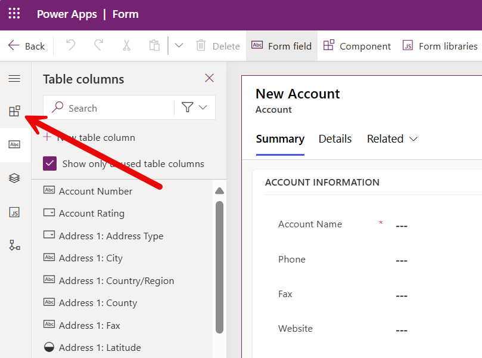

7. In the **Components** pane, drag and drop the **1-Column tab** into the form header, directly after the **Details** tab.

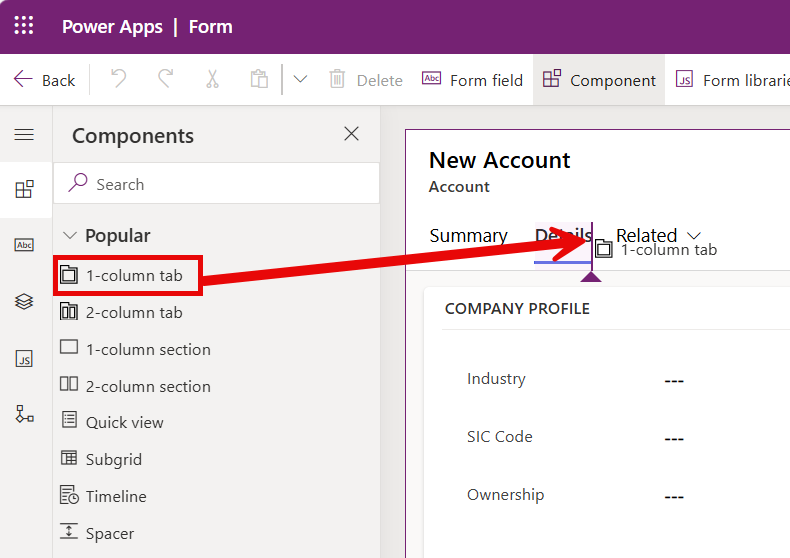

8. With the new tab selected, in the **Details** pane on the right, configure the following properties:
   - **Label**: `Purchase Orders`
   - **Name**: `tab_purchaseorders`
   - **Expand this tab by default**: Untick

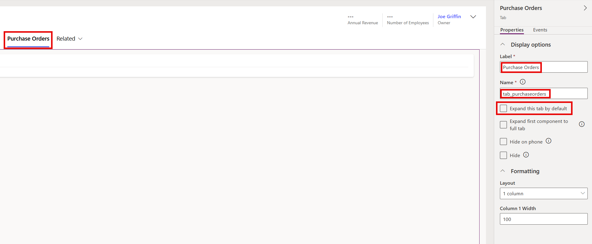

9. With the **Purchase Orders** tab selected, click on the **New section** section and configure the following properties:
   - **Label**: `Related Purchase Orders`
   - **Name**: `tab_purchaseorders_section_pos`
   - **Hide label**: Tick

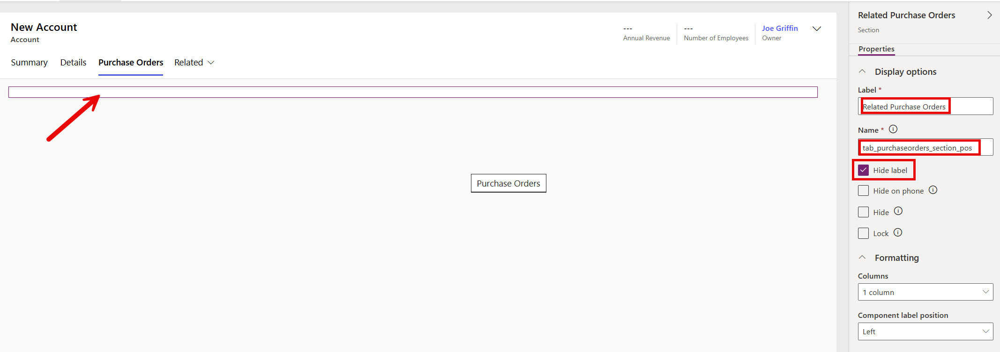

10. From the **Components** pane, drag and drop the **Subgrid** component into the **Related Purchase Orders** section.

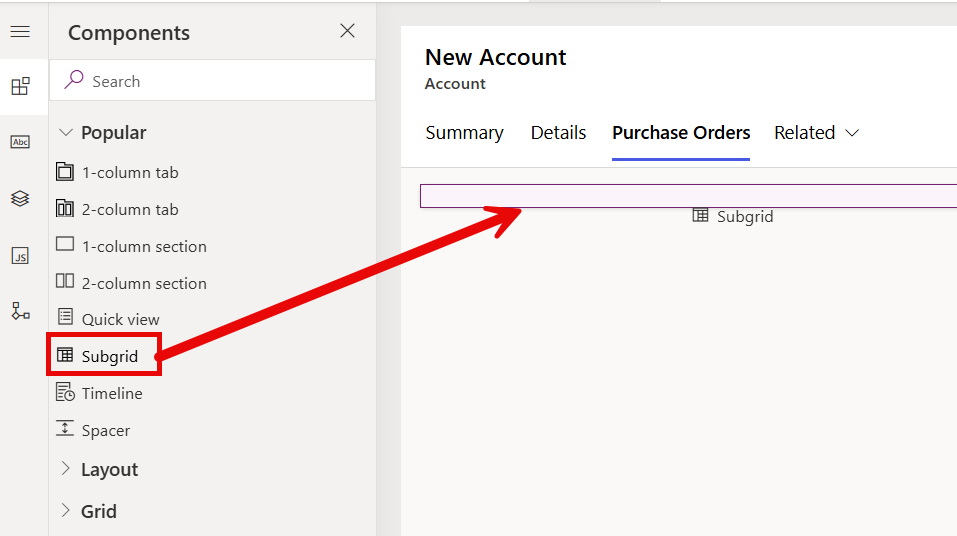

11. In the **Select subgrid views** dialog, select the following options and then click **Done**:
    - **Show related records**: Tick
    - **Table**: Select **Purchase Orders (Account)**
    - **Default view**: Select **Active Purchase Orders**

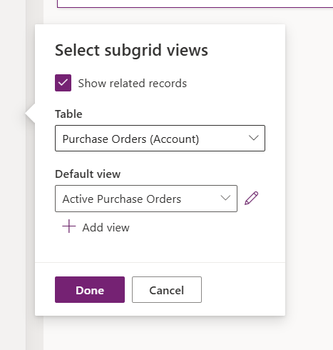

12. In the **Subgrid** properties pane on the right, configure the following properties:
    - **Label**: `Related Purchase Orders`
    - **Name**: `subgrid_purchaseorders`
    - **Hide label**: Untick

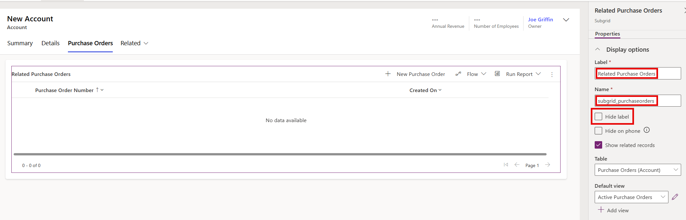

13. Click on **Save and publish** in the command bar to save your changes. It may take several minutes for the changes to be published.

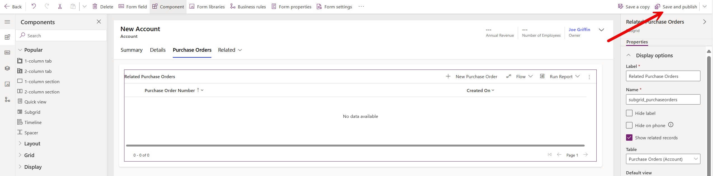

14. Once the form is saved and published, click on **Back** to return to the **Account** table designer.


15. Repeat steps 1-14 for the **Contact** table, making sure you use the **Contact** main form. The form should resemble the below when you are finished.

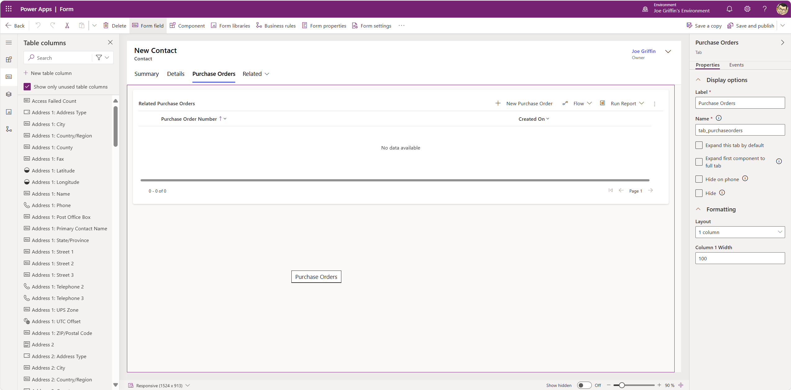

16. Returning back to the **Coho Winery PP Solution** solution, click on **All** and then select **Publish all customizations** from the command bar to ensure all changes are published. This may take several minutes to complete.

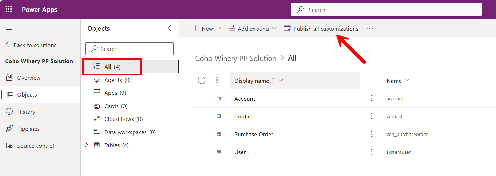

17. Leave the **Coho Winery PP Solution** solution open, as we will continue to work on it in the next exercise.

## âœï¸ Exercise 3: Create the Model-Driven App

Our model-driven app will be used to display and edit purchase order information, including related customer information. We will also use it to provide a landing page for users to navigate to internal and external links, and display current data from the ERP system when we create our custom pages in the next lab.

1. In the **Coho Winery PP Solution** solution, select **+ New** -> **App** -> **Model-driven app** from the command bar.

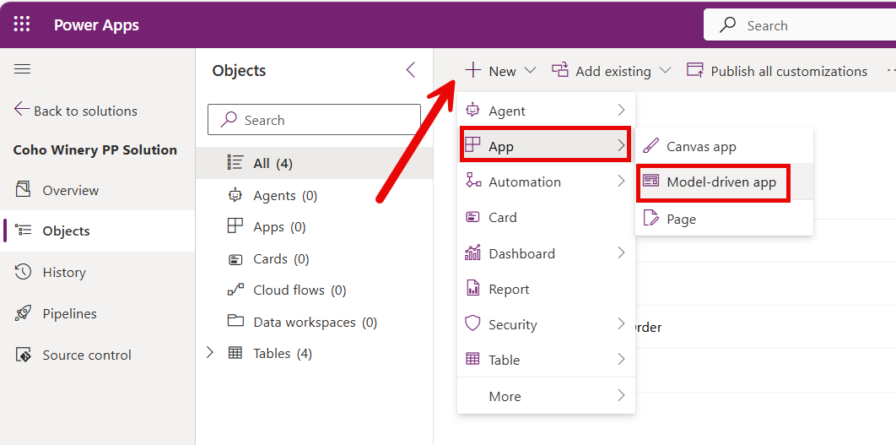

2. In the **New model-driven app** dialog, provide the following details and then click **Create**. You may need to select **Advanced** to see all options:
   - **Name**: `Coho Winery Purchase Order Management`
   - **Description**: `Model-driven app for managing purchase orders`
   - **Use components from a custom solution**: Tick
    - **Solution**: Select the **Coho Winery PP Solution** solution

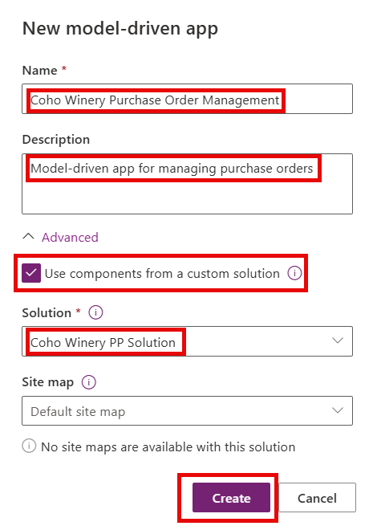

3. In the app designer, under the **Pages** tab, remove the **User** table by clicking the elipses (...) next to **User views** and selecting **Remove from app**.

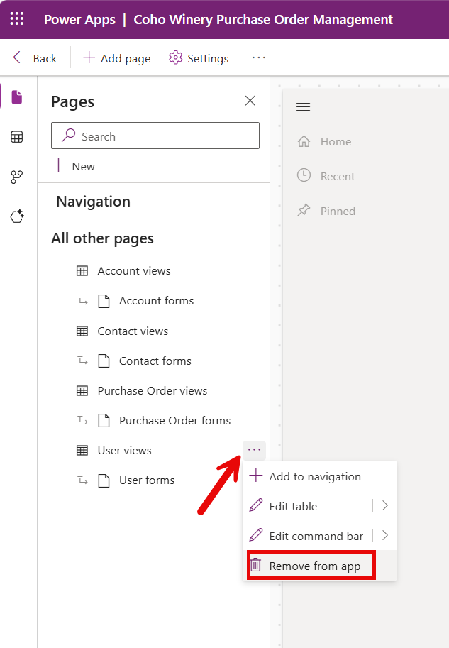

4. In the "What You See Is What You Get" (WYSIWYG) designer, select the **+ Add page** button.

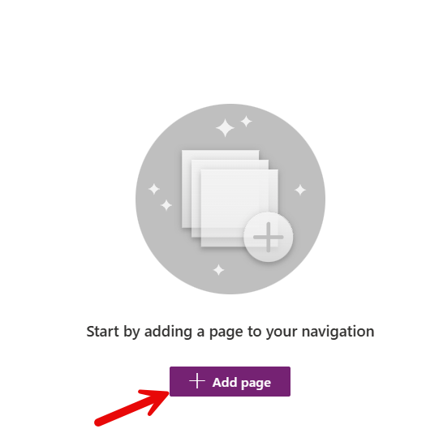

5. In the **Add page** dialog, click the **Table** option, select the following tables and then click **Add**. Make sure the **Show in navigation** option is ticked:
   - **Purchase Order**
   - **Account**
   - **Contact**

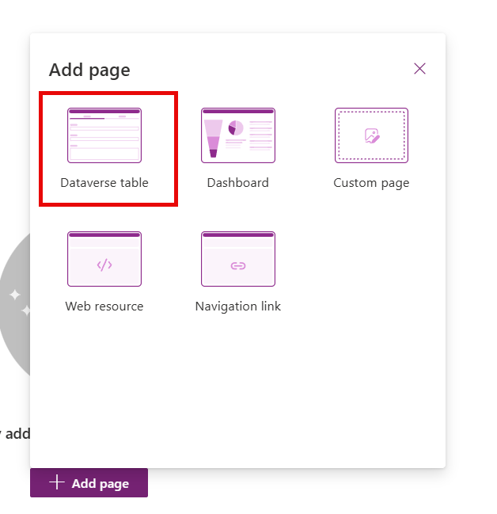

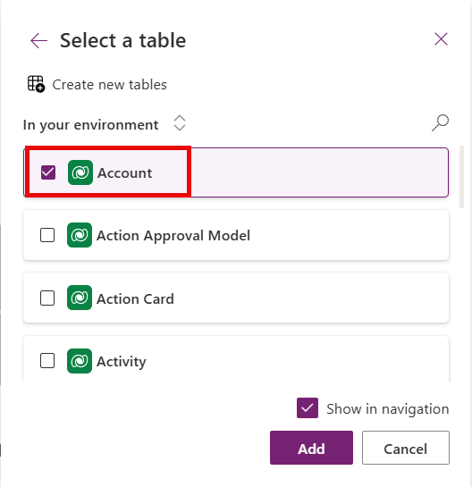

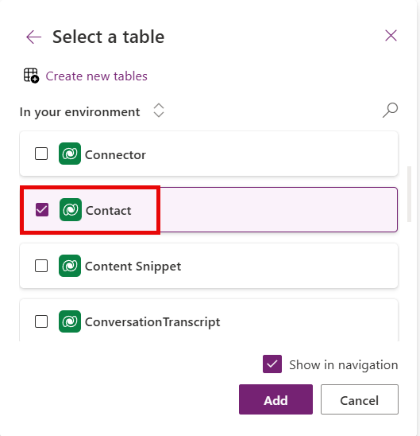

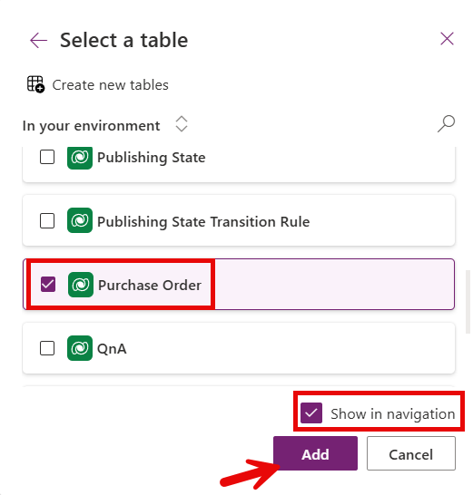

6. The tables will appear in the sitemap navigation, underneath a default **New group** sitemap group.

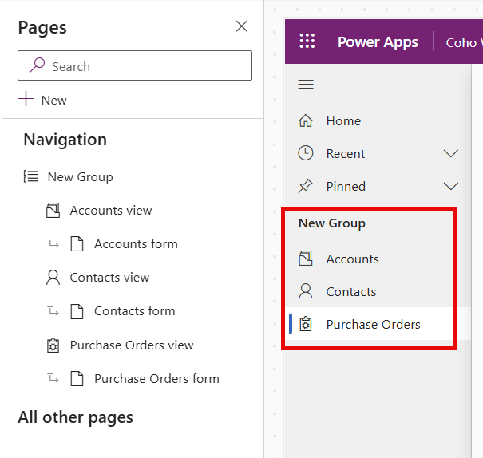

7. We will now proceed to reorganize the sitemap, so that it resembles the following structure:

   - **Home**
     - **Home Page** - This will be left empty for now, as we will add the custom page for this in the next lab.
   - **Customers**
     - **Accounts** 
     - **Contacts**
   - **Finance**
     - **Purchase Orders**
     - **PO Request Documents** - This will be left empty for now, as we will add the custom page for this in the next lab.

To start this process, select the **New group** group in the sitemap, expand the **New group** properties pane on the right, and then update the following properties:
   - **Title**: `Home`
   - **ID**: `group_home`

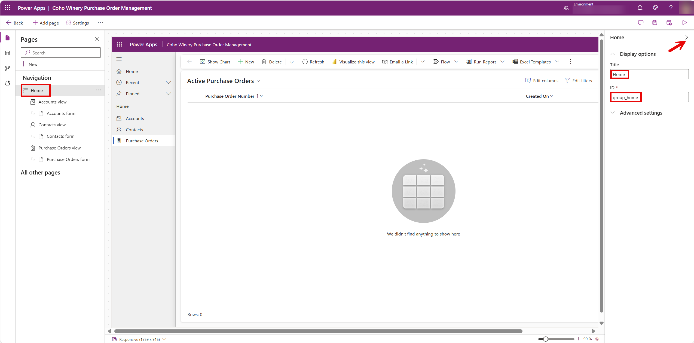

8. Click the ellipses (...) next to the **Home** group and select **New group**.


9. In the **New group** properties pane, update the following properties:
   - **Title**: `Customers`
   - **ID**: `group_customers`

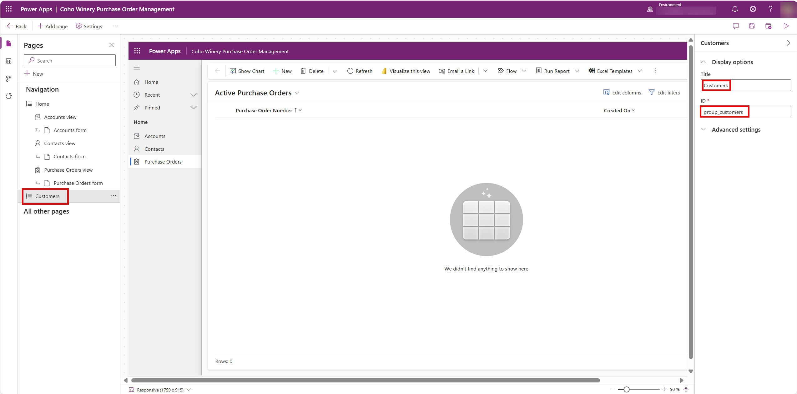

10. Repeat steps 8-9 to create a new group called **Finance** with the following properties:
    - **Title**: `Finance`
    - **ID**: `group_finance`

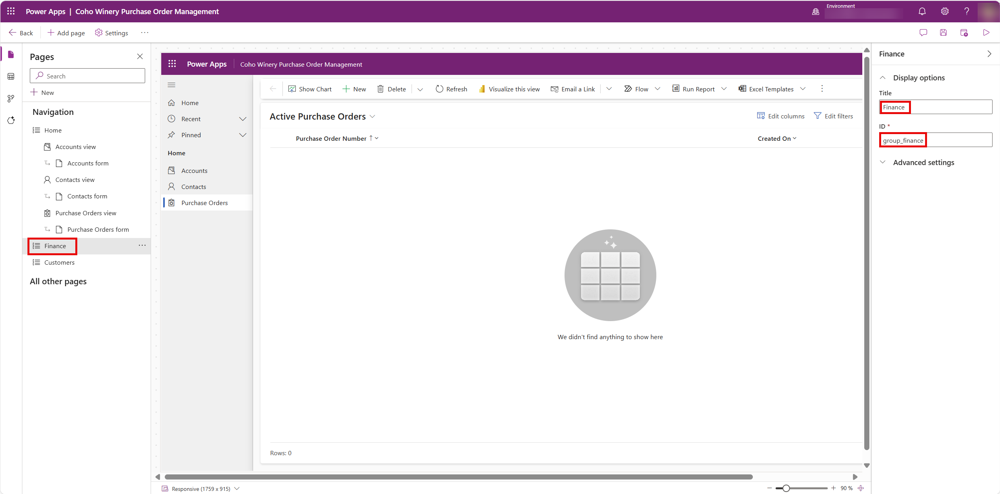

11. Reorder the groups and the areas in the sitemap by clicking on the elipses (...) next to each group and selecting **Move up** or **Move down**. The sitemap should resemble the structure above and screenshots below when you are finished.

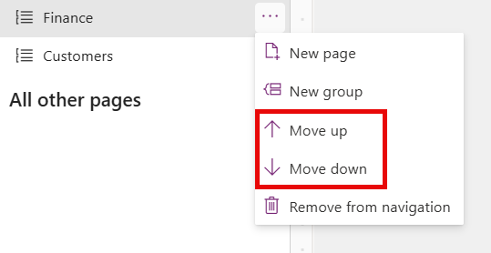

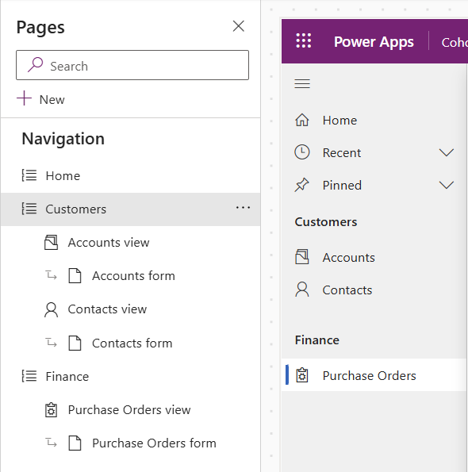

12. Click on **Save** in the command bar to save your changes, and then **Publish** to publish the app. The publishing process may take several minutes to complete.

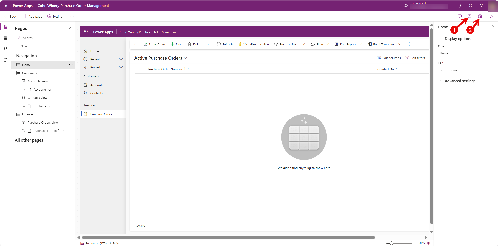

13. Once the app is published, click on **Play** to open the app in a new tab.

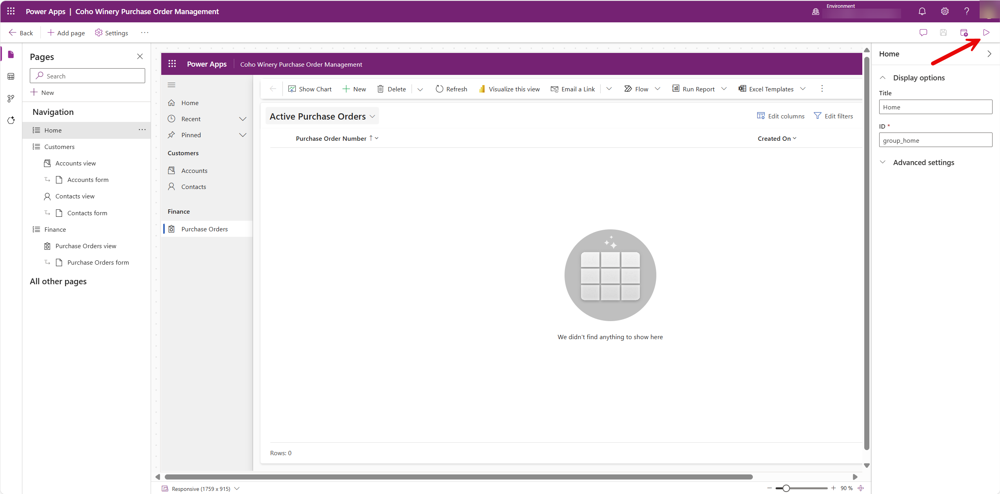

14. Browse around the newly created app, ensuring you can navigate to the **Purchase Orders**, **Accounts**, and **Contacts** pages. You will see that all of the pages are empty, as we have not yet added any data to the system; we will do this in the next exercise.

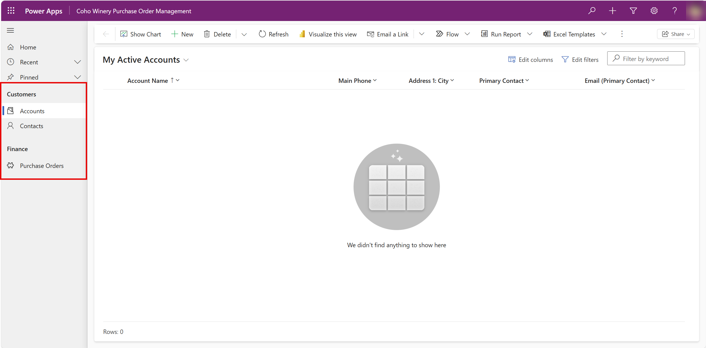

15. Leave the **Coho Winery Purchase Order Management** app open, as we will continue to work on it in the next exercise.

## âœï¸ Exercise 4: Add Test Records

To ensure we can test our app successfully with the ERP API integration and document generation, we will add some test records to the **Purchase Order**, **Account**, and **Contact** tables.

1. In the **Coho Winery Purchase Order Management** app, navigate to the **Accounts** page and click on **New**.

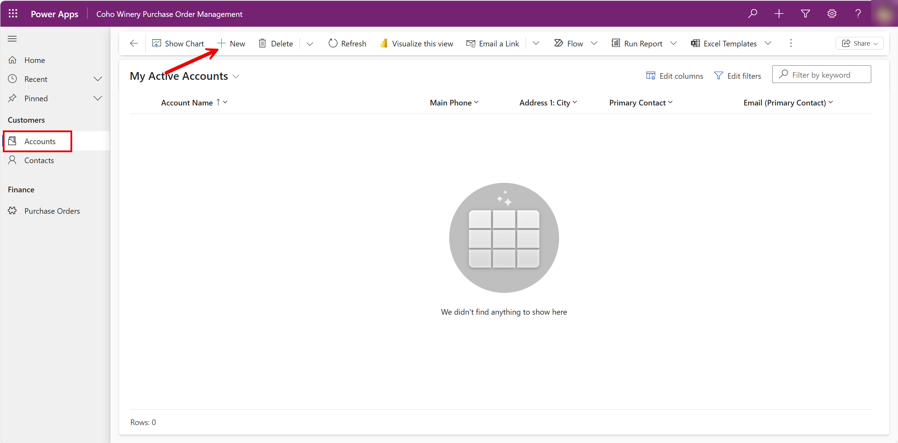

2. In the **New Account** form, enter the following details and then click **Save & Close**:
   - **Account Name**: `Wingtip Toys`
   - **Phone**: `555-1234`
   - **Website**: `https://www.wingtiptoys.com`

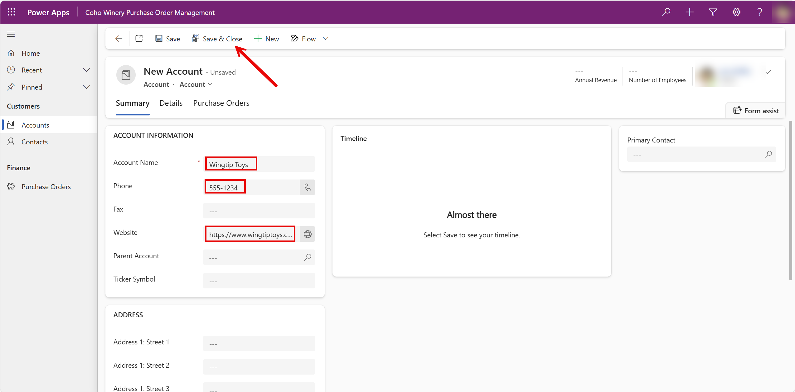

3. Navigate to the **Contacts** page and click on **New**.


4. In the **New Contact** form, enter the following details and then click **Save & Close**:
   - **First Name**: `John`
   - **Last Name**: `Doe`
   - **Account Name**: Select the **Wingtip Toys** account you created earlier in this exercise.
   - **Email**: `john.doe@wingtiptoys.com`
   - **Business Phone**: `555-5678`

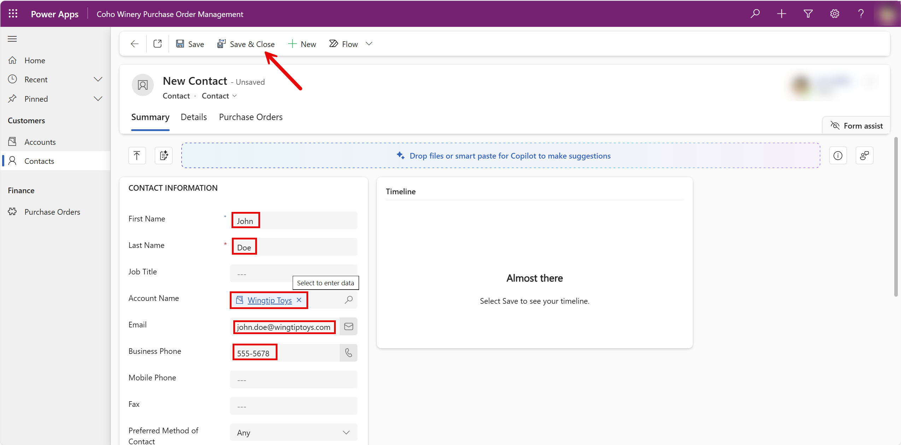

5. Navigate to the **Purchase Orders** page and click on **New**.

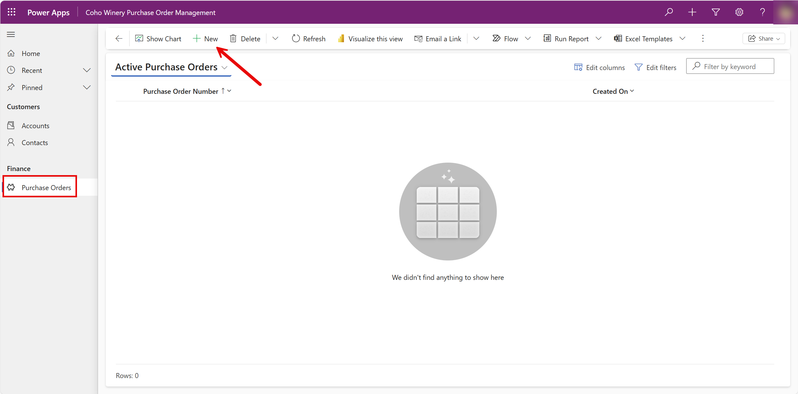

6. In the **New Purchase Order** form, enter the following details and then click **Save & Close**:
   - **Account**: Select the **Wingtip Toys** account you created earlier in this exercise.
   - **Contact**: Select the **John Doe** contact you created earlier in this exercise.
   - **Requested Date**: Select today's date and time.
   - **Value**: `2500`
   - **Description**: `Purchase order miniature toys representing wine bottles and grapes.`

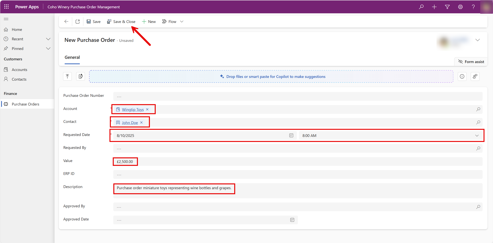

7. Feel free to create additional test records in the **Purchase Order**, **Account**, and **Contact** tables as needed. When you are finished, close the browser tab.

## âœï¸ Exercise 5: Setup Custom Connector for the EPI API

In this exercise, we will integrate our app with the ERP API to enable the creation and retrieval of purchase orders. This will be done by creating a custom connector that connects to the ERP API via a [Swagger definition](https://swagger.io/solutions/api-documentation/), which describes the two core operations of the API:

- **CreatePurchaseOrder**: This operation allows us to create a new purchase order in the ERP system.
- **RetrieveRemainingValue**: This operation allows us to retrieve the remaining value of a purchase order from the ERP system.

Once we have created the custom connector, we will then perform a test to ensure the connection is working correctly.

> [!IMPORTANT]
> The API key for the endpoint should have already been shared with you by your instructors. Ensure you have this key available before proceeding with the steps below.

1. Open a new browser tab and navigate to the following URL: https://beautifulappsformakers-functions.azurewebsites.net/api/swagger/ui

2. The Swagger UI will load, displaying the API documentation for the Coho Winery ERP API. You should see two operations: **CreatePurchaseOrder** and **RetrieveRemainingValue**. You can expand each operation to see the details, including the request and response formats.

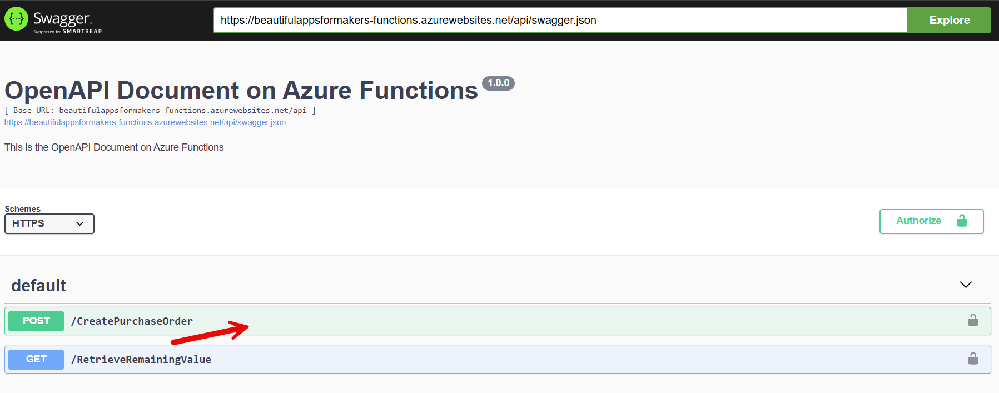


2. On the top of the page, click on the URL hyperlink for the **swagger.json** file. This will open the Swagger JSON definition in a new tab.

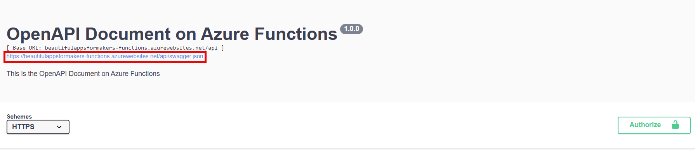

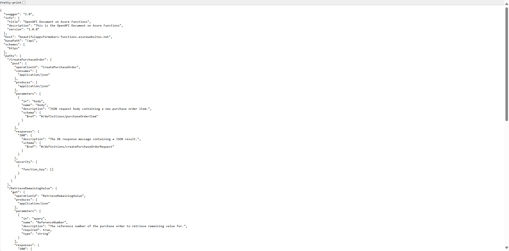

3. Right-click on the page and select **Save as...** to save the Swagger JSON file to your local machine. Name the file `coho-winery-erp-api.json` and save it in a location you can easily access later.

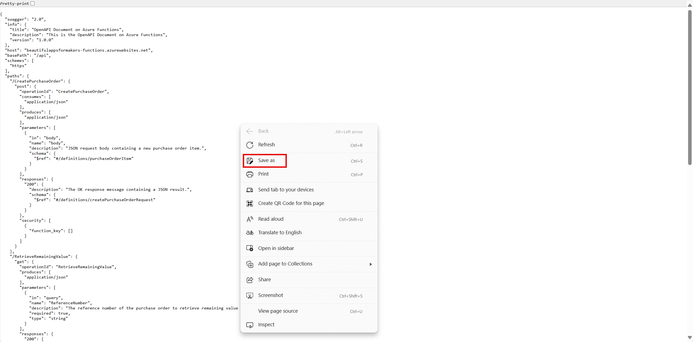

4. Close the JSON file and Swagger UI tabs.

5. Navigate back to the [Power Apps Maker portal](https://make.powerapps.com) and ensure you are in the **Developer** environment you created in Lab 0. Navigate to the **Coho Winery PP Solution** solution.

6. In the solution, select **+ New** -> **Automation** -> **Custom connector**.

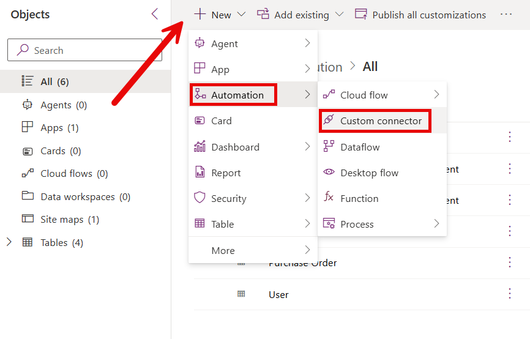

7. On the **General information** page, populate the following details and then click **Create connector**:
   - **Connector name**: `Coho Winery ERP API`
   - **Host**: `beautifulappsformakers-functions.azurewebsites.net`


8. Once the connector has finished saving, click on the back icon.

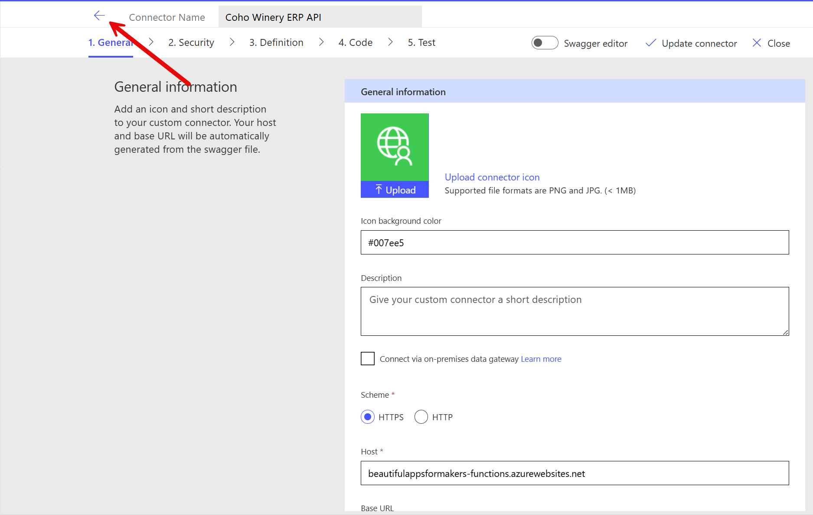

9. On the **Custom connectors** page, click on the elipses (...) next to the **Coho Winery ERP API** connector and select **Update from OpenAPI file**.


10. On the **Import an OpenAPI file** dialog, click on **Import** and select the `coho-winery-erp-api.json` file you saved earlier. Then click **Continue**.


11. The connector will now be updated with the operations defined in the Swagger file. Click on **Update connector** to save the changes. Once the update is complete, click on **2. Security**.


12. Review the **Security** page and confirm that the **Authentication type** is set to **API key**. Click on **3. Definition**.


13. On the **Definition** page, verify that you can see the two operations: **CreatePurchaseOrder** and **RetrieveRemainingValue**.


14. With the **CreatePurchaseOrder** operation selected, click on the **Import from sample** button under the **Request** section.


15. On the **Import from sample** pane, configure the following details and then click **Import**:
    - **Verb**: Select **POST**
    - **URL**: `https://beautifulappsformakers-functions.azurewebsites.net/api/CreatePurchaseOrder`
    - **Headers**: 
      - `Content-Type: application/json`

    - **Body**: 
      ```json
      {
        "ReferenceNumber": "PO1234567",
        "TotalValue": 2500.00
      }
      ```


16. Click on **Content-Type** under **Headers**, and select **Edit**.


17. In the **Parameter** section, configure the following details and then click **Update connector**. This will ensure that this header value is always set correctly:
    - **Default value**: `application/json`
    - **Is required?**: Select **Yes**
    - **Visibility**: Select **internal**


18. We are now ready to test the connector. Click on **5. Test** at the top of the page.


19. In the **Test operation** section, click on **New connection**.


20. A new browser tab will open, prompting you to enter the API key. Enter the API key provided by your instructors and click **Create connection**.


21. Close the browser tab to return to the previous page.

22. Click the refresh icon and then select the newly created connection from the dropdown list.


23. We will now proceed to test both operations, starting with the **CreatePurchaseOrder** operation, which should already be selected. If not, select it under the **Operations** heading and then enter the following details. Click on **Test operation** to run the test:
    - **ReferenceNumber**: Your initials followed by a hyphen and then seven 9's (e.g., `JD-9999999`)
    - **TotalValue**: `2500.00`


24. If the test is successful, you should see a 200 response similar to the following, which contains the Unique Identifier (GUID) of the newly created purchase order:
    ```json
    {
      "PurchaseOrderUID": "6f5febfe-6e5c-488e-9352-609249402116"
    }
    ```


25. Now, let's test the **RetrieveRemainingValue** operation. Click on the **RetrieveRemainingValue** operation under the **Operations** heading and enter the following details. Click on **Test operation** to run the test:
    - **ReferenceNumber**: The reference number used in step 23 (e.g., `JD-9999999`)


26. If the test is successful, you should see a 200 response similar to the following, which contains the remaining value of the purchase order. This is a randomly generated value for the purpose of this lab, and may differ from the example below:
    ```json
    {
      "remainingValue": 905
    }
    ```


27. Our custom connector is now successfully configured and tested. Click on **Update connector** for a final time to save the changes and then close the browser tab.

28. On the **Coho Winery PP Solution** solution page, click on **Done** and then verify that the custom connector has been added to the solution. The **Name** value may differ from the example below.


29. Click on **Publish all customizations** in the command bar to ensure all changes are published. This may take several minutes to complete.

30. Leave the **Coho Winery PP Solution** solution open, as we will continue to work in it during the next exercise.

## âœï¸ Exercise 6: Integrate with the ERP API

Now that our custom connector is setup, let's configure a cloud flow that triggers whenever a new Purchase Order record is created. The cloud flow will POST the record details to the ERP and then save back the **PurchaseOrderUID** field to the Purchase Order **ERP ID** column.

1. You should still be in the **Coho Winery PP Solution** from the previous exercise. In this solution, select **+ New** -> **Automation** -> **Cloud flow** -> **Automated**.


2. In the **Build an automated cloud flow** dialog, enter the following details and then click **Create**:
   - **Flow name**: `Create Purchase Order in ERP`
   - **Choose your flow's trigger**: Search for `Dataverse` and select the **When a row is added, modified or deleted** trigger.


3. You will be taken to the cloud flow designer and prompted to authenticate to sign in. Ensure that **OAuth** is selected as the **Authentication type** and then click on **Sign in**. A pop-up window may appear, prompting you to sign in again with your Microsoft 365 credentials.


4. Once you have signed in, configure the **When a row is added, modified or deleted** trigger as follows:
   - **Change type**: Select **Added**
   - **Table name**: Select **Purchase Orders**
   - **Scope**: Select **Organization**


5. Click on the elipses (...) next to the trigger and select **Rename**. Change the name of the trigger to **When a new Purchase Order is created**.


> [!TIP]
> It is always a good practice to rename your flow triggers and steps to make them more descriptive and easier to understand.

6. Click on **+ New step** to add a new action to the flow.


7. In the **Choose an operation** pane, click on **Custom** and then select the **Coho Winery ERP API** connector.


8. Select the **CreatePurchaseOrder** action.


9. Enter **ERP API Connection** as **Connection name** and then enter the API key provided by your instructors as the **API key**. Click on **Create** to create the connection.


10. In the **CreatePurchaseOrder** action, configure the following details:
    - **ReferenceNumber**: Select the **Purchase Order Number** dynamic content from the trigger.
    - **TotalValue**: Select the **Value** dynamic content from the trigger. You may need to click on **See more** to find this value.


11. Rename the action to **Create Purchase Order in ERP**.

12. Click on **+ New step** to add a new action to the flow.

13. In the **Choose an operation** pane, search for `Dataverse` and select the **Dataverse** connector.


14. Select the **Update a row** action. You may need to scroll down to find it.


15. In the **Update a row** action, configure the following details. You may need to click on **Show advanced options** to see all options:
    - **Table name**: Select **Purchase Orders**
    - **Row ID**: Select the **Purchase Order** dynamic content from the trigger.
    - **ERP ID**: Select the **purchaseOrderUID** dynamic content from the **Create Purchase Order in ERP** action.


16. Rename the action to **Update Purchase Order with ERP ID**.

17. Your completed cloud flow should resemble the below. Click on **Save** in the command bar to save your changes.


18. It's now time to test the cloud flow. First, duplicate the current browser tab to keep the flow open.


19. In the new browser tab, click on the **Coho Winery Purchase Order Management** app and select **Play** to open the app in a new tab.


20. In the app, navigate to the **Purchase Orders** page and click on **New**.

21. The new record form should open. Do **NOT** create the record just yet. Instead, return to the original browser tab that was duplicated and click on **Test** in the command bar.


22. In the **Test flow** pane, select **Manually** and then click on **Test**.


23. Return to the other browser tab with the app and complete the **New Purchase Order** form with the following details. Then click on **Save** to create the record:
    - **Account**: Select the **Wingtip Toys** account you created earlier in this lab.
    - **Contact**: Select the **John Doe** contact you created earlier in this lab.
    - **Requested Date**: Select today's date and time.
    - **Value**: `3000`
    - **Description**: `ERP creation test.`


24. After clicking **Save**, return to the original browser tab with the cloud flow and monitor the flow run. It may take a few moments for the flow to trigger and complete. Verify that is has run successfully.


25. Return to the other browser tab with the app and refresh the **Purchase Orders** page. Verify that the **ERP ID** field has been populated with a GUID value from the ERP API.


26. Close the **Coho Winery Purchase Order Management** app browser tab to return to the solution.

27. In the solution, click on **Publish all customizations** in the command bar to ensure all changes are published. This may take several minutes to complete.

28. Leave the **Coho Winery PP Solution** solution open, as we will continue to work on it during the next exercise.

## âœï¸ Exercise 7: Create Cloud Flow for Document Creation

We will now create a second cloud flow that will generate a Word document from a template whenever a Purchase Order request is approved. The document will then be saved to the OneDrive for Business folder we created in Lab 0.

> [!NOTE]
> The workflow to handle the approval process will be done in the next lab, so for now, we will just simulate the approval by manually changing some fields on the Purchase Order record.

1. You should still be in the **Coho Winery PP Solution** from the previous exercise. In this solution, select **+ New** -> **Automation** -> **Cloud flow** -> **Automated**.


2. In the **Build an automated cloud flow** dialog, enter the following details and then click **Create**:
   - **Flow name**: `Generate Purchase Order Document`
   - **Choose your flow's trigger**: Search for `Dataverse` and select the **When a row is added, modified or deleted** trigger.


3. You will be taken to the cloud flow designer and prompted to sign in. Ensure that **OAuth** is selected as the **Authentication type** and then click on **Sign in**. A pop-up window may appear, prompting you to sign in again with your Microsoft 365 credentials.


4. Once you have signed in, configure the **When a row is added, modified or deleted** trigger as follows:
   - **Change type**: Select **Modified**
   - **Table name**: Select **Purchase Orders**
   - **Scope**: Select **Organization**
   - **Select columns**: Type `coh_approvedby,coh_approveddate`
   - **Filter rows**: Type `_coh_approvedby_value ne null and coh_approveddate ne null`

5. Rename the trigger to **When a Purchase Order is approved**. It should resemble the below when you are finished.


6. Click on **+ New step** to add a new action to the flow.

7. In the **Choose an operation** pane, search for `Dataverse` and select the **Dataverse** connector. Then, select the **Get a row by ID** action. You may need to scroll down to find it.


8. In the **Get a row by ID** action, configure the following details. You will need to click on **Show advanced options** to see all options:
   - **Table name**: Select **Purchase Orders**
   - **Row ID**: Select the **Purchase Order** dynamic content from the trigger.
   - **Return full metadata**: Select **Yes**

9. Rename the action to **Get Purchase Order friendly values**. The action should resemble the below when you are finished.


> [!NOTE]
> This action is necessary to retrieve the "friendly" display values of the different lookup properties, such as the **Contact** and **Account** fields. These values are not available directly from the trigger. In a real-world example, we would also want to limit the number of columns that are returned using the **Select columns** input, but for the purpose of this lab, we will leave it blank.

10. Click on **+ New step** to add a new action to the flow.

11. In the **Choose an operation** pane, search for `Word` and select the **Word Online (Business)** connector. Then, select the **Populate a Microsoft Word template** action.


12. In the **Populate a Microsoft Word template** action, configure the following details. The flow should resemble the below when you are finished:
   - **Location**: Select **OneDrive for Business**
   - **Document Library**: Select **OneDrive**
   - **File**: Click on the folder icon and navigate to the `Beautiful Power Apps for Makers Lab` folder you created in Lab 0. Select the `PO-Request-TEMPLATE.docx` file.
   - **coh_erpid**: Select the **ERP ID** dynamic content from the trigger.
   - **coh_purchaseordernumber**: Select the **Purchase Order Number** dynamic content from the trigger.
   - **coh_approvedby**: Paste the following value in the input. This will return the full name of the approver from the **Get Purchase Order friendly values** action: `@{outputs('Get_Purchase_Order_friendly_values')?['body/_coh_approvedby_value@OData.Community.Display.V1.FormattedValue']}`
   - **coh_requestedby**: Paste the following value in the input. This will return the full name of the **User** requesting the purchase order from the **Get Purchase Order friendly values** action: `@{outputs('Get_Purchase_Order_friendly_values')?['body/_coh_requestedby_value@OData.Community.Display.V1.FormattedValue']}`
   - **coh_requesteddate**: Select the **Requested Date** dynamics content from the trigger.
   - **coh_description**: Select the **Description** dynamic content from the trigger.
   - **coh_account**: Paste the following value in the input. This will return the name of the **Account** from the **Get Purchase Order friendly values** action: `@{outputs('Get_Purchase_Order_friendly_values')?['body/_coh_account_value@OData.Community.Display.V1.FormattedValue']}` 
   - **coh_contact**: Paste the following value in the input. This will return the full name of the **Contact** from the **Get Purchase Order friendly values** action: `@{outputs('Get_Purchase_Order_friendly_values')?['body/_coh_contact_value@OData.Community.Display.V1.FormattedValue']}`
   - **coh_value**: Select the **Value** dynamic content from the trigger.
   - **coh_approveddate**: Select the **Approved Date** dynamic content from the trigger.

13. Rename the action to **Populate Purchase Order Request template**. The action should resemble the below when you are finished.


14. Click on **+ New step** to add a new action to the flow.

15. In the **Choose an operation** pane, search for `OneDrive` and select the **OneDrive for Business** connector. Then, select the **Create file** action.


16. In the **Create file** action, configure the following details. The flow should resemble the below when you are finished:
   - **Folder Path**: Click on the folder icon and navigate to the `Generated Documents` folder you created in Lab 0.
   - **File Name**: Paste the following value in the input. This will create a unique file name for each document: `PO-Request-@{triggerOutputs()?['body/coh_purchaseordernumber']}.docx`
   - **File Content**: Select the **Microsoft Word document** dynamic content from the **Populate Purchase Order Request template** action.

17. Rename the action to **Save staging document to OneDrive**. The action should resemble the below when you are finished.


18. We need the document to be in PDF format, so we will add three additional steps - one to convert the Word document to PDF, the second to delete the staging Word document file and third to delete the "staging" file created above. Click on **+ New step** to add a new action to the flow.

19. In the **Choose an operation** pane, search for `Word` and select the **Word Online (Business)** connector. Then, select the **Convert Word Document to PDF** action.


20. In the **Convert Word Document to PDF** action, configure the following details:
   - **Location**: Select **OneDrive for Business**
   - **Document Library**: Select **OneDrive**
   - **File**: Paste in the following formula, which will navigate the Word document created in the previous action step: `@{concat('/Beautiful Power Apps for Makers Lab/Generated Documents/PO-Request-',triggerOutputs()?['body/coh_purchaseordernumber'], '.docx')}`

21. Rename the action to **Convert Purchase Order Request to PDF**. The action should resemble the below when you are finished.


22. Click on **+ New step** to add a new action to the flow.

22. In the **Choose an operation** pane, search for `OneDrive` and select the **OneDrive for Business** connector. Then, select the **Create file** action.

23. In the **Create file** action, configure the following details:
   - **Folder Path**: Click on the folder icon and navigate to the `Generated Documents` folder you created in Lab 0.
   - **File Name**: Paste the following value in the input. This will create a unique file name for each document: `PO-Request-@{triggerOutputs()?['body/coh_purchaseordernumber']}.pdf`
   - **File Content**: Select the **PDF document** dynamic content from the **Convert Purchase Order Request to PDF** action.

24. Rename the action to **Save PDF document to OneDrive**. The action should resemble the below when you are finished.


25. Click on **+ New step** to add a new action to the flow.

26. In the **Choose an operation** pane, search for `OneDrive` and select the **OneDrive for Business** connector. Then, select the **Delete file** action.


27. In the **Delete file** action, configure the following details:
   - **File**: Select the **Id** dynamic content from the **Save staging document to OneDrive** action.

28. Rename the action to **Delete staging Word document**. The action should resemble the below when you are finished.


29. Your completed cloud flow should resemble the below. Click on **Save** in the command bar to save your changes.


30. We are now ready to test the cloud flow. First, click on **Test** in the command bar.

31. In the **Test flow** pane, select **Manually** and then click **Test**.

30. Next, in a new browser tab, open the **Coho Winery Purchase Order Management** app, and navigate to the **Purchase Order** record that was created in Exercise 6.

31. Update the record by populating the following fields and then click on **Save** to simulate the approval process:
   - **Approved By**: Select your user account.
   - **Approved Date**: Select today's date and time.


32. Navigate back to the original browser tab with the cloud flow and monitor the flow run. It may take a few moments for the flow to trigger and complete. Verify that it has run successfully.


33. Open a new browser tab and navigate to [OneDrive for Business](https://onedrive.live.com/about/en-us/signin/). Ensure you are signed in with the same Microsoft 365 account used for this lab.

34. In OneDrive, navigate to the `Beautiful Power Apps for Makers Lab` folder and then open the `Generated Documents` folder. Verify that a new PDF document has been created with the correct file name. You can open the document to verify that all details are correct.

>[!NOTE]
> The **Requested By** column in the document may show as blank. This is expected, as we did not set this field when creating the Purchase Order record in Exercise 6.


35. Close the OneDrive browser tab to return to the flow designer and click on **Back** to return to the solution.

36. In the solution, click on **Publish all customizations** in the command bar to ensure all changes are published. This may take several minutes to complete.

37. If you are planning to continue to Lab 2, leave the **Coho Winery PP Solution** solution open, as we will continue to work on it during the next lab. If you are finished for now, you can close the browser tab.

## 🌟 Extra Challenges

- Can you think of any additional fields that would be useful to add to the **Purchase Order** table to enhance the functionality of the app? Consider fields that could help with tracking, reporting, or integration with other systems. Try adding these fields and updating the app accordingly.
- Are there any other tables as part of the Common Data Model that could be useful to include as well? Explore the list of available tables and add any that you think would be suitable.
- There are many options available to us when setting up a custom connector. Can you think of any additional configurations you could apply? Use the links below to get some insipriation:
   - [Add a custom logo](https://learn.microsoft.com/en-us/connectors/custom-connectors/define-blank#step-1-update-general-details)
   - [Policies](https://learn.microsoft.com/en-us/connectors/custom-connectors/policy-templates)
   - [Custom code](https://learn.microsoft.com/en-us/connectors/custom-connectors/write-code)
- Currently, our cloud flows have not implemented any error handling. How could we improve the flows with this in mind? Consider adding [conditions](https://learn.microsoft.com/en-us/power-automate/add-condition), [scopes](https://learn.microsoft.com/en-us/power-automate/scopes), or [run after branches](https://learn.microsoft.com/en-us/power-automate/flows-designer#settings) to handle errors gracefully.

**Congratulations, you've finished Lab 1** 🥳