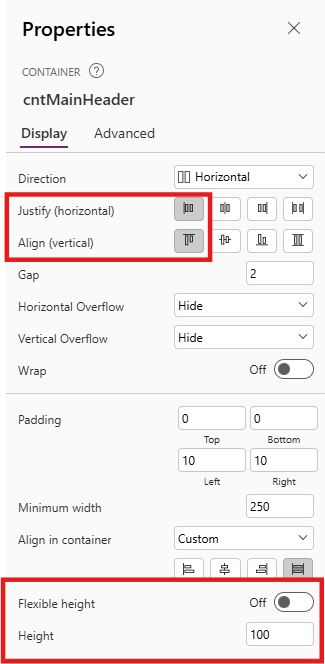
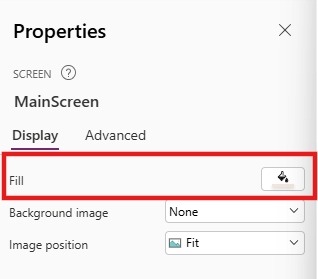
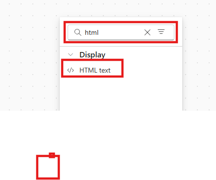
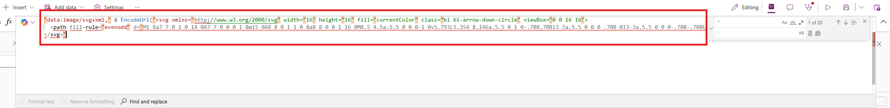
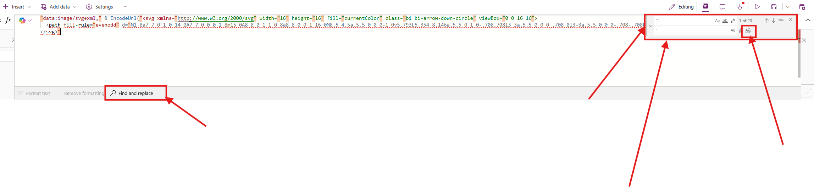
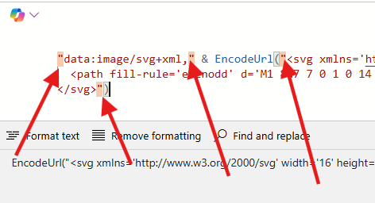

# Lab 2 - Create Beautiful Custom Pages

In this lab, you will learn how to **build** custom pages with a focus on **responsive design**, **styling** and accessing **Model-Driven App record details**

## Lab Overview 

### 🎯 Goal

- Build a Custom Page to use as a full page and a side pane within a Model-Driven App.
- Connect to your data sources and fetch record details with the Param() function in the Custom Page.
- Master responsive layouts so your page looks good everywhere.
- Add modern styling elements like shadows, rounded corners, blur effects, and SVGs to make apps pop
- Optimised Power Fx syntax for reusability, performance and maintainable applications

### ✅ Prerequisites

- Completion of [Lab 1 - Create a Model-Driven Power App](Lab1-CreateModelDrivenPowerApp.md)

### 💻 Scenario

Coho Winery are rolling out a new Purchase Order app to replace their manual Word-and-screenshot process. To improve the user experience, you have been asked to design two key pages: 

- **Landing Page** – a modern entry point where users can quickly navigate to key links, view PO data from the ERP system, and access important actions.
- **PO Document Side Pane** – a page that displays stored PDF versions of PO requests, giving finance and auditors instant access without leaving the app.

Together, these pages will provide both an attractive front door to the application and a practical way to view and manage PO request documents. 

### ⌛ Length

This lab will take approximately 60–75 minutes to complete. 

## ✍️ Exercise 1: Create a Landing Page and Configure Settings

We will begin by creating the first custom **Landing Page** that will be presented to the users. This page will set the tone for the app and gives users a clear "home base" to work from as the first thing they will see when opening the **Coho Winery Purchase Order** app.

1. Navigate to the [Power Apps Maker portal](https://make.powerapps.com) and ensure you are in the **Developer** environment you created in Lab 0.
2. Select **Solutions** from the left navigation pane.


3. Select the **Coho Winery** solution you created in Lab 0.


3. In the solution, select **New** -> **App** -> **Page** from the command bar.


4. The canvas designer page will load. Click on **Settings** in the ribbon (sometimes settings will be located behind the three dots).


 
5. On the **General** tab, edit the name of the page to be **Coho Winery Landing Page** by clicking the edit pen and clicking **Save**.


6. Update the **Description** of the custom page to `Landing page for Coho Winery Purchase Order Application`
7. Download [the Coho Winery Logo](Assets/Lab2/Coho-Winery.png) from the repository and save it to your computer.
8. Back in the custom page **Settings**, click on **+ Add image** and upload the **Coho-Winery.png** image.
9. Update the **Icon Background Fill** to `#f4e6d7`


10. Scroll to verify that the **Auto save** option is set to **On** (this will give you peace of mind that no changes will be lost 🧘)


11. Click on the **Display** tab and verify that the **Scale to fit** option is set to **Off**; this will ensure we retain a responsive layout.


> [!TIP]
> At this stage, there are two (optional) settings you can enable. First, scroll down on the **Display** tab to enable **multiple screens** if you would like to have more than one page. This can be used for navigation purposes, admin screens or other use cases where screen contents should be separated. Secondly, you can click on the **Updates** tab to enable **Modern Controls and Themes**. This will give you access to the latest controls and themes in Power Apps, so that you can create experiences that fit in naturally with the look and feel of Microsoft 365. You can click on **Close** once you are finished to exit the settings.


12. On the canvas designer, select **Play mode** by clicking the Play icon in the upper right corner to preview the page. Verify that the the page width and height expands according to your screen size.


13. On the canvas designer, click the **Publish** icon in the upper right corner and then **Publish this version** to save and publish the page.


14. Once the page has saved and published, click on **Back** and then **Leave** to return to the solution.


10. Verify that the **Coho Winery Landing Page** is listed in the solution. The new component should be of type **Page**.


11. Keep the **Coho Winery PP Solution** solution open, as we will continue to work on it in the next exercise.

## ✍️ Exercise 2: Build a Responsive Layout

Our goal is to ensure that our new **Coho Winery Landing Page** looks great, regardless of the screen size where it's being rendered, by understanding [containers](https://learn.microsoft.com/en-us/power-apps/maker/canvas-apps/controls/control-container). We will use a combination of vertical and horizontal containers to create a flexible layout that will adapt accordingly.

1. You should still be in the **Coho Winery** solution from Exercise 1; if not, navigate back to it.
2. Open the **Coho Winery Landing Page** by selecting it from the list of components in the solution.
3. Change the name of **Screen1** to **MainScreen**.

> [!TIP]
> You can rename any screen or control by either double clicking it, or clicking on the elipses (...) next to the control name and selecting **Rename**.


4. We will now begin to build the layout. On the canvas designer, select the **Insert** tab in the ribbon, expand **Layout** and then select **Vertical container**.


5. A new vertical container will be added to the screen. Rename it to **cntMainVertical** by selecting the container in the **Tree view** pane and clicking twice.


6. Select the container **cntMainVertical** and update the **X**, **Y**, **Width** and **Height** properties to the dynamic values listed below. The settings can either be updated from the formula dropdown bar or from the properties pane on the right side. Keep in mind, that the labels in the properties pane differ from the formula bar, but they represent the same property.

    | Property | Formula |
    | --- | --- |
    | **X** | `(Parent.Width - Self.Width) / 2` |
    | **Y** | `(Parent.Height - Self.Height) / 2` |
    | **Width** | `Parent.Width-(Parent.Width*0.05)` |
    | **Height** | `Parent.Height-(Parent.Height*0.05)` |
    | **RadiusTopLeft** | `4` |
    | **DropShadow** | `None` |


7. Insert a Horizontal container within *cntMainVertical* by clicking on *cntMainVertical*, selecting the **Insert** tab in the ribbon, expand **Layout** and then select **Horizontal container**. Rename it to **cntMainHeader**
8. Insert a Vertical container within *cntMainHeader*. Rename it to *cntHeaderVertical*.
9. Insert a Vertical container within *cntMainVertical*. Rename it to **cntMainBody**.
10. Your Tree view should now resemble the below:


11. We will now build out the header, by first adding a welcome message to the user. We'll also add the Coho Winery Logo to the page. To do this, we will work with [named formulas](https://learn.microsoft.com/en-us/power-platform/power-fx/reference/object-app#formulas-property). To begin, select **App** in the **Tree View** and then select **Formulas** from the dropdown.
12. Copy and paste the following code within the formula bar to create two named formulas: one to capture the font used for the title and one for the background color.

```
nfFont = "Inter, Open Sans";
nfBackgroundColor = "#f4e6d7";
```


> [!TIP]
> When working with Named Formulas, remember to always end each formula with semicolon ;

13. Select the **cntMainHeader** container underneath **cntMainVertical**.
14. Adjust the properties of the control as listed below. No changes are required if the properties already match the values below:

    | Property | Formula |
    | --- | --- |
    | **Height** | `100` |
    | **LayoutJustifyContent** | `LayoutJustifyContent.Start` |
    | **LayoutAlignItems** | `LayoutAlignItems.Start` |
    | **FillPortions** | `0` |



14. Insert an HTML Text control within the **cntMainHeader** container by selecting **+ Insert**, searching for **html** and clicking on **HTML text**.


15. Rename the HTML Text control to **htmlHeaderTitle**. 
16. Select **Font** on the properties of the **htmlHeaderTitle** and set the formula value to the **nfFont** Named Formula created earlier.


17. Set the **HTML text value** located on the properties to the following code. This will create a welcome message with a gradient effect on the user's first name.

``` HTML
$"<div style=' 
    position:absolute; 
    inset:0;               
    display:flex; 
    align-items:center;         
    justify-content:flex-start;             
    box-sizing:border-box; 
    padding:0 8px;
    font-size:28px; 
    font-family: Inter, Open Sans, sans-serif;
    font-weight:bold; 
    color:#000;
    line-height:1.1;'> 
  <!-- Welcome text stays black -->
  <span>Welcome&nbsp;</span>
  <a style='font-size: 28px; font-family: Inter, Open Sans; font-weight: bold; 
            /* Grape gradient for name */
            background: linear-gradient(90deg, 
              #7f1d1d,  /* Deep red (Cabernet) */
              #9b1c31,  /* Wine red */
              #a21caf  /* Dark magenta */
            ); 
            -webkit-background-clip: text; 
            -webkit-text-fill-color: transparent;'> 
    {First( Split(User().FullName," ")).Value}! 
  </a> 
</div>"
```


18. Adjust the following additional properties of the **htmlHeaderTitle** control to resemble the below:

    | Property | Formula |
    | --- | --- |
    | **Height** | `Parent.Height` |
    | **Width** | `Parent.Width` |

18. Select the **cntMainHeader** in the **Tree view**, click on **+ Insert** on the ribbon and serach for **image**. Click on the **Image** control under **Media**. Proceed to then add the **Coho-Winery** logo by uploading it into the designer and setting the **Image** property to the name of the image, in this case **Coho-Winery**.

 

19. You should now be able to see the image control next to the HTML text control, on the right side of the container.
20. Select the image control, rename to **imgCohoLogo** and set the Height property to `Parent.Height`. This will ensure that the image height is always the same as the parent container height.


21. Your **MainScreen** should now resemble the below screenshot.


22. On the **Properties** of the **MainScreen** on the right side, click on the *paint bucket* to adjust the background fill.



23. Click on **Custom** and update the HEX value to `f4e6d7`. Alternatively, click on **Fill** and set the formula to:

```
ColorValue(nfBackgroundColor)
```


24. Click on **Save** and then **Publish** to save your progress.
25. Leave the designer open if you plan to continue to the next Exercise.

## ✍️ Exercise 3: Build Responsive Galleries

1. With **cntMainBody** selected, insert a **Horizontal container**. Rename it to **cntBodyGalleries**
2. Adjust the following properties on the **cntBodyGalleries** control to resemble the below. The changes will ensure that the container behaves like a responsive 2-column row.

    | Property | Formula |
    | --- | --- |
    | **FillPortions** | `1 // Responsive behavior` |
    | **LayoutDirection** | `LayoutDirection.Horizontal` |
    | **LayoutGap** | `12` |
    | **LayoutWrap** | `true // allows columns to wrap on narrow widths` |
    | **PaddingBottom** | `4 // Let the row take all remaining height` |
    | **PaddingLeft** | `8` |
    | **PaddingRight** | `8` |
    | **PaddingTop** | `4` |

3. Insert two *Vertical containers* inside **cntBodyGalleries** and rename them to **cntPurchaseOrders** and **cntMyPurchaseOrders** respectively. Your **Tree view** should now resemble the below:


4. Adjust the following properties on each of the two new containers (**cntPurchaseOrders** and **cntMyPurchaseOrders**) so they share space evenly and stretch:

    | Property | Formula |
    | --- | --- |
    | **FillPortions** | `1 // equal width columns` |
    | **LayoutAlignItems** | `LayoutAlignItems.Stretch` |
    | **LayoutDirection** | `LayoutDirection.Vertical` |
    | **LayoutGap** | `8` |
    | **LayoutMinWidth** | `260 // lets them wrap on narrow screens` |
    | **PaddingBottom** | `8` |
    | **PaddingLeft** | `10` |
    | **PaddingRight** | `10` |
    | **PaddingTop** | `8` |

5. In the **Tree view**, select **App** and then **Formulas** from the App properties dropdown. 

6. In the **Formulas**, create a *Named Formula* for the collection **nfcolPurchaseOrders** by setting the formula from [this resource](/Assets/Lab2/PurchaseOrderCollection.md). **Do not overwrite the existing formulas**.


7. In **Tree view**, select **cntPurchaseOrders**. Go to **Insert** → **Layout** → **Horizontal container** and rename it **cntPOHeader**.
8. With **cntPOHeader** selected, adjust the following properties:

    | Property | Formula |
    | --- | --- |
    | **DropShadow** | `DropShadow.None` |
    | **FillPortions** | `0` |
    | **Height** | `Parent.Height` |
    | **LayoutDirection** | `LayoutDirection.Horizontal` |
    | **LayoutGap** | `3` |
    | **LayoutJustifyContent** | `LayoutJustifyContent.SpaceBetween` |
    | **LayoutMinHeight** | `30` |
    | **PaddingLeft** | `10` |
    | **PaddingRight** | `10` |

9. Inside the **cntPOHeader** container, insert a Label by selecting **+ Insert**, searching for "label" and selecting **Label**. Rename it to **lblTitlePurchaseOrders** and adjust the following properties:

    | Property | Formula |
    | --- | --- |
    | **AlignInContainer** | `AlignInContainer.Stretch` |
    | **Alignment** | `Align.Justify` |
    | **AutoHeight** | `true` |
    | **Color** | `RGBA(92, 37, 4, 1)` |
    | **FillPortions** | `1` |
    | **FontSize** | `16` |
    | **FontWeight** | `FontWeight.Bold` |
    | **LayoutMinWidth** | `100` |
    | **Text** | `"Purchase Orders"` |
    | **TextRole** | `'Label.TextRole'.Heading2` |
    | **Wrap** | `false` |


11. With **cntPOHeader** still selected, insert an **Icon (Classic/Icon)** -> **Add Document**. Rename it to **icnAddDocument**.


12. Adjust the properties of the newly added **icnAddDocument** icon to resemble the below:

    | Property | Formula |
    | --- | --- |
    | **Color** | `RGBA(92, 37, 4, 1)` |
    | **Height** | `Parent.Height` |
    | **HoverColor** | `ColorFade(Self.Color, -30%)` |
    | **HoverFill** | `RGBA(0,0,0,0)` |
    | **Icon** | `Icon.AddDocument` |
    | **LayoutMinHeight** | `Parent.Height` |
    | **OnSelect** | `ClearCollect(colPurchaseOrders, nfcolPurchaseOrders)` |
    | **PaddingBottom** | `15` |
    | **PaddingLeft** | `15` |
    | **PaddingRight** | `15` |
    | **PaddingTop** | `15` |
    | **PressedBorderColor** | `RGBA(0,0,0,0)` |
    | **PressedColor** | `ColorFade(Self.Color, -30%)` |
    | **PressedFill** | `RGBA(0,0,0,0)` |
    | **Width** | `50` |

13. With **cntPurchaseOrders** selected, insert a **Rectangle** and rename it to **recDividerPurchaseOrders**.
14. Adjust the properties of the newly added **recDividerPurchaseOrders** rectangle to resemble the below:

    | Property | Formula |
    | --- | --- |
    | **AlignInContainer** | `AlignInContainer.Stretch` |
    | **BorderColor** | `RGBA(166,166,166,1)` |
    | **BorderStyle** | `BorderStyle.None` |
    | **DisabledFill** | `RGBA(166,166,166,1)` |
    | **Fill** | `RGBA(245,245,245,1)` |
    | **FocusedBorderColor** | `RGBA(0,120,212,1)` |
    | **Height** | `1` |
    | **HoverFill** | `RGBA(0,120,212,1)` |
    | **PressedFill** | `RGBA(0,120,212,1)` |

15. With **cntPurchaseOrders** selected, insert a **Blank vertical gallery** from **+ Insert**, search for `gallery` and select **Vertical gallery**. Rename it to **galPurchaseOrders** and adjust the properties to resemble the below:

    | Property | Formula |
    | --- | --- |
    | **BorderColor** | `RGBA(166,166,166,1)` |
    | **FocusedBorderColor** | `RGBA(0,120,212,1)` |
    | **FocusedBorderThickness** | `2` |
    | **Height** | `Parent.Height` |
    | **Items** | `colPurchaseOrders` |
    | **LayoutMinWidth** | `Parent.Width` |
    | **TemplateSize** | `55` |
    | **Transition** | `Transition.Pop // optional: bubble selection to item container` |
    | **Width** | `Parent.Width` |

16. Click on **Layout** in the ribbon and select **Title** to add a title layout to the gallery. This is necessary so we can then proceed to add additional components into the gallery.


16. With **galPurchaseOrders** selected, insert a **Horizontal container** and rename it **cntGalleryPOHorizontal**. The container will be added **outside** the gallery, so drag and drop it within the **galPurchaseOrders** Adjust the properties to resemble the below:

    | Property | Formula |
    | --- | --- |
    | **DropShadow** | `DropShadow.None` |
    | **Height** | `48` |
    | **LayoutDirection** | `LayoutDirection.Horizontal` |
    | **LayoutJustifyContent** | `LayoutJustifyContent.SpaceBetween` |
    | **Width** | `Parent.Width` |

> ![IMPORTANT]
> The other Label and Rectangle controls within the gallery can be deleted, as these are not required.

17. Inside **cntGalleryPOHorizontal**, insert a **Vertical container** and rename it to **cntGalleryPOVertical**. Adjust the properties to resemble the below:

    | Property | Formula |
    | --- | --- |
    | **DropShadow** | `DropShadow.None` |
    | **FillPortions** | `1` |
    | **Height** | `48` |
    | **LayoutDirection** | `LayoutDirection.Vertical` |
    | **LayoutMinHeight** | `Parent.Height` |
    | **PaddingLeft** | `15` |
    | **PaddingRight** | `10` |

18. With **cntGalleryPOVertical** selected, insert a **Label** and rename it to **lblPurchaseOrderNumber**. Then, insert another **Label** and rename it to **lblPOVendorInfo**.

19. Set the properties for **lblPurchaseOrderNumber** to resemble the below.

    | Property | Formula |
    | --- | --- |
    | **AutoHeight** | `true` |
    | **Color** | `RGBA(0,0,0,1)` |
    | **FillPortions** | `1` |
    | **FontWeight** | `FontWeight.Semibold` |
    | **Height** | `24` |
    | **LayoutMinHeight** | `Parent.Height/2` |
    | **TabIndex** | `-1` |
    | **Text** | `ThisItem.poNumber` |
    | **VerticalAlignment** | `VerticalAlign.Middle` |
    | **Width** | `344` |
    | **Wrap** | `false` |
    | **X** | `22` |

20. Set the properties for **lblPOVendorInfo** to resemble the below.

    | Property | Formula |
    | --- | --- |
    | **FillPortions** | `1` |
    | **FontSize** | `9` |
    | **FontWeight** | `FontWeight.Normal` |
    | **Height** | `28` |
    | **LayoutMinHeight** | `Parent.Height/2` |
    | **TabIndex** | `-1` |
    | **Text** | `ThisItem.vendorName & " \|\| " & ThisItem.vendorId` |
    | **VerticalAlignment** | `VerticalAlign.Top` |
    | **Width** | `355` |
    | **X** | `5` |
    | **Y** | `20` |

21. With the **cntGalleryPOHorizontal** container selected, insert an **Icon (Classic/Icon)**, rename it to **icnExpandPO**, and set the properties to resemble the below:

    | Property | Formula |
    | --- | --- |
    | **AlignInContainer** | `AlignInContainer.Stretch` |
    | **BorderColor** | `RGBA(0,0,0,0)` |
    | **Color** | `RGBA(92, 37, 4, 1)` |
    | **DisabledColor** | `RGBA(220,220,220,1)` |
    | **DisabledFill** | `RGBA(0,0,0,0)` |
    | **Height** | `Parent.Height` |
    | **HoverBorderColor** | `RGBA(0,0,0,0)` |
    | **HoverColor** | `ColorFade(Self.Color, -30%)` |
    | **HoverFill** | `RGBA(0,0,0,0)` |
    | **Icon** | `Icon.ExpandView` |
    | **LayoutMinHeight** | `Parent.Height` |
    | **PaddingBottom** | `15` |
    | **PaddingLeft** | `15` |
    | **PaddingRight** | `15` |
    | **PaddingTop** | `15` |
    | **PressedBorderColor** | `RGBA(0,0,0,0)` |
    | **PressedColor** | `ColorFade(RGBA(0,120,212,1), -30%)` |
    | **PressedFill** | `RGBA(0,0,0,0)` |
    | **Width** | `50` |

22. Test it: Select **icnExpandPO** to load the sample data (or use your nfcolPurchaseOrders). You should see rows like:

PO-1001 — Vintners AB || V001

PO-1002 — GrapeWorks || GW02

PO-1003 — Oak & Co || OK03

<br>

24. Add a Purchase Order Screen to the custom page by copying the YAML code located [here](Assets/Lab2/PurchaseOrderScreen.yml) 

25. With the **MainScreen** selected, paste the YAML code by selecting **CTRL + V** on your keyboard. A new screen called **PurchaseOrders** should render, resembling the below. 


26. Navigate back to **MainScreen** and select the label **lblTitlePurchaseOrders** within **cntPOHeader**


> ### 💡 Search for controls
> Search in the Tree view to locate controls easier (if you have been naming elements wisely 🥰)
> 

27. In the properties dropdown, locate **OnSelect** and use the **Navigate** formula to navigate to the new **PurchaseOrders** screen: 

| Property    | Formula                    |
|-------------|----------------------------|
| **OnSelect**| `Navigate(PurchaseOrders)` |


28. Test the functionality by holding down **ALT** on your keyboard, while selecting the **Purchase Orders** label.  

<video controls src="20250915-1041-20.6049692.mp4" title="Hold ALT - test"></video>

> ### 💡 CONTAINER PROPERTIES
> The difficult part when working with responsive layouts are the different properties and making sure you have selected the correct nested container.  
> 
> You can always adjust the direction of the container after adding it to a screen. The other main properties you will be looking at are **X**, **Y**, **Width** and **Height**. These decide the placement, alignment and the size which makes them resize according to the user screen.
>


<!-- This is hidden in the rendered page, but anyone can view the source 

// 5. Name it cntHeaderHorizontal and adjust the Width to:


5. With the **cntMainVertical** container selected, set the following Power Fx formulas in the **Properties** dropdown to center it on the screen. The formulas will also ensure the main container remains aligned whenever the screen size is adjusted:
- **X**: `(Parent.Width - Self.Width) / 2`
- **Y**: `(Parent.Height - Self.Height) / 2`


6. With the **cntMainVertical** container still selected, insert a new **Horizontal container** inside it by clicking the **+** icon in the container, expanding **Layout** and then selecting **Horizontal container**.


7. Rename the new horizontal container to **cntHeaderHorizontal** in the **Tree view** pane.


8. With the **cntHeaderHorizontal** container selected, set the following Power Fx formula in the **Properties** dropdown to ensure the width of the second container always reflects the size of the Parent **cntMainVertical** container's width:
- **Width**: `Parent.Width`


9. In the cntHeaderHorizontal container, insert another
10. Nest horizontal containers within the main container
11. Create the navigation bar

-->
## ✍️ Exercise 4: Side Pane custom page
Add a **custom page** that opens as a **side pane** from a Purchase Order and shows the related **PDF** in context.

---

### Option 1 — Build from scratch (paste YAML)
Build a new page from scratch following the instrctions from exercise 1 and pasting in the YAML from this [Resource](https://github.com/JJGriffin/Designing-Beautiful-Power-Apps-For-Makers/blob/c5935b91121df04e1de02169a9ac3a52ab5bbcbd/Assets/Lab2/PurchaseOrderSidePane.yml)

1. **Create the page**  
   - In the **Coho Winery** solution: **+ New → App → Page**  (Follow the steps from exercise 1)
   - Name: **Purchase Order Side Pane**

2. **Apply the layout (YAML)**  
   - Copy the YAML code from  **[PurchaseOrderSidePane.yml](https://github.com/JJGriffin/Designing-Beautiful-Power-Apps-For-Makers/blob/c5935b91121df04e1de02169a9ac3a52ab5bbcbd/Assets/Lab2/PurchaseOrderSidePane.yml)**  

3. Select **Screen1** in the **Tree view** of the page and press **CTRL+V** on your keyboard or right click on the canvas and select **Paste** 

4. **Save** → **Publish** the page.

5. **Add context formulas** by setting *Named Formulas* that will fetch the passed record ID from the Purchase Order
6.  Select **App** in the **Tree view**, and click on **Formulas** in the dropdown porperty list

   ```powerfx
   // Record ID passed from command bar (strip braces)
   nfRecordId =
       GUID(Substitute(Substitute(Param("recordId"), "{", ""), "}", ""));

   // Current PO (rename table/column to match your schema)
   nfPO = LookUp('Purchase Orders', 'Purchase Order' = nfRecordId); ```

7. Remove **Screen1** by right clicking and **Delete**


## Option 2 — Import the prebuilt page (.msapp)

1. **Download** the prebuilt file:  
   [Purchase Order Side Pane.msapp](https://github.com/JJGriffin/Designing-Beautiful-Power-Apps-For-Makers/blob/c5935b91121df04e1de02169a9ac3a52ab5bbcbd/Assets/Lab2/Purchase%20Order%20Side%20Pane.msapp)

2. In the **Coho Winery** solution, go to **+ New → App → Page** (Follow the exercise 1 instructions)

3. In the page studio, choose **File → Open → Browse** and select the `.msapp` from your downloads.

4. **Save** and **Publish** the page - name it **Purchase Order Side Pane** if the option pops up

5. **Add context formulas** by setting *Named Formulas* that will fetch the passed record ID from the Purchase Order

6.  Select **App** in the **Tree view** → from the properties, select **Formulas**

   ```powerfx
   // Record ID passed from command bar (strip braces)
   nfRecordId =
       GUID(Substitute(Substitute(Param("recordId"), "{", ""), "}", ""));

   // Current PO (rename table/column to match your schema)
   nfPO = LookUp('Purchase Orders', 'Purchase Order' = nfRecordId);```

7. Remove **Screen1** by right clicking and **Delete**

---


## Add the custom page to the model-driven app
The page must exist within the MDA to work properly. Make sure the custom page is present under **All other pages** in the MDA editor. When successfully added to the model-driven app, you will be able to trigger it as part of the command bar from a Form. 

1. **Open the editor of the model-driven app.** 
    - Add the side pane to the **Coho Winery Purchase Order** model-driven app. Click on **+ Add page** - **Custom page**
2. Search for **Purchase** and select the custom page **Purchase Order Side Pane** - click **Add**



> If the page is added to the navigation, but you don't want end users to be able to select it, then remove it. You can also avoid adding it to navigation when adding it by unselecting **Show in navigation**


3. Click on the **three dots** to expand the dropdown
4. CLick on **Remove from navigation** - the page should still be part of the application under **All other pages** 


## ✍️ Exercise 5: Styling 

For this exercise you will use to YAML provided under lab resources as the pre build layout for the side pane. 

> ### 💡 Design
> Designing apps can be difficult and challenging. Keeping it simple will help you to build better user interfaces. 
>
> Keep controls modern by utilizing shadow effect, bolder fonts, a unified color palett and slightly rounded corners
>
> Add fun design objects that are gradient, moves and provides interactive options to engage the users. SVGs and HTML will be useful to understand.
>
> Add rounded corners to controls, containers and visuals for a modern look (between 5-10 border radius) and set a light drop shadow   


### Buttons with SVGs
1. Open a new browser and navigate to https://icons.getbootstrap.com/ 
2. Search for *Arrow* in the search bar and select the **arrow pointing down** (feel free to select any icon you would like)


5. Copy the **SVG code** by clicking the *copy to clipboard* option under **Copy HTML**


6. Navigate back to the maker studio and your page **Purchase Order Side Pane** in edit mode
7. Select **Image1** in the button container and click on **Image** on the properties to the right. 


> ### 💡 When working with SVGs in Power Apps
> Make sure to always use the formula for encoding the URL, the SVG code won't work without the encoding.
>
> The code copied from any SVG source often has to be updated and compatible with Power Apps syntax, meaning that every " in the original code snippet has to be converted to ' 

### Build the correct syntax and SVG reference by replacing " with ' 
8. Edit the **Image formula** to reference the SVG-code you copied in step 5, staring with encoding the URL:

<pre> Power Fx
"data:image/svg+xml," & EncodeUrl()
</pre>

9. Set this formula on the **Image** property:

```  
"data:image/svg+xml," & EncodeUrl("<svg xmlns="http://www.w3.org/2000/svg" width="16" height="16" fill="currentColor" class="bi bi-arrow-down-circle" viewBox="0 0 16 16">
  <path fill-rule="evenodd" d="M1 8a7 7 0 1 0 14 0A7 7 0 0 0 1 8m15 0A8 8 0 1 1 0 8a8 8 0 0 1 16 0M8.5 4.5a.5.5 0 0 0-1 0v5.793L5.354 8.146a.5.5 0 1 0-.708.708l3 3a.5.5 0 0 0 .708 0l3-3a.5.5 0 0 0-.708-.708L8.5 10.293z"/>
</svg>") 

```

10. You should see that there are syntax errors and nothing showing in the image



11. Click on the **Find and replace** option on the formula bar - the string to search for should be visible
12. Click on the **arrow pointing down** to expand the **Find and replace** section
13. The first input should be **"** and the replace value should be **'**


14. After updating the **Find and replace** values, click on the small **replace all** icon on the right:



15. The result will still return errors and should resemble the below code:

```  
'data:image/svg+xml,' & EncodeUrl('<svg xmlns='http://www.w3.org/2000/svg' width='16' height='16' fill='currentColor' class='bi bi-arrow-down-circle' viewBox='0 0 16 16'>
  <path fill-rule='evenodd' d='M1 8a7 7 0 1 0 14 0A7 7 0 0 0 1 8m15 0A8 8 0 1 1 0 8a8 8 0 0 1 16 0M8.5 4.5a.5.5 0 0 0-1 0v5.793L5.354 8.146a.5.5 0 1 0-.708.708l3 3a.5.5 0 0 0 .708 0l3-3a.5.5 0 0 0-.708-.708L8.5 10.293z'/>
</svg>')

```  

16. To fix the syntax error, replace four instances of **'** to **"** - these are not in the SVG code, but used to symbolise the text as a string value:

```  
"data:image/svg+xml," & EncodeUrl("<svg xmlns='http://www.w3.org/2000/svg' width='16' height='16' fill='currentColor' class='bi bi-arrow-down-circle' viewBox='0 0 16 16'>
  <path fill-rule='evenodd' d='M1 8a7 7 0 1 0 14 0A7 7 0 0 0 1 8m15 0A8 8 0 1 1 0 8a8 8 0 0 1 16 0M8.5 4.5a.5.5 0 0 0-1 0v5.793L5.354 8.146a.5.5 0 1 0-.708.708l3 3a.5.5 0 0 0 .708 0l3-3a.5.5 0 0 0-.708-.708L8.5 10.293z'/>
</svg>")

```  



17. Icon should now be visible ✅


18. Update the padding properties of the **Image1** control

   | Property | Formula |
    | --- | --- |
    | **Padding top** | `5` |
    | **Padding bottom** | `5` |
    | **Padding Left** | `5` |
    | **Padding Right** | `5` |

19. Rename the control to **imgArrowIconSVG** 


### Optional: **Add HTML blur to your page - Glass Morphism effect:**
1. Select **MainScreen** in the **Tree view** 
2. Select the container **cntMainVertical** 


3. Click **+ Insert** on the ribbon and search for **Container** - Select *Container* from the layout section


4. Rename the added container to **cntHTMLBlur** and drag the **cntHTMLBlur** container under **cntMainVertical** - should be on the same level as **cntMainBody** and in between **cnMainHeader** and **cntMainBody**.

 -> 

5. Expand the **cntHTMLBlur** by clicking the arrow facing down. 
6. Click and hold the **cntMainBody** to drag it into the **cntHTMLBlur** container as shown below


7. The **cntHTMLBlur** should now contain one element, the **cntMainBody**.

8. With the **cntHTMLBlur** container selected, insert an **HTMLtext control**
9. Selecting **+ Insert** on the ribbon, search for **HTML** and select the *HTML Text* control
10. Rename the control to **htmlBlur** and reorder **Send to back** by clicking the **three dots**, selecting **Reorder** and **Send to back**


11. On the properties of the html control, select **HtmlText** and edit formula to the below value:

``` HTML 

$"<div style='
  background: rgba(255,255,255,0.2);
  border-radius: 16px;
  box-shadow: 0 4px 4px rgba(0,0,0,0.1);
  backdrop-filter: blur(5px);
  -webkit-backdrop-filter: blur(5px);
  border: 1px solid rgba(255,255,255,0.3);

  /* Fill the HTMLText control exactly */
  position: absolute; inset: 0;
  width: 100%; height: 100%;
  box-sizing: border-box;

  padding: 10px;
  overflow: hidden;
  color: white;
  font-family: Poppins, sans-serif;
'>"


```


> ### Working with HTML
> When creating the HTML code for Power Apps, use **'** instead of **"** in the string, or else it wont work
>
> 💡 Change the effect and looks of the blur on https://css.glass/
>
> 💡 Use $ to avoid excessive use of & as well as "" in the text, this enables you to only use {} when referring to dynamic content


12. Set **Width** and **Height** to adjust according to screen size:

| Property   | Formula                          |
|------------|----------------------------------|               
| **Width**  | `Parent.Width`                   |
| **Height** | `Parent.Height`                  |


13. Ensure that Automatic Height is **On** to avoid a scroll bar
14. Set Padding to (this avoids gaps between the content and the control box):

| Property | Formula |
|---|---|
| **Top** | `0` |
| **Bottom** | `0` |
| **Left** | `0` |
| **Right** | `0` |


15. Set transparency of the Main Body Container **cntMainBody** to 100 by selecting **cntMainBody** in the **Tree View**
16. Click on the *paint bucket* on the right and chosing the transparent color option:


17. To see the effect of the blur - select **MainScreen** in the **Tree view** and locate the **Background image** under Properties on the right


18. Select the first option **Stock images**.
19. Scroll far down on the stock images gallery and select the **Confetti** image or another of your choosing (You're allowed to be creative)
> You can also input the value **'07_readyconfetti_light'** as a formula on the BackgroungImage property of the **MainScreen**

20. Click on **Insert**


21. You will now be able to see that the HTML blur effect is covering some of the background. Test it by clicking on **Play** in the right corner to preview the page. 

22. On your keyboard, select **CTRL** + **SHIFT** + **P** or click on **Publish** to save and publish your page

**You have successfully added a blur effect using HTML ✅**


### Extra: Use templates

💡 You can start from a template when working with responsive layouts

**✅ Prerequisites** 
- Multiple screens in settings under the Display tab must be enabled to add several screens to your Coho Winery page


If you already have a new screen added, you could select **Templates** or **with Layout** to start with a responsive page


1. Click **New screen** on the ribbon and select a layout of your choosing
2. Have fun 

<!---

## ✍️ Exercise 3: Fetch Record Information
1. Add datasource (Dataverse, SharePoint etc.)
2. Select **App** in the left corner and click **Formulas**
3. Create a formula for referencing the record GUID and use the function GUID() to ensure correct type

<pre> Power Fx 
nfRecordItem =
    If(
        "," in Text(Param("recordId")),
        LookUp(Table, 'Unique GUID field' = GUID(Last(Split(Param("recordId"), ",")).Value)),
        LookUp(Table, 'Unique GUID field'  = GUID(Param("recordId")))
    ); </pre>

The record can also be wrapped in {} so that needs to be removed in some cases:

<pre> Power Fx 
GUID(Substitute(Substitute(Param("recordId"), "{", ""), "}", ""))</pre>

> **Note:** 
*Named Formulas needs to be closed using ;*

*Param() function gets the record GUID parsed from the JavaScript, and GUID() formats the output as GUID, not a string. We are also checking if there are several records selected by splitting the string after ","*
--->

**Congratulations, you've finished Lab 2** 🥳