# Lab 2 - Create Beautiful Custom Pages

In this lab, you will learn how to **build** custom pages with a focus on **responsive design**, **styling** and accessing **Model-Driven App record details**

## Lab Overview 

### 🎯 Goal

- Build a Custom Page to use as a full page and a side pane within a Model-Driven App.
- Connect to your data sources and fetch record details with the Param() function in the Custom Page.
- Master responsive layouts so your page looks good everywhere.
- Add modern styling elements like shadows, rounded corners, blur effects, and SVGs to make apps pop
- Optimised Power Fx syntax for reusability, performance and maintainable applications

### ✅ Prerequisites

- Completion of [Lab 1 - Create a Model-Driven Power App](Lab1-CreateModelDrivenPowerApp.md)

### 💻 Scenario

Coho Winery are rolling out a new Purchase Order app to replace their manual Word-and-screenshot process. To improve the user experience, you have been asked to design two key pages: 

- **Landing Page** – a modern entry point where users can quickly navigate to key links, view PO data from the ERP system, and access important actions.
- **PO Document Side Pane** – a page that displays stored PDF versions of PO requests, giving finance and auditors instant access without leaving the app.

Together, these pages will provide both an attractive front door to the application and a practical way to view and manage PO request documents. 

### ⌛ Length

This lab will take approximately 60–75 minutes to complete. 

## ✍️ Exercise 1: Create a Landing Page and Configure Settings

We will begin by creating the first custom **Landing Page** that will be presented to the users. This page will set the tone for the app and gives users a clear "home base" to work from as the first thing they will see when opening the **Coho Winery Purchase Order** app.

1. Navigate to the [Power Apps Maker portal](https://make.powerapps.com) and ensure you are in the **Developer** environment you created in Lab 0.
2. Select **Solutions** from the left navigation pane.


3. Select the **Coho Winery** solution you created in Lab 0.


3. In the solution, select **New** -> **App** -> **Page** from the command bar.


4. The canvas designer page will load. Click on **Settings** in the ribbon (sometimes settings will be located behind the three dots).


### On the **General** tab
    
5. Edit the name of the page to be **Coho Winery Landing Page** by clicking the edit pen and **saving**


6. Provide a description of the custom page

<pre> Landing page for Coho Winery Purchase Order Application </pre>

7. Add an image - the Coho Winery Logo - download the picture and select **+ Add image** in the settings


8. Set Icon Background Fill to **#f4e6d7**


9. Scroll to verify that the **Auto save** option is set to **On**. (This will give you peace of mind)

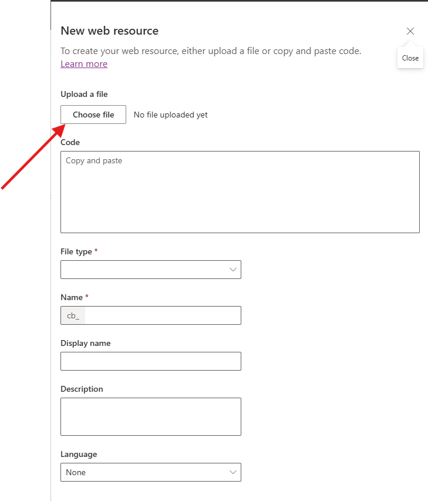


### On the **Display** tab

10. Click on the **Display** tab and verify that the **Scale to fit** option is set to **Off** (Ensures responsive layout).


11. Optional: Scroll down to enable *multiple screens* if you would like to have more than one page. Can be used for navigation purposes, admin screens or other use cases where screen contents should be separated.

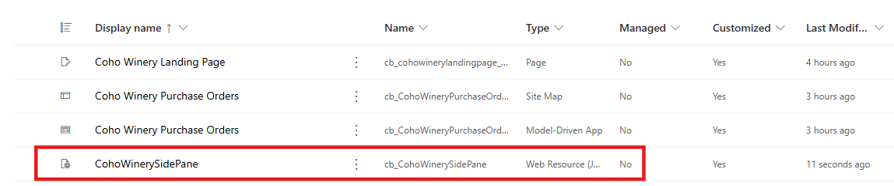


### Optional: On the **Updates** tab

12. Click the **Updates** tab 
13. Enable *Modern Controls and Themes* 
14. Click on **Close** when you are finished.

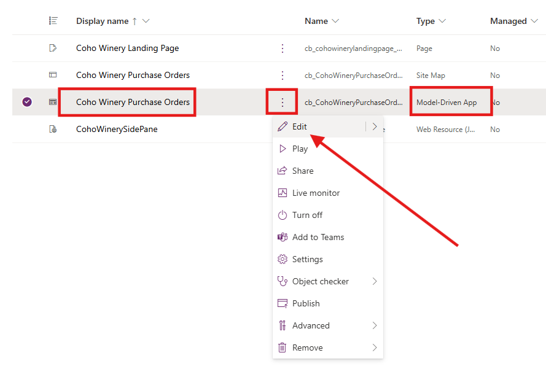

15. On the canvas designer, select **Play mode** by clicking the Play icon in the upper right corner to preview the page


*You should be able to see that the page width and height expands according to your screen*

15. On the canvas designer, click the **Publish** icon in the upper right corner


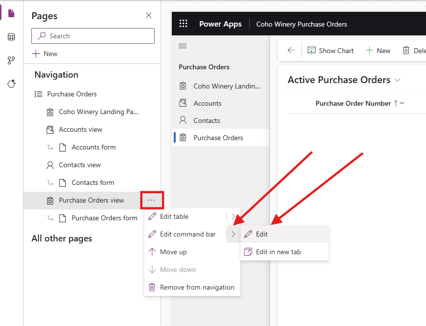

9. Once the page has saved and published, click on **Back** and then **Leave** to return to the solution.


10. Verify that the **Coho Winery Landing Page** is listed in the solution. The new component should be of type **Page**.


11. Keep the **Coho Winery PP Solution** solution open, as we will continue to work on it in the next exercise.


**Exercise 1 completed✅** 


## ✍️ Exercise 2: Build a Responsive Layout

Our goal is to ensure that our new **Coho Winery Landing Page** looks great, regardless of the screen size where it's being rendered, by understanding [containers](https://learn.microsoft.com/en-us/power-apps/maker/canvas-apps/controls/control-container). We will use a combination of vertical and horizontal containers to create a flexible layout that will adapt accordingly.

### Preparation
1. You should still be in the **Coho Winery** solution from Exercise 1. If not, navigate back to it.
2. Open the **Coho Winery Landing Page** by selecting it from the list of components in the solution.
3. Update name of screen1 to *MainScreen* by clicking twice on **screen1** in the **Tree view** on the left side


4. On the canvas designer, select the **Insert** tab in the ribbon, expand **Layout** and then select **Vertical container**.


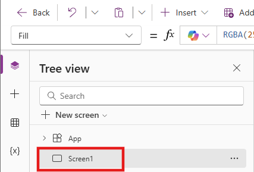

5. A new vertical container will be added to the screen. Rename it to **cntMainVertical** by selecting the container in the **Tree view** pane and clicking twice

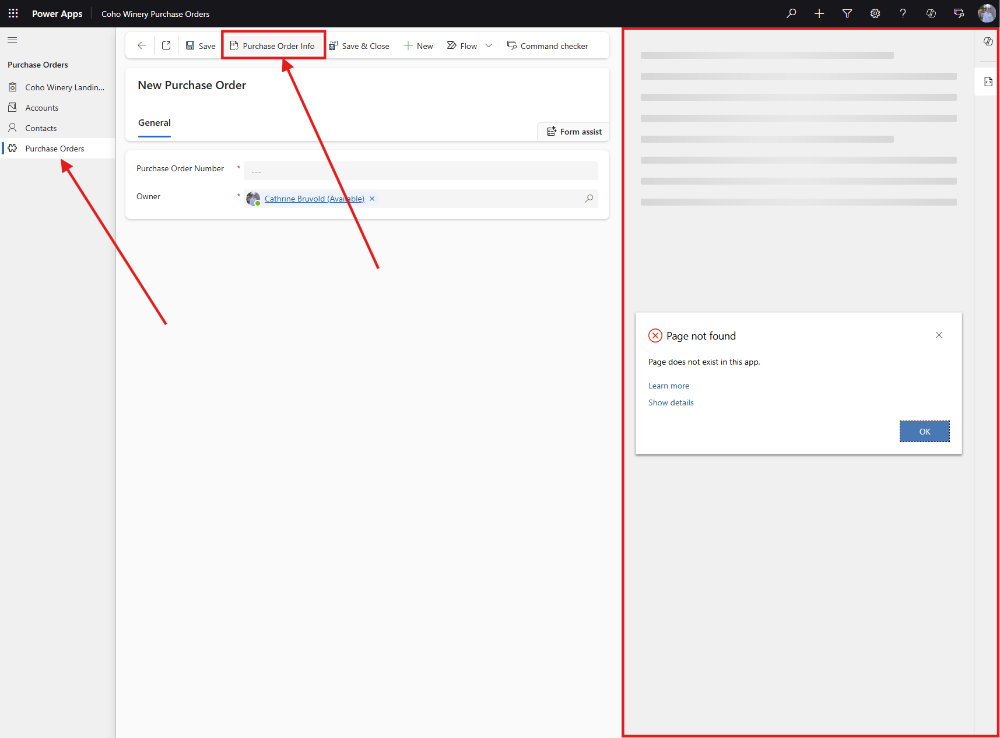

6. Select the container **cntMainVertical** and update the **X**, **Y**, **Width** and **Height** properties to dynamic values listed below:

<pre> Power Fx 
X: (Parent.Width - Self.Width) / 2
Y: (Parent.Height - Self.Height) / 2
Width: Parent.Width-(Parent.Width*0.05)
Height: Parent.Height-(Parent.Height*0.05)
</pre>


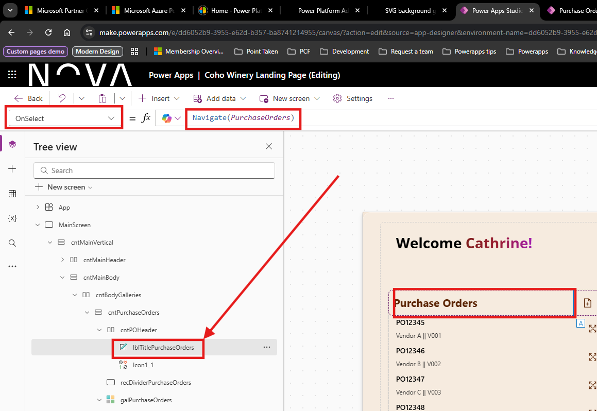

7. Insert a Horizontal container within *cntMainVertical* by clicking on *cntMainVertical*, select the **Insert** tab in the ribbon, expand **Layout** and then select **Horizontal container**. Rename it to **cntMainHeader**
8. Insert a Vertical container within *cntMainHeader*. Rename it to *cntHeaderVertical*.
9. Insert a Vertical container within *cntMainVertical*. Rename it to **cntMainBody** - should be below the *cntMainHeader*

> [!TIP]
> You can rename any control by either double clicking it, or clicking on the elipses (...) next to the control name and selecting **Rename**.

Your Tree view should look something like the picture below:


10. With **cntMainBody** selected, insert a **Horizontal container**. Rename it **cntBodyGalleries**

Configure cntBodyGalleries to behave like a responsive 3-column row:

<pre>Power Fx 
LayoutDirection: LayoutDirection.Horizontal 
LayoutGap: 12 
PaddingLeft: 8 
PaddingRight: 8 
PaddingTop: 4 
PaddingBottom: 4 // Let the row take all remaining height 
FillPortions: 1 // Responsive behavior 
LayoutWrap: true // allows columns to wrap on narrow widths 
</pre>

11. Insert three *Vertical containers* inside **cntBodyGalleries** and rename them:

<Pre>
cntPurchaseOrders

cntMyPurchaseOrders

cntPurchaseOrderDueDate
</pre>

Set the same properties on each of the three column containers so they share space evenly and stretch:
// Apply to: cntPurchaseOrders, cntMyPurchaseOrders, cntPurchaseOrderDueDate 

<pre> Power Fx 

FillPortions: 1 // equal width columns 
LayoutDirection: LayoutDirection.Vertical 
LayoutGap: 8 
PaddingLeft: 10 
PaddingRight: 10 
PaddingTop: 8 
PaddingBottom: 8 
AlignInContainer: AlignInContainer.Stretch 
LayoutAlignItems: LayoutAlignItems.Stretch 
LayoutMinWidth: 260 // lets them wrap on narrow screens </pre>

12. Verify that your **Tree view** looks like somthing like this:


13. In **Tree view**, select **cntPurchaseOrders**. Go to **Insert** → **Layout** → **Horizontal** container and rename it **cntPOHeader**.

With **cntPOHeader** selected, set these properties:

<pre>Power Fx 
DropShadow: DropShadow.None 
FillPortions: 0 
Height: 50 
LayoutDirection: LayoutDirection.Horizontal 
LayoutGap: 3 
LayoutJustifyContent: LayoutJustifyContent.SpaceBetween 
LayoutMinHeight: 30 
PaddingLeft: 10 
PaddingRight: 10 </pre>

14. Inside **cntPOHeader**, insert a Label by selecting **+ Insert**, searching for "label" and selecting **Label**. Rename it to **lblTitlePurchaseOrders** and set:

<pre>Power Fx 
AlignInContainer: AlignInContainer.Stretch 
Alignment: Align.Justify 
AutoHeight: true 
Color: RGBA(92, 37, 4, 1) 
FillPortions: 1 
FontSize: 16 
FontWeight: FontWeight.Bold 
LayoutMinWidth: 100 
Text: "Purchase Orders" 
TextRole: 'Label.TextRole'.Heading2 
Wrap: false </pre>


15. Still in **cntPOHeader**, insert an Icon (Classic/Icon) -> **Add Document**. Rename it **icnAddDocument**. 


16. Set properties of the added *Document Icon*:

<pre>Power Fx 
Color: RGBA(92, 37, 4, 1) 
Height: Parent.Height 
HoverColor: ColorFade(Self.Color, -30%) 
HoverFill: RGBA(0,0,0,0) 
Icon: Icon.AddDocument 
LayoutMinHeight: Parent.Height 
PaddingBottom: 15 
PaddingLeft: 15 
PaddingRight: 15 
PaddingTop: 15 
PressedBorderColor: RGBA(0,0,0,0) 
PressedColor: ColorFade(Self.Color, -30%) 
PressedFill: RGBA(0,0,0,0) 
Width: 50 
// Use either A or B below for OnSelect // 
A) If you have a Named Formula nfcolPurchaseOrders: 
OnSelect: ClearCollect(colPurchaseOrders, nfcolPurchaseOrders) 
// B) If not, seed dummy data quickly: 
OnSelect: ClearCollect( colPurchaseOrders, Table( { poNumber:"PO-1001", vendorName:"Vintners AB", vendorId:"V001", LastModified: Now()-Time(1,0,0) }, { poNumber:"PO-1002", vendorName:"GrapeWorks", vendorId:"GW02", LastModified: Now()-Time(0,45,0) }, { poNumber:"PO-1003", vendorName:"Oak & Co", vendorId:"OK03", LastModified: Now()-Time(0,12,0) } ) ) </pre>

17. With **cntPurchaseOrders** selected, insert a Rectangle and rename it recDividerPurchaseOrders. 

18. Set rectangle divider properties:

<pre>Power Fx 
AlignInContainer: AlignInContainer.Stretch 
BorderColor: RGBA(166,166,166,1) 
BorderStyle: BorderStyle.None 
DisabledFill: RGBA(166,166,166,1) 
Fill: RGBA(245,245,245,1) 
FocusedBorderColor: RGBA(0,120,212,1) 
Height: 1 
HoverFill: RGBA(0,120,212,1) 
PressedFill: RGBA(0,120,212,1) </pre>

19. Insert a **Vertical Gallery** from **+ Insert**, search for gallery and select **Vertical gallery**, inside **cntPurchaseOrders**. Rename it galPurchaseOrders and set:

<pre>Power Fx 
BorderColor: RGBA(166,166,166,1) 
FocusedBorderColor: RGBA(0,120,212,1) 
FocusedBorderThickness: 2 
Items: colPurchaseOrders 
LayoutMinWidth: Parent.Width 
TemplateSize: 55 
Transition: Transition.Pop // optional: bubble selection to item container 
OnSelect: Select(Parent) </pre>

20. Inside **galPurchaseOrders**, insert a **Horizontal container** and rename it **cntGalleryPOHorizontal**. 

21. Set container properties for **cntGalleryPOHorizontal**:

<pre>Power Fx 
DropShadow: DropShadow.None 
Height: 48 
LayoutDirection: LayoutDirection.Horizontal 
LayoutJustifyContent: LayoutJustifyContent.SpaceBetween 
Width: Parent.Width </pre>

22. Inside **cntGalleryPOHorizontal**, insert a Vertical container and rename it **cntGalleryPOVertical**. 

23. Set **cntGalleryPOVertical** containter properties:

<pre>Power Fx 
DropShadow: DropShadow.None 
Height: 48 
LayoutDirection: LayoutDirection.Vertical 
LayoutMinHeight: Parent.Height 
PaddingLeft: 15 
PaddingRight: 10 
Flexible Width: true </pre>

24. Inside **cntGalleryPOVertical**, insert a **Label** and rename it **lblPurchaseOrderNumber**. Then insert another Label and rename it **lblPOVendorInfo**. 
25. Set their properties:

<pre>Power Fx  
**lblPurchaseOrderNumber** 
AutoHeight: true 
Color: RGBA(0,0,0,1) 
FillPortions: 1 
FontWeight: FontWeight.Semibold 
Height: 24 
LayoutMinHeight: Parent.Height/2 
TabIndex: -1 
Text: ThisItem.poNumber 
VerticalAlignment: VerticalAlign.Middle 
Width: 344 
Wrap: false 
X: 22

**lblPOVendorInfo**
 FillPortions: 1 
 FontSize: 9 
 FontWeight: FontWeight.Normal 
 Height: 28 
 LayoutMinHeight: Parent.Height/2 
 TabIndex: -1 
 Text: ThisItem.vendorName & " || " & ThisItem.vendorId 
 VerticalAlignment: VerticalAlign.Top 
 Width: 355 
 X: 5 
 Y: 20 
 </pre>

Back in Container7, insert an Icon (Classic/Icon), rename it Icon1_2, and set:

<pre>Power Fx AlignInContainer: AlignInContainer.Stretch BorderColor: RGBA(0,0,0,0) Color: RGBA(92, 37, 4, 1) DisabledColor: RGBA(220,220,220,1) DisabledFill: RGBA(0,0,0,0) Height: 32 HoverBorderColor: RGBA(0,0,0,0) HoverColor: ColorFade(Self.Color, -30%) HoverFill: RGBA(0,0,0,0) Icon: Icon.ThumbsDown LayoutMinHeight: Parent.Height PaddingBottom: 15 PaddingLeft: 15 PaddingRight: 15 PaddingTop: 15 PressedBorderColor: RGBA(0,0,0,0) PressedColor: ColorFade(RGBA(0,120,212,1), -30%) PressedFill: RGBA(0,0,0,0) Width: 50 </pre>

Test it: Select Icon1_1 to load the sample data (or use your nfcolPurchaseOrders). You should see rows like:

PO-1001 — Vintners AB || V001

PO-1002 — GrapeWorks || GW02

PO-1003 — Oak & Co || OK03

> ### 💡 CONTAINER PROPERTIES
> The difficult part when working with responsive layouts are the different properties and making sure you have selected the correct nested container.  
> 
> You can always adjust the direction of the container after adding it to a screen. The other main properties you will be looking at are **X**, **Y**, **Width** and **Height**. These decide the placement, alignment and the size which makes them resize according to the user screen.
>
 


### Build the header
We are now adding text and a welcome message to the user, as well as adding the Coho Winery Logo to the page

1. Select **App** -> **Formulas** on the right side in the **Tree View**
2. Create *Named formulas* capturing the font used for the title and the background color by setting this formula: 

<Pre> Power Fx
nfFont = "Inter, Open Sans";
nfBackgroundColor = "#f4e6d7";
</pre>


> [!TIP]
> When working with Named Formulas, remember to always end each formula with semicolon ;

3. Select the **cntHeaderVertical** on level 3 of the **cntMainVertical**
4. Adjust the **Height** property of **cntHeaderVertical** to **100**

   - Ensure that the flexible height is **Off**

    

5. Insert an HTMLtext control by selecting **+ Insert**, searching for **html** and clicking on **HTML text**


6. Rename the htmlText to **htmlHeaderTitle** 
7. Select **Font** on the properties of the **htmlHeaderTitle** and set the formula to the Named Formula from step 2 - **nfFont**

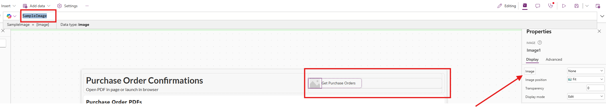

8. Set the **HTML text value** located on the properties on the right to:

``` HTML
$"<div style='font-size: 28px; font-family: Inter, Open Sans; font-weight: bold; color: black;'> 
  <!-- Welcome text stays black -->
  Welcome 
  
  <a style='font-size: 28px; font-family: Inter, Open Sans; font-weight: bold; 
            /* Grape gradient for name */
            background: linear-gradient(90deg, 
              #7f1d1d,  /* Deep red (Cabernet) */
              #9b1c31,  /* Wine red */
              #a21caf  /* Dark magenta */
            ); 
            -webkit-background-clip: text; 
            -webkit-text-fill-color: transparent;'> 
    {  First(Split(User().FullName," ")).Value }! 
  </a> 
</div>"

```


9. Select the **cntMainHeader** in the **Tree view**, click on **+ Insert** on the ribbon and serach for **image**
10. Click on the **Image** control under **Media**


11. You should now be able to see the image control next to the HTML text control, on the right side of the container.
12. Select the image control and set the Height property to: 

<pre> Power Fx
Height: Parent.Height
</pre>

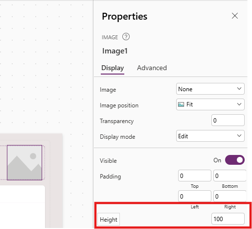

This ensures the image always is resized accourding to the parent container height. 

13. Add logo as media if it's not already by selecting the image control, clicking on the **Image** dropdown and **Upload** - Use the image downloaded from earlier.


14. Add galleries with Purchase Order data. Select the **cntMainBody** and paste the YAML:

<pre> Canvas YAML
- Container2:
    Control: GroupContainer@1.3.0
    Variant: AutoLayout
    Properties:
      LayoutDirection: =LayoutDirection.Horizontal
    Children:
      - Container1:
          Control: GroupContainer@1.3.0
          Variant: AutoLayout
          Properties:
            LayoutDirection: =LayoutDirection.Vertical
          Children:
            - Container3_1:
                Control: GroupContainer@1.3.0
                Variant: AutoLayout
                Properties:
                  DropShadow: =DropShadow.None
                  FillPortions: =0
                  Height: =50
                  LayoutDirection: =LayoutDirection.Horizontal
                  LayoutGap: =3
                  LayoutJustifyContent: =LayoutJustifyContent.SpaceBetween
                  LayoutMinHeight: =30
                  PaddingLeft: =10
                  PaddingRight: =10
                Children:
                  - Label2_5:
                      Control: FluentV8/Label@1.8.6
                      Properties:
                        AlignInContainer: =AlignInContainer.Stretch
                        Alignment: =Align.Justify
                        AutoHeight: =true
                        Color: =RGBA(92, 37, 4, 1)
                        FillPortions: =1
                        FontSize: =16
                        FontWeight: =FontWeight.Bold
                        LayoutMinWidth: =100
                        Text: ="Purchase Orders"
                        TextRole: ='Label.TextRole'.Heading2
                        Wrap: =false
                  - Icon1_1:
                      Control: Classic/Icon@2.5.0
                      Properties:
                        AlignInContainer: =AlignInContainer.Stretch
                        BorderColor: =RGBA(0, 0, 0, 0)
                        Color: =RGBA(92, 37, 4, 1)
                        DisabledColor: =RGBA(220, 220, 220, 1)
                        DisabledFill: =RGBA(0, 0, 0, 0)
                        Height: =32
                        HoverBorderColor: =RGBA(0, 0, 0, 0)
                        HoverColor: =ColorFade(RGBA(0, 120, 212, 1), -30%)
                        HoverFill: =RGBA(0, 0, 0, 0)
                        Icon: =Icon.AddDocument
                        LayoutMinHeight: =Parent.Height
                        OnSelect: =ClearCollect(colPurchaseOrders,nfcolPurchaseOrders)
                        PaddingBottom: =15
                        PaddingLeft: =15
                        PaddingRight: =15
                        PaddingTop: =15
                        PressedBorderColor: =RGBA(0, 0, 0, 0)
                        PressedColor: =ColorFade(RGBA(0, 120, 212, 1), -30%)
                        PressedFill: =RGBA(0, 0, 0, 0)
                        Width: =50
            - Rectangle4:
                Control: Rectangle@2.3.0
                Properties:
                  AlignInContainer: =AlignInContainer.Stretch
                  BorderColor: =RGBA(166, 166, 166, 1)
                  BorderStyle: =BorderStyle.None
                  DisabledFill: =RGBA(166, 166, 166, 1)
                  Fill: =RGBA(245, 245, 245, 1)
                  FocusedBorderColor: =RGBA(0, 120, 212, 1)
                  Height: =1
                  HoverFill: =RGBA(0, 120, 212, 1)
                  PressedFill: =RGBA(0, 120, 212, 1)
            - Gallery1:
                Control: Gallery@2.15.0
                Variant: BrowseLayout_Vertical_TwoTextVariant_pcfCore
                Properties:
                  BorderColor: =RGBA(166, 166, 166, 1)
                  FocusedBorderColor: =RGBA(0, 120, 212, 1)
                  FocusedBorderThickness: =2
                  Items: =colPurchaseOrders
                  LayoutMinWidth: =Parent.Width
                  OnSelect: =Navigate('Sessions (Views)'.Sessions)
                  TemplateSize: =55
                  Transition: =Transition.Pop
                Children:
                  - Container7:
                      Control: GroupContainer@1.3.0
                      Variant: AutoLayout
                      Properties:
                        DropShadow: =DropShadow.None
                        Height: =48
                        LayoutDirection: =LayoutDirection.Horizontal
                        LayoutJustifyContent: =LayoutJustifyContent.SpaceBetween
                        Width: =Parent.Width
                      Children:
                        - Container6:
                            Control: GroupContainer@1.3.0
                            Variant: AutoLayout
                            Properties:
                              DropShadow: =DropShadow.None
                              Height: =48
                              LayoutDirection: =LayoutDirection.Vertical
                              LayoutMinHeight: =Parent.Height
                              PaddingLeft: =15
                              PaddingRight: =10
                              Width: =422
                            Children:
                              - Title3_1:
                                  Control: FluentV8/Label@1.8.6
                                  Properties:
                                    AutoHeight: =true
                                    Color: =RGBA(0, 0, 0, 1)
                                    FillPortions: =1
                                    FontWeight: =FontWeight.Semibold
                                    Height: =24
                                    LayoutMinHeight: =Parent.Height/2
                                    OnSelect: =//Navigate('Sessions (Views)'.Sessions)
                                    TabIndex: =-1
                                    Text: =ThisItem.poNumber
                                    VerticalAlignment: =VerticalAlign.Middle
                                    Width: =344
                                    Wrap: =false
                                    X: =22
                                    Y: =
                              - Subtitle3_1:
                                  Control: FluentV8/Label@1.8.6
                                  Properties:
                                    FillPortions: =1
                                    FontSize: =9
                                    FontWeight: =FontWeight.Normal
                                    Height: =28
                                    LayoutMinHeight: =Parent.Height/2
                                    OnSelect: =//Navigate('Sessions (Views)'.Sessions)
                                    TabIndex: =-1
                                    Text: =ThisItem.vendorName & " || " & ThisItem.vendorId
                                    VerticalAlignment: =VerticalAlign.Top
                                    Width: =355
                                    X: =5
                                    Y: =20
                        - Icon1_2:
                            Control: Classic/Icon@2.5.0
                            Properties:
                              AlignInContainer: =AlignInContainer.Stretch
                              BorderColor: =RGBA(0, 0, 0, 0)
                              Color: =RGBA(92, 37, 4, 1)
                              DisabledColor: =RGBA(220, 220, 220, 1)
                              DisabledFill: =RGBA(0, 0, 0, 0)
                              Height: =32
                              HoverBorderColor: =RGBA(0, 0, 0, 0)
                              HoverColor: =ColorFade(Self.Color, -30%)
                              HoverFill: =RGBA(0, 0, 0, 0)
                              Icon: =Icon.ThumbsDown
                              LayoutMinHeight: =Parent.Height
                              OnSelect: =//Remove('Attendee sessions',ThisItem)
                              PaddingBottom: =15
                              PaddingLeft: =15
                              PaddingRight: =15
                              PaddingTop: =15
                              PressedBorderColor: =RGBA(0, 0, 0, 0)
                              PressedColor: =ColorFade(RGBA(0, 120, 212, 1), -30%)
                              PressedFill: =RGBA(0, 0, 0, 0)
                              Width: =50
      - Container1_1:
          Control: GroupContainer@1.3.0
          Variant: AutoLayout
          Properties:
            LayoutDirection: =LayoutDirection.Vertical
          Children:
            - Container3:
                Control: GroupContainer@1.3.0
                Variant: AutoLayout
                Properties:
                  DropShadow: =DropShadow.None
                  FillPortions: =0
                  Height: =50
                  LayoutDirection: =LayoutDirection.Horizontal
                  LayoutGap: =3
                  LayoutJustifyContent: =LayoutJustifyContent.SpaceBetween
                  LayoutMinHeight: =30
                  PaddingLeft: =10
                  PaddingRight: =10
                Children:
                  - Label2_3:
                      Control: FluentV8/Label@1.8.6
                      Properties:
                        AlignInContainer: =AlignInContainer.Stretch
                        Alignment: =Align.Justify
                        AutoHeight: =true
                        Color: =RGBA(92, 37, 4, 1)
                        FillPortions: =1
                        FontSize: =16
                        FontWeight: =FontWeight.Bold
                        LayoutMinWidth: =100
                        Text: ="My orders"
                        TextRole: ='Label.TextRole'.Heading2
                        Wrap: =false
                  - Icon1:
                      Control: Classic/Icon@2.5.0
                      Properties:
                        AlignInContainer: =AlignInContainer.Stretch
                        BorderColor: =RGBA(0, 0, 0, 0)
                        Color: =RGBA(0, 60, 106, 1)
                        DisabledColor: =RGBA(220, 220, 220, 1)
                        DisabledFill: =RGBA(0, 0, 0, 0)
                        Height: =32
                        HoverBorderColor: =RGBA(0, 0, 0, 0)
                        HoverColor: =ColorFade(RGBA(0, 120, 212, 1), -30%)
                        HoverFill: =RGBA(0, 0, 0, 0)
                        Icon: =Icon.Add
                        LayoutMinHeight: =Parent.Height
                        OnSelect: =//Navigate(Defaults('Session Feedbacks'))
                        PaddingBottom: =15
                        PaddingLeft: =15
                        PaddingRight: =15
                        PaddingTop: =15
                        PressedBorderColor: =RGBA(0, 0, 0, 0)
                        PressedColor: =ColorFade(RGBA(0, 120, 212, 1), -30%)
                        PressedFill: =RGBA(0, 0, 0, 0)
                        Width: =50
            - Rectangle4_1:
                Control: Rectangle@2.3.0
                Properties:
                  AlignInContainer: =AlignInContainer.Stretch
                  BorderColor: =RGBA(166, 166, 166, 1)
                  BorderStyle: =BorderStyle.None
                  DisabledFill: =RGBA(166, 166, 166, 1)
                  Fill: =RGBA(245, 245, 245, 1)
                  FocusedBorderColor: =RGBA(0, 120, 212, 1)
                  Height: =1
                  HoverFill: =RGBA(0, 120, 212, 1)
                  PressedFill: =RGBA(0, 120, 212, 1)
            - Gallery1_2:
                Control: Gallery@2.15.0
                Variant: BrowseLayout_Vertical_TwoTextVariant_pcfCore
                Properties:
                  BorderColor: =RGBA(166, 166, 166, 1)
                  FocusedBorderColor: =RGBA(0, 120, 212, 1)
                  FocusedBorderThickness: =2
                  Items: |+
                    =colPurchaseOrders
                  LayoutMinWidth: =Parent.Width
                  OnSelect: |-
                    =Navigate(
                        Gallery1_2.Selected,
                        {Page: 'Session Feedbacks (Forms)'.Information}
                    )
                  Transition: =Transition.Pop
                Children:
                  - Container5:
                      Control: GroupContainer@1.3.0
                      Variant: AutoLayout
                      Properties:
                        DropShadow: =DropShadow.None
                        Height: =48
                        LayoutAlignItems: =LayoutAlignItems.Stretch
                        LayoutDirection: =LayoutDirection.Horizontal
                        LayoutGap: =2
                        LayoutJustifyContent: =LayoutJustifyContent.SpaceBetween
                        PaddingLeft: =15
                        PaddingRight: =10
                        Width: =Parent.Width
                      Children:
                        - Title2_4:
                            Control: FluentV8/Label@1.8.6
                            Properties:
                              Color: =RGBA(0, 0, 0, 1)
                              FontWeight: =FontWeight.Semibold
                              Height: =37
                              OnSelect: |-
                                =/*Navigate(
                                    Gallery1_2.Selected,
                                    {Page: 'Session Feedbacks (Forms)'.Information}
                                )*/
                              TabIndex: =-1
                              Text: =ThisItem.poNumber
                              Tooltip: =//ThisItem.'Feedback Text'
                              VerticalAlignment: =VerticalAlign.Middle
                              Width: =257
                              Wrap: =false
                              X: =15
                              Y: =9
      - Container1_2:
          Control: GroupContainer@1.3.0
          Variant: AutoLayout
          Properties:
            LayoutDirection: =LayoutDirection.Vertical
          Children:
            - Label2_4:
                Control: FluentV8/Label@1.8.6
                Properties:
                  AlignInContainer: =AlignInContainer.Stretch
                  Alignment: =Align.Left
                  Color: =RGBA(92, 37, 4, 1)
                  FontSize: =16
                  FontWeight: =FontWeight.Bold
                  Height: =50
                  PaddingStart: =8
                  Text: ="Purchase Orders Due"
                  TextRole: ='Label.TextRole'.Heading2
            - Rectangle4_2:
                Control: Rectangle@2.3.0
                Properties:
                  AlignInContainer: =AlignInContainer.Stretch
                  BorderColor: =RGBA(166, 166, 166, 1)
                  BorderStyle: =BorderStyle.None
                  DisabledFill: =RGBA(166, 166, 166, 1)
                  Fill: =RGBA(245, 245, 245, 1)
                  FocusedBorderColor: =RGBA(0, 120, 212, 1)
                  Height: =1
                  HoverFill: =RGBA(0, 120, 212, 1)
                  PressedFill: =RGBA(0, 120, 212, 1)
            - Gallery1_1:
                Control: Gallery@2.15.0
                Variant: BrowseLayout_Vertical_TwoTextVariant_pcfCore
                Properties:
                  BorderColor: =RGBA(166, 166, 166, 1)
                  FocusedBorderColor: =RGBA(0, 120, 212, 1)
                  FocusedBorderThickness: =2
                  Items: =colPurchaseOrders
                  LayoutMinWidth: =Parent.Width
                  OnSelect: =Navigate(LookUp(Sessions,Sessions=ThisItem.'Session title'.Sessions))
                  Transition: =Transition.Pop
                Children:
                  - Container4:
                      Control: GroupContainer@1.3.0
                      Variant: AutoLayout
                      Properties:
                        DropShadow: =DropShadow.None
                        Height: =48
                        LayoutDirection: =LayoutDirection.Horizontal
                        LayoutJustifyContent: =LayoutJustifyContent.SpaceBetween
                        LayoutWrap: =true
                        PaddingLeft: =15
                        PaddingRight: =10
                        Width: =Parent.Width
                      Children:
                        - Title2_2:
                            Control: FluentV8/Label@1.8.6
                            Properties:
                              AlignInContainer: =AlignInContainer.Stretch
                              Color: =If(Now()>ThisItem.LastModified,Color.DarkGray,Color.Black)
                              FillPortions: =1
                              FontWeight: =FontWeight.Semibold
                              Height: =48
                              LayoutMinWidth: =200
                              OnSelect: |-
                                =/*Navigate(
                                    LookUp(
                                        Sessions,
                                        Sessions = ThisItem.'Session title'.Sessions
                                    )
                                )*/
                              TabIndex: =-1
                              Text: =ThisItem.poNumber
                              VerticalAlignment: =VerticalAlign.Middle
                              Width: =306
                              X: =67
                        - Subtitle2_1:
                            Control: FluentV8/Label@1.8.6
                            Properties:
                              Color: =//If(Now()>ThisItem.Time,Color.DarkGray,Color.Black)
                              FillPortions: =1
                              FontSize: =10
                              FontWeight: =FontWeight.Bold
                              Height: =48
                              OnSelect: =//Navigate(LookUp(Sessions,Sessions=ThisItem.'Session title'.Sessions))
                              TabIndex: =-1
                              Text: =Text(ThisItem.LastModified, "DD.MM.YYYY","en-GB")
                              VerticalAlignment: =VerticalAlign.Middle
                              Width: =46
                              X: =16
                        - Icon1_3:
                            Control: Classic/Icon@2.5.0
                            Properties:
                              BorderColor: =RGBA(0, 0, 0, 0)
                              Color: =RGBA(0, 60, 106, 1)
                              DisabledColor: =RGBA(220, 220, 220, 1)
                              DisabledFill: =RGBA(0, 0, 0, 0)
                              Height: =48
                              HoverBorderColor: =RGBA(0, 0, 0, 0)
                              HoverColor: =ColorFade(Self.Color, -30%)
                              HoverFill: =RGBA(0, 0, 0, 0)
                              Icon: =Icon.Heart
                              OnSelect: =//Patch('Attendee sessions',Defaults('Attendee sessions'),{Session:ThisItem.'Session title'})
                              PaddingBottom: =15
                              PaddingLeft: =15
                              PaddingRight: =15
                              PaddingTop: =15
                              PressedBorderColor: =RGBA(0, 0, 0, 0)
                              PressedColor: =ColorFade(RGBA(0, 120, 212, 1), -30%)
                              PressedFill: =RGBA(0, 0, 0, 0)
                              Visible: "=//IsBlank(LookUp(Gallery1.AllItems,Session.'Session title'=ThisItem.'Session title'.'Session title'))\r\n// !(Now()>ThisItem.Time) Or "
                              Width: =48
                              X: =369
                        - Title2_3:
                            Control: FluentV8/Label@1.8.6
                            Properties:
                              Color: =Color.DarkMagenta
                              FillPortions: =1
                              FontWeight: =FontWeight.Semibold
                              Height: =48
                              LayoutMinWidth: =20
                              OnSelect: =
                              TabIndex: =-1
                              Text: ="Ongoing"
                              VerticalAlignment: =VerticalAlign.Middle
                              Visible: =//Now()>=ThisItem.Time && Now()<=ThisItem.Time
                              Width: =306
                              X: =67
                        - Icon1_4:
                            Control: Classic/Icon@2.5.0
                            Properties:
                              BorderColor: =RGBA(0, 0, 0, 0)
                              Color: =RGBA(109, 49, 162, 1)
                              DisabledColor: =RGBA(220, 220, 220, 1)
                              DisabledFill: =RGBA(0, 0, 0, 0)
                              Height: =48
                              HoverBorderColor: =RGBA(0, 0, 0, 0)
                              HoverColor: =ColorFade(Self.Color, -30%)
                              HoverFill: =RGBA(0, 0, 0, 0)
                              Icon: =Icon.Draw
                              OnSelect: =//Navigate(Patch(Defaults('Session Feedbacks'),{Session:ThisItem.'Session title'}))
                              PaddingBottom: =15
                              PaddingLeft: =15
                              PaddingRight: =15
                              PaddingTop: =15
                              PressedBorderColor: =RGBA(0, 0, 0, 0)
                              PressedColor: =ColorFade(RGBA(0, 120, 212, 1), -30%)
                              PressedFill: =RGBA(0, 0, 0, 0)
                              Visible: =//IsBlank(LookUp(Gallery1_2.AllItems,Session.'Session title'=ThisItem.'Session title'.'Session title'))
                              Width: =48
                              X: =369
</pre>

<!-- This is hidden in the rendered page, but anyone can view the source 

// 5. Name it cntHeaderHorizontal and adjust the Width to:


5. With the **cntMainVertical** container selected, set the following Power Fx formulas in the **Properties** dropdown to center it on the screen. The formulas will also ensure the main container remains aligned whenever the screen size is adjusted:
- **X**: `(Parent.Width - Self.Width) / 2`
- **Y**: `(Parent.Height - Self.Height) / 2`

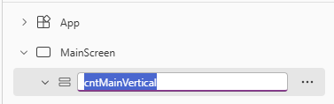


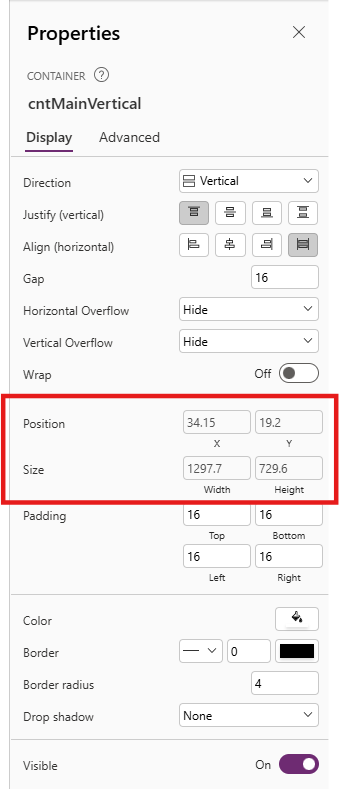

6. With the **cntMainVertical** container still selected, insert a new **Horizontal container** inside it by clicking the **+** icon in the container, expanding **Layout** and then selecting **Horizontal container**.


7. Rename the new horizontal container to **cntHeaderHorizontal** in the **Tree view** pane.


8. With the **cntHeaderHorizontal** container selected, set the following Power Fx formula in the **Properties** dropdown to ensure the width of the second container always reflects the size of the Parent **cntMainVertical** container's width:
- **Width**: `Parent.Width`


9. In the cntHeaderHorizontal container, insert another
10. Nest horizontal containers within the main container
11. Create the navigation bar

-->


## ✍️ Exercise 4: Styling 


1. On the properties of **MainScreen** on the right side, click on the *paint bucket* for the background Fill 


2. Click on **Custom** and update HEX value to **f4e6d7** OR click on **Fill** and set the formula to:

<Pre> Power Fx
Fill: ColorValue(nfBackgroundColor)
</pre>


**Ideas:** 
- Add rounded corners to controls, containers and visuals for a modern look (between 5-10 border radius)
- Set a light drop shadow 

- Add effects that provides depth and custom design to your apps aligning with your brand


**4a: Add HTML background:**

1. Insert HTMLtext control and right click to Reorder ->  **Send to Back**


2. Edit HTML text value to be:

``` HTML 

$"<div style='
width: {Parent.Width}px;
height: {Parent.Height}px;
padding: 0px 0px;
background: linear-gradient(135deg, #f4e6d7 0%, #e8d5c4 100%);
box-sizing: border-box;
overflow: hidden;
display: flex;
flex-direction: column;
justify-content: center;
align-items: center;
position: relative;
'>

<div style='text-align: center; position: relative; z-index: 2;'>
<h1 style='font-size: 2.5rem; color: rgba(44, 24, 16, 0.15); margin-bottom: 5px; font-family: Georgia, serif;'>Coho Winery</h1>
<p style='color: rgba(139, 69, 19, 0.12); font-size: 1rem; font-style: italic; font-family: Georgia, serif; letter-spacing: 2px; font-weight: 300; margin-bottom: 15px;'>est. 2025</p>
<p style='color: rgba(44, 24, 16, 0.13); font-size: 1.3rem; font-family: Georgia, serif; font-weight: 400; letter-spacing: 1px;'>Excellent Wine & Excellent Taste</p>
</div>

</div>"

```

**Note** 
*When creating the HTML code for Power Apps, use ' instead of " in the string, or else it wont work*


3. Set Width and Height to adjust according to screen size:

<pre> Power Fx 
Width: Parent.Width
Height: Parent.Height
</pre>

4. Set X and Y properties to control starting point of the control:

<pre> Power Fx 
X: 0
Y: 0
</pre>

6. Set Padding to (this avoids gaps between the content and the control box):

<pre> Power Fx 
Top: 0
Bottom: 0
Left: 0
Right:0
</pre>

5. Ensure that Automatic Height is On to avoid a scrollbar

*💡 Use $ to avoid excessive use of & as well as "" in the text, this enables you to only use {} when referring to dynamic content*

**4c: Add HTML blur to your page - Glass Morphism effect:**
1. Insert HTMLtext control
2. Edit text value to be:

``` HTML 

$" <div style='
background: rgba(255, 255, 255, 0.2); /* Solid background */
border-radius: 16px;
box-shadow: 0 4px 4px rgba(0, 0, 0, 0.1);
backdrop-filter: blur(5px);
-webkit-backdrop-filter: blur(5px);
border: 1px solid rgba(255, 255, 255, 0.3);
width: {Self.Width-2}px;
height: {Self.Height-2}px;
padding: 10px; /* Adds space inside the box */
overflow: hidden; /* Prevents scrollbars */
box-sizing: border-box; /* Ensures padding is included in width/height */
position: absolute; /* Allows absolute positioning */
top: 0; /* Aligns to the top */
left: 0; /* Aligns to the left */
color: white; /* Default text color for fallback */
font-family: Poppins, sans-serif; /* Sets the font to Poppins */
'>

```


3. Add Horizontal or vertical containers above the HTML TEXT control if you want it to be the background
4. Set Width and Height to adjust according to screen size:

<pre> Power Fx 
Width: Parent.Width
Height: Parent.Height
</pre>

5. Ensure that Automatic Height is On to avoid a scroll bar
6. Set Padding to (this avoids gaps between the content and the control box):

<pre> Power Fx 
Top: 0
Bottom: 0
Left: 0
Right:0
</pre>

*💡 Change the effect and looks of the blur on https://css.glass/*


## Exercise 5: Working with YAML
1. Copy the container you have built
2. Add it to another screen


## Exercise 6: Working with SVGs
1. Add an image control 
2. Build the SVG code (for icons Bootstrap is a great source for generating SVG code)
3. Alter the code to your needs with dynamic values using set variables


<pre> SVG code
"data:image/svg+xml," & EncodeUrl("<svg xmlns='http://www.w3.org/2000/svg' width='16' height='16' fill='" & varHexValue & "' class='bi bi-plus-lg' viewBox='0 0 16 16'>
  <path fill-rule='evenodd' d='M8 2a.5.5 0 0 1 .5.5v5h5a.5.5 0 0 1 0 1h-5v5a.5.5 0 0 1-1 0v-5h-5a.5.5 0 0 1 0-1h5v-5A.5.5 0 0 1 8 2'/>
</svg>")
</pre>

4. Use the correct encoding format for Power Apps:

<pre> Power Fx
"data:image/svg+xml," & EncodeUrl("
</pre>

## 🌟 Extra Challenges

- Add dark mode 
- Add CSS styling 
- Add SVGs for design 
- Adjust styling of the container and alignment of items


### Extra: Use templates

💡 You can start from a template when working with responsive layouts

**✅ Prerequisites** 
- Multiple screens in settings under the Display tab must be enabled to add several screens to your Coho Winery page


If you already have a new screen added, you could select **Templates** or **with Layout** to start with a responsive page


1. Click **New screen** on the ribbon and select a layout of your choosing
2. Have fun 


## ✍️ Exercise 3: Fetch Record Information
1. Add datasource (Dataverse, SharePoint etc.)
2. Select **App** in the left corner and click **Formulas**
3. Create a formula for referencing the record GUID and use the function GUID() to ensure correct type

<pre> Power Fx 
nfRecordItem =
    If(
        "," in Text(Param("recordId")),
        LookUp(Table, 'Unique GUID field' = GUID(Last(Split(Param("recordId"), ",")).Value)),
        LookUp(Table, 'Unique GUID field'  = GUID(Param("recordId")))
    ); </pre>

The record can also be wrapped in {} so that needs to be removed in some cases:

<pre> Power Fx 
GUID(Substitute(Substitute(Param("recordId"), "{", ""), "}", ""))</pre>

> **Note:** 
*Named Formulas needs to be closed using ;*

*Param() function gets the record GUID parsed from the JavaScript, and GUID() formats the output as GUID, not a string. We are also checking if there are several records selected by splitting the string after ","*

**Congratulations, you've finished Lab 2** 🥳