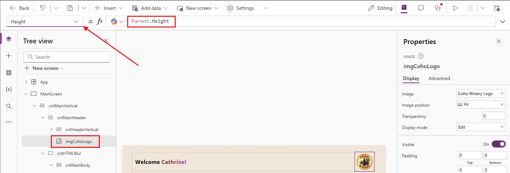
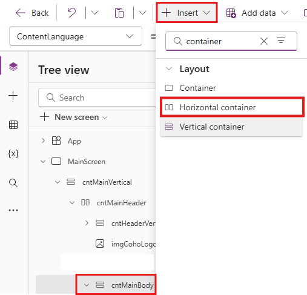
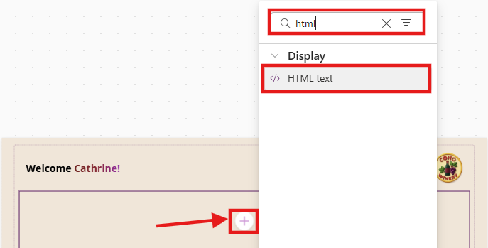
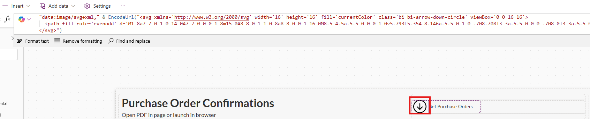

# Lab 2 - Create Beautiful Custom Pages

In this lab, you will learn how to **build** custom pages with a focus on **responsive design**, **styling** and accessing **Model-Driven App record details**

## Lab Overview 

### 🎯 Goal

- Build a custom page to use as our landing page for the Coho Winery Purchase Order application.
- Extend the newly created custom page, to show a list of Purchase Orders in a responsive gallery layout, using HTML, containers and Power Fx.
- Add responsive galleries to the custom page, to display Purchase Order data from a temporary collection; this will be replaced with real data in a later exercise.
- Build a new custom page that will act as our side pane to display PDF documents related to a Purchase Order, using the Param() function to fetch record details.
- Add modern styling elements to both custom pages like shadows, rounded corners, blur effects, and SVGs to make the experiences pop. 💥
- Replace the temporary collection with real data from the ERP API, using the custom connector created in Lab 1.

### ✅ Prerequisites

- Completion of [Lab 1 - Create a Model-Driven Power App](Lab1-CreateModelDrivenPowerApp.md)

### 💻 Scenario

Coho Winery are rolling out a new Purchase Order app to replace their manual Word-and-screenshot process. To improve the user experience, you have been asked to design two key pages: 

- **Landing Page** – a modern entry point where users can quickly navigate to key links, view PO data from the ERP system, and access important actions.
- **PO Document Side Pane** – a page that displays stored PDF versions of PO requests, giving finance and auditors instant access without leaving the app.

Together, these pages will provide both an attractive front door to the application and a practical way to view and manage PO request documents. As you build the custom page, you will be using Power Fx throughout for reusability, performance and to create a truly maintainable applications. Named Formulas and Collections will be some of the key functionality areas.

### ⌛ Length

This lab will take approximately 60–75 minutes to complete. 

## ✍️ Exercise 1: Create a Landing Page and Configure Settings

We will begin by creating the first custom **Landing Page** that will be presented to the users. This page will set the tone for the app and gives users a clear "home base" to work from as the first thing they will see when opening the **Coho Winery Purchase Order** app.

1. Navigate to the [Power Apps Maker portal](https://make.powerapps.com) and ensure you are in the **Developer** environment you created in Lab 0.
2. Select **Solutions** from the left navigation pane.


3. Select the **Coho Winery** solution you created in Lab 0.


3. In the solution, select **New** -> **App** -> **Page** from the command bar.


4. The canvas designer page will load. Click on **Settings** in the ribbon (sometimes settings will be located behind the three dots).


 
5. On the **General** tab, edit the name of the page to be **Coho Winery Landing Page** by clicking the edit pen and clicking **Save**.


6. Update the **Description** of the custom page to `Landing page for Coho Winery Purchase Order Application`
7. Download [the Coho Winery Logo](Assets/Lab2/Coho-Winery.png) from the repository and save it to your computer.
8. Back in the custom page **Settings**, click on **+ Add image** and upload the **Coho-Winery.png** image.
9. Update the **Icon Background Fill** to `#f4e6d7`


10. Scroll to verify that the **Auto save** option is set to **On** (this will give you peace of mind that no changes will be lost 🧘)


11. Click on the **Display** tab and verify that the **Scale to fit** option is set to **Off**; this will ensure we retain a responsive layout.


> [!TIP]
> At this stage, there are two (optional) settings you can enable. First, scroll down on the **Display** tab to enable **multiple screens** if you would like to have more than one page. This can be used for navigation purposes, admin screens or other use cases where screen contents should be separated. Secondly, you can click on the **Updates** tab to enable **Modern Controls and Themes**. This will give you access to the latest controls and themes in Power Apps, so that you can create experiences that fit in naturally with the look and feel of Microsoft 365. You can click on **Close** once you are finished to exit the settings.


12. On the canvas designer, select **Play mode** by clicking the Play icon in the upper right corner to preview the page. Verify that the the page width and height expands according to your screen size.


13. On the canvas designer, click the **Publish** icon in the upper right corner and then **Publish this version** to save and publish the page.


14. Once the page has saved and published, click on **Back** and then **Leave** to return to the solution.


10. Verify that the **Coho Winery Landing Page** is listed in the solution. The new component should be of type **Page**.


11. Keep the **Coho Winery PP Solution** solution open, as we will continue to work on it in the next exercise.

## ✍️ Exercise 2: Build a Responsive Layout

Our goal is to ensure that our new **Coho Winery Landing Page** looks great, regardless of the screen size where it's being rendered, by understanding [containers](https://learn.microsoft.com/en-us/power-apps/maker/canvas-apps/controls/control-container). We will use a combination of vertical and horizontal containers to create a flexible layout that will adapt accordingly.

1. You should still be in the **Coho Winery** solution from Exercise 1; if not, navigate back to it.
2. Open the **Coho Winery Landing Page** by selecting it from the list of components in the solution.
3. Change the name of **Screen1** to **MainScreen**.

> [!TIP]
> You can rename any screen or control by either double clicking it, or clicking on the elipses (...) next to the control name and selecting **Rename**.


4. We will now begin to build the layout. On the canvas designer, select the **Insert** tab in the ribbon, expand **Layout** and then select **Vertical container**.


5. A new vertical container will be added to the screen. Rename it to **cntMainVertical** by selecting the container in the **Tree view** pane and clicking twice.


6. Select the container **cntMainVertical** and update the **X**, **Y**, **Width** and **Height** properties to the dynamic values listed below. The settings can either be updated from the formula dropdown bar or from the properties pane on the right side. Keep in mind, that the labels in the properties pane differ from the formula bar, but they represent the same property.

    | Property | Formula |
    | --- | --- |
    | **X** | `(Parent.Width - Self.Width) / 2` |
    | **Y** | `(Parent.Height - Self.Height) / 2` |
    | **Width** | `Parent.Width-(Parent.Width*0.05)` |
    | **Height** | `Parent.Height-(Parent.Height*0.05)` |
    | **RadiusTopLeft** | `4` |
    | **DropShadow** | `None` |

> ### Container Properties
> You are free to adjust the design of your own containers, so if you would like to have DropShadow set and have the container showing visually, then you can choose **Light**, **Semi-Light** or any of the other options as well as adjusting the border radius to your liking. This will help you familiarise yourself with the properties. 


7. Insert a Horizontal container within *cntMainVertical* by clicking on *cntMainVertical*, selecting the **Insert** tab in the ribbon, expand **Layout** and then select **Horizontal container**. Rename it to **cntMainHeader**
8. Insert a Vertical container within *cntMainHeader*. Rename it to *cntHeaderVertical*.
9. Insert a Vertical container within *cntMainVertical*. Rename it to **cntMainBody**.
10. Adjust the properties of the **cntMainBody** control as listed below. No changes are required if the properties already match the values below:

    | Property | Formula |
    | --- | --- |
    | **Height** | `Parent.Height` |
    | **Width** | `Parent.Width` |
    | **X** | `0` |
    | **Y** | `0` |

10. Your Tree view should now resemble the below:


11. We will now build out the header, by first adding a welcome message to the user. We'll also add the Coho Winery Logo to the page. To do this, we will work with [named formulas](https://learn.microsoft.com/en-us/power-platform/power-fx/reference/object-app#formulas-property). To begin, select **App** in the **Tree View** and then select **Formulas** from the dropdown.
12. Copy and paste the following code within the formula bar to create two named formulas: one to capture the font used for the title and one for the background color.

```
nfFont = "Inter, Open Sans";
nfBackgroundColor = "#f4e6d7";
```


> [!TIP]
> When working with Named Formulas, remember to always end each formula with semicolon ;

13. Select the **cntMainHeader** container underneath **cntMainVertical**.
14. Adjust the properties of the control as listed below. No changes are required if the properties already match the values below:

    | Property | Formula |
    | --- | --- |
    | **Height** | `100` |
    | **LayoutJustifyContent** | `LayoutJustifyContent.Start` |
    | **LayoutAlignItems** | `LayoutAlignItems.Start` |
    | **FillPortions** | `0` |


14. Insert an HTML Text control within the **cntMainHeader** container by selecting **+ Insert**, searching for **html** and clicking on **HTML text**.


15. Rename the HTML Text control to **htmlHeaderTitle**. 
16. Select **Font** on the properties of the **htmlHeaderTitle** and set the formula value to the **nfFont** Named Formula created earlier.


17. Set the **HTML text value** located on the properties to the following code. This will create a welcome message with a gradient effect on the user's first name.

``` HTML
$"<div style=' 
    position:absolute; 
    inset:0;               
    display:flex; 
    align-items:center;         
    justify-content:flex-start;             
    box-sizing:border-box; 
    padding:0 8px;
    font-size:28px; 
    font-family: Inter, Open Sans, sans-serif;
    font-weight:bold; 
    color:#000;
    line-height:1.1;'> 
  <!-- Welcome text stays black -->
  <span>Welcome&nbsp;</span>
  <a style='font-size: 28px; font-family: Inter, Open Sans; font-weight: bold; 
            /* Grape gradient for name */
            background: linear-gradient(90deg, 
              #7f1d1d,  /* Deep red (Cabernet) */
              #9b1c31,  /* Wine red */
              #a21caf  /* Dark magenta */
            ); 
            -webkit-background-clip: text; 
            -webkit-text-fill-color: transparent;'> 
    {First( Split(User().FullName," ")).Value}! 
  </a> 
</div>"
```


18. Adjust the following additional properties of the **htmlHeaderTitle** control to resemble the below:

    | Property | Formula |
    | --- | --- |
    | **Height** | `Parent.Height` |
    | **Width** | `Parent.Width` |

19. Select the **cntMainHeader** in the **Tree view**, click on **+ Insert** on the ribbon and search for **image**. Click on the **Image** control under **Media**.

 

 20. Proceed to then add the **Coho-Winery** [logo](https://github.com/JJGriffin/Designing-Beautiful-Power-Apps-For-Makers/blob/5f8012895efa8ef1a129a35a45e09a8efd8ae1f3/Assets/Lab2/Coho-Winery.png) by uploading it into the designer and setting the **Image** property to the name of the image, in this case **Coho-Winery**.


20. You should now be able to see the **logo** next to the **HTML text of your name**, on the right side of the container.
21. Select the image control **image1**, rename to **imgCohoLogo** and set the **Height** property to `Parent.Height`. This will ensure that the image height is always the same as the parent container height.



 >![TIP] **Dynamic values**
 > 
 > If it looks like the containers, placement and looks of the layout is *off* in a way, usually the issue is related to the properties **X** and **Y** not being set to **0** (starting point within the parent object), and the **Width** and **Height** not being set to **Parent.Width** or **Parent.Height**
 >
 > Usually helps to check these out


21. Your **MainScreen** should now resemble the below screenshot.


22. On the **Properties** of the **MainScreen** on the right side, click on the *paint bucket* to adjust the background fill.


23. Click on **Custom** and update the HEX value to `f4e6d7`. Alternatively, click on **Fill** and set the formula to:

```
ColorValue(nfBackgroundColor)
```


24. Click on **Save** and then **Publish** to save your progress.
25. Leave the designer open if you plan to continue to the next Exercise.

## ✍️ Exercise 3: Build Responsive Galleries

For this exercise, we will start by adding a collection of data which will be used later to show *dummy data* in the galleries before building the actual layout. This collection will surface some "test" data for now, which will be replaced with real data from the ERP system in a later exercise.

You should still be in the **Coho Winery Landing Page** from [✍️ Exercise 2](https://github.com/JJGriffin/Designing-Beautiful-Power-Apps-For-Makers/blob/5f8012895efa8ef1a129a35a45e09a8efd8ae1f3/Lab2-CreateCustomPages.md#L102); if not, navigate back to it.

1. In the **Tree view**, select **App** and then **Formulas** from the App properties dropdown.

2. In the **Formulas**, create a *Named Formula* for the collection **nfcolPurchaseOrders** by setting the formula from [this resource](/Assets/Lab2/PurchaseOrderCollection.md). **Do not overwrite the existing formulas**.


> **Named Formulas** 
>
> Storing functionality as formulas and then referencing these to make the performance and readability of the code simpler. Very handy to use in Power Apps when you want to do calculations or filtering once instead of setting variables and duplicating code. This is the **better option** to using the **OnStart** property
>

3. With **cntMainBody** selected in the **Tree View**, insert a **Horizontal container**. Rename it to **cntBodyGalleries**



4. Adjust the following properties on the **cntBodyGalleries** control to resemble the below. The changes will ensure that the container behaves like a responsive 2-column row.

    | Property | Formula |
    | --- | --- |
    | **FillPortions** | `1 // Responsive behavior` |
    | **LayoutGap** | `12` |
    | **LayoutWrap** | `true // allows columns to wrap on narrow widths` |
    | **PaddingBottom** | `4 // Let the row take all remaining height` |
    | **PaddingLeft** | `8` |
    | **PaddingRight** | `8` |
    | **PaddingTop** | `4` |

5. Insert two *Vertical containers* inside **cntBodyGalleries** and rename them to **cntPurchaseOrders** and **cntMyPurchaseOrders** respectively. 
    - **Insert** → **Layout** → **Vertical container**

Your **Tree view** should now resemble the below:


6. Adjust the following properties on each of the **two new** containers (**cntPurchaseOrders** and **cntMyPurchaseOrders**) so they share space evenly and stretch:

    | Property | Formula |
    | --- | --- |
    | **LayoutAlignItems** | `LayoutAlignItems.Stretch` |
    | **LayoutGap** | `8` |
    | **LayoutMinHeight** |  `Parent.Height` | 
    | **LayoutMinWidth** | `260 // lets them wrap on narrow screens` |
    | **PaddingBottom** | `8` |
    | **PaddingLeft** | `10` |
    | **PaddingRight** | `10` |
    | **PaddingTop** | `8` |

7. In **Tree view**, select **cntPurchaseOrders**. Go to **Insert** → **Layout** → **Horizontal container** and rename it **cntPOHeader**.


8. With **cntPOHeader** selected, adjust the following properties:

    | Property | Formula |
    | --- | --- |
    | **DropShadow** | `DropShadow.None` |
    | **FillPortions** | `0` |
    | **Height** | `50` |
    | **LayoutDirection** | `LayoutDirection.Horizontal` |
    | **LayoutGap** | `3` |
    | **LayoutJustifyContent** | `LayoutJustifyContent.SpaceBetween` |
    | **LayoutMinHeight** | `30` |
    | **PaddingLeft** | `10` |
    | **PaddingRight** | `10` |

9. Inside the **cntPOHeader** container, insert a **Label** by selecting **+ Insert**, searching for "label" and selecting **Label**. Rename it to **lblTitlePurchaseOrders** and adjust the following properties:

    | Property | Formula |
    | --- | --- |
    | **AlignInContainer** | `AlignInContainer.Stretch` |
    | **Alignment** | `Align.Justify` |
    | **AutoHeight** | `true` |
    | **Color** | `RGBA(92, 37, 4, 1)` |
    | **FillPortions** | `1` |
    | **FontSize** | `16` |
    | **FontWeight** | `FontWeight.Bold` |
    | **LayoutMinWidth** | `100` |
    | **Text** | `"Purchase Orders"` |
    | **TextRole** | `'Label.TextRole'.Heading2` |
    | **Wrap** | `false` |


10. With **cntPOHeader** still selected, insert an **Icon (Classic/Icon)** -> **Add Document**. Rename it to **icnAddDocument**.


11. Adjust the properties of the newly added **icnAddDocument** icon to resemble the below:

    | Property | Formula |
    | --- | --- |
    | **Color** | `RGBA(92, 37, 4, 1)` |
    | **Height** | `Parent.Height` |
    | **HoverColor** | `ColorFade(Self.Color, -30%)` |
    | **LayoutMinHeight** | `Parent.Height` |
    | **OnSelect** | `ClearCollect(colPurchaseOrders, nfcolPurchaseOrders)` |
    | **PaddingBottom** | `15` |
    | **PaddingLeft** | `15` |
    | **PaddingRight** | `15` |
    | **PaddingTop** | `15` |
    | **PressedColor** | `ColorFade(Self.Color, -30%)` |
    | **Width** | `50` |

12. With **cntPurchaseOrders** selected, insert a **Rectangle** and rename it to **recDividerPurchaseOrders**.
14. Adjust the properties of the newly added **recDividerPurchaseOrders** rectangle to resemble the below:

    | Property | Formula |
    | --- | --- |
    | **AlignInContainer** | `AlignInContainer.Stretch` |
    | **Fill** | `RGBA(245,245,245,1)` |
    | **Height** | `1` |

13. With **cntPurchaseOrders** selected, insert a **Blank vertical gallery** from **+ Insert**, search for `gallery` and select **Blank vertical gallery**. Rename it to **galPurchaseOrders** and adjust the properties to resemble the below:

    | Property | Formula |
    | --- | --- |
    | **Items** | `colPurchaseOrders` |
    | **LayoutMinWidth** | `Parent.Width` |
    | **TemplateSize** | `55` |
    | **Transition** | `Transition.Pop // optional: bubble selection to item container` |
    | **Width** | `Parent.Width` |

14. With **galPurchaseOrders** selected, insert a **Horizontal container** and rename it **cntGalleryPOHorizontal**.

>[!IMPORTANT]
> If the container is added **outside** of the gallery, you should first select **galPurchaseOrders** then the **Edit pen** on the screen as shown below before adding the horizontal container. This is because Power Apps expects you to "Select the first row" to edit the content of the gallery.


 
15. Adjust the properties of **cntGalleryPOHorizontal** to resemble the below:

    | Property | Formula |
    | --- | --- |
    | **DropShadow** | `DropShadow.None` |
    | **Height** | `Parent.TemplateHeight` |
    | **LayoutJustifyContent** | `LayoutJustifyContent.SpaceBetween` |
    | **Width** | `Parent.TemplateWidth`|
    | **X** | `0` |
    | **Y** | `0` |

16. Inside **cntGalleryPOHorizontal**, insert a **Vertical container** and rename it to **cntGalleryPOVertical**. Adjust the properties to resemble the below:

    | Property | Formula |
    | --- | --- |
    | **DropShadow** | `DropShadow.None` |
    | **Height** | `48` |
    | **LayoutMinHeight** | `Parent.Height` |
    | **PaddingLeft** | `15` |
    | **PaddingRight** | `10` |

17. With **cntGalleryPOVertical** selected, insert a **Label** and rename it to **lblPurchaseOrderNumber**. Then, insert another **Label** and rename it to **lblPOVendorInfo**.

18. Set the properties for **lblPurchaseOrderNumber** to resemble the below.

    | Property | Formula |
    | --- | --- |
    | **AutoHeight** | `true` |
    | **Color** | `RGBA(0,0,0,1)` |
    | **FillPortions** | `1` |
    | **FontWeight** | `FontWeight.Semibold` |
    | **Height** | `24` |
    | **LayoutMinHeight** | `Parent.Height/2` |
    | **TabIndex** | `-1` |
    | **Text** | `ThisItem.poNumber` |
    | **VerticalAlignment** | `VerticalAlign.Middle` |
    | **Width** | `344` |
    | **Wrap** | `false` |
    | **X** | `22` |

19. Set the properties for **lblPOVendorInfo** to resemble the below.

    | Property | Formula |
    | --- | --- |
    | **FillPortions** | `1` |
    | **FontSize** | `9` |
    | **FontWeight** | `FontWeight.Normal` |
    | **Height** | `28` |
    | **LayoutMinHeight** | `Parent.Height/2` |
    | **TabIndex** | `-1` |
    | **Text** | `ThisItem.vendorName & " \|\| " & ThisItem.vendorId` |
    | **VerticalAlignment** | `VerticalAlign.Top` |
    | **Width** | `355` |
    | **X** | `5` |
    | **Y** | `20` |

20. With the **cntGalleryPOHorizontal** container selected, insert an **Expand View** icon, rename it to **icnExpandPO**, and set the properties to resemble the below:

    | Property | Formula |
    | --- | --- |
    | **AlignInContainer** | `AlignInContainer.Stretch` |
    | **Color** | `RGBA(92, 37, 4, 1)` |
    | **Height** | `Parent.Height` |
    | **HoverColor** | `ColorFade(Self.Color, -30%)` |
    | **LayoutMinHeight** | `Parent.Height` |
    | **PaddingBottom** | `15` |
    | **PaddingLeft** | `15` |
    | **PaddingRight** | `15` |
    | **PaddingTop** | `15` |
    | **PressedColor** | `ColorFade(RGBA(0,120,212,1), -30%)` |
    | **Width** | `50` |

21. Let's test the work we've done so far. With the **ALT** key pressed on your keyboard, select the **icnAddDocument** icon. This will load the sample data into the collection **colPurchaseOrders**, which will populate the gallery accordingly.


22. Add a **Purchase Order Screen** to the custom page by copying the YAML code located [here](Assets/Lab2/PurchaseOrderScreen.yml) 

23. With the **MainScreen** selected, paste the YAML code by selecting **CTRL + V** on your keyboard. A new screen called **PurchaseOrders** should render, resembling the below. The paste operation may take a few moments to complete.


24. Navigate back to the **MainScreen** and select the label **lblTitlePurchaseOrders** within **cntPOHeader**


>[!TIP]
> You can search in the Tree view to locate controls faster (if you have been naming elements wisely 🥰)

25. In the properties dropdown, locate the **OnSelect** property and use the **Navigate** formula to allow users to traverse to the new **PurchaseOrders** screen: 

| Property    | Formula                    |
|-------------|----------------------------|
| **OnSelect**| `Navigate(PurchaseOrders)` |


26. Test the functionality by holding down **ALT** on your keyboard, while selecting the **Purchase Orders** label. 

<video src="Images/Lab2-CreateCustomPages/E3_9.mp4" width="600" controls></video>

> [!NOTE] 
> The difficult part when working with responsive layouts are the different properties and making sure you have selected the correct nested container.
> You can always adjust the direction of the container after adding it to a screen. The other main properties you will be looking at are **X**, **Y**, **Width** and **Height**. These decide the placement, alignment and the size which makes them resize according to the user screen. 
> 
> **DO NOT** RESIZE MANUALLY IF YOU HAVE SET DYNAMIC VALUES


27. Click on **Save** and then **Publish** to save your progress.
38. Leave the designer open if you plan to continue to the next Exercise.

## ✍️ Exercise 4: Side Pane custom page

With the basic structure of our app in place, we will now create the second custom page that will be used as a **side pane** to show the PDF version of a Purchase Order. To assist us, we have created a prebuilt version of the page that you can paste into your page.

1. If you are still in the designer for the **Coho Winery Landing Page**, click on **Back** to return to the **Coho Winery PP Solution** solution. If not, navigate back to here.
2. In the solution, select **New** -> **App** -> **Page** from the command bar.
3. Configure the app per the instructions in **Exercise 1**. Use the following values for each property:
    - Name: **Purchase Order Side Pane**
    - Description: `Side pane to show PDF version of Purchase Order`
    - App icon: Upload the **Coho-Winery.png** image again
    - Icon background fill: `#f4e6d7`


4. Copy the YAML code from the [PurchaseOrderSidePane.yml](/Assets/Lab2/PurchaseOrderSidePane.yml) file.
5. Return to the custom page designer, select **Screen1** in the **Tree view** and press **CTRL + V** on your keyboard or right click on the canvas and select **Paste**
6. A new page called **PDFViewer** should render, resembling the below. Ignore any errors that may appear on the screen, as these will be fixed shortly.


7. Remove **Screen1** by right clicking and selecting **Delete**
8. In the page designer, click on **Data** and then **Add data**.


9. In the list of **Tables**, select **Purchase Orders** and then click on **Add**. You may need to search for the table if it doesn't appear.


10. Verify that the **Purchase Orders** table is now listed under **Data** in the right pane.


11. We will now **add context formulas** by setting **Named Formulas** that will fetch the passed record ID from the Purchase Order. Select **App** in the **Tree view**, and click on **Formulas** in the dropdown property list. Copy and paste the following code into the formula bar. Verify that none of the formulas error.

```powerfx
// Record ID passed from command bar and JavaScript
nfRecordId =Param("recordId");

nfPO = LookUp('Purchase Orders', 'Purchase Order' = GUID(nfRecordId)); 
```

>[!NOTE]
> As part of working with **side panes** in model-driven apps, we want to pass the **recordId** from the current record that is open. Therefore, we create a named formula called **nfRecordId** that fetches the record ID from the URL parameter called `recordId`. This is a standard parameter that is passed when opening a custom page from a command bar or JavaScript.

12. The **PDFViewer** page should now have just a single error on the screen, on the **icnLaunch** component. We will fix this error later on, so for now, you can ignore it.


13. Click on **Save** and then **Publish** to save your progress.
14. With an initial version of our pages ready, we will now add the custom page to our model-driven app. Click on **Back** to return to the solution. Press **Leave** to confirm, if prompted.
15. Click on the **Coho Winery Purchase Order Management** model-driven app to open the editor.
16. You should now be in the editor for the model-driven app. Click on **+ Add page** -> **Custom page**.


17. Search for the **Purchase Order Side Pane** custom page, select it and click on **Add**.


>[!TIP]
> If the page is added to the navigation, but you don't want end users to be able to select it, then remove it. Do this by selecting the **three dots** next to the page and clicking on **Remove from navigation**. You can also avoid adding it to navigation when adding it by unselecting **Show in navigation**.


18. You are now ready to reference this custom page in Lab 3 for triggering the side pane on a **Purchase Order**. For now, click on **Save** and then **Publish** to save your progress. This may take a few moments to complete.
19. Click on **Back** to return to the solution.
20. Leave the solution open if you plan to continue to the next Exercise.

## ✍️ Exercise 5: Styling

Designing apps can be difficult and challenging. Keeping it simple will help you build better user interfaces. Here are some tips to help you:

- Keep controls modern by utilizing shadow effect, bolder fonts, a unified color palett and slightly rounded corners
- Add fun design objects that are gradient, moves and provides interactive options to engage the users. SVGs and HTML will be useful to understand.
- Add rounded corners to controls, containers and visuals for a modern look (between 5-10 border radius) and set a light drop shadow

In this exercise, we will add some of these design elements to our existing **Coho Winery Landing Page**.

### Add Glass Morphism effect using HTML

1. You should still be in the **Coho Winery Landing Page** from Exercise 4; if not, navigate back to it.
2. Open the **Coho Winery Landing Page** custom page by selecting it from the list of components in the solution.
3. Once the designer loads, select **MainScreen** in the **Tree view**.
4. Select the container **cntMainVertical**. Then, click **+ Insert** on the ribbon and search for **Container**. Select **Container** from the layout section.


5. Rename the newly added container to **cntHTMLBlur** and drag the **cntHTMLBlur** container under **cntMainVertical**. It should be on the same level as **cntMainBody** and in between **cntMainHeader** and **cntMainBody**. Use the before/after images below as a guide.


6. Select the container **cntHTMLBlur** and verify the properties:

| Property    | Formula                    |
|-------------|----------------------------|
| **X**| `0` |
| **Y**| `0` |
| **FlexibleHeight**| `true` |
| **AlignInContainer**| `AlignInContainer.Stretch` |
| **DropShadow**| `Light` |
| **FlexibleHeight**| `true` |


7. With the **cntHTMLBlur** component selected, click on the **+** icon in the designer 
    - Search for **html** and add the control **HTML text**




8. Rename the control to **htmlBlur** and reorder by clicking the **three dots**, selecting **Reorder** and **Send to back**.


9. Click and hold the **cntMainBody** to drag it into the **cntHTMLBlur** container as shown below.


The **cntHTMLBlur** should now contain two elements, the `cntMainBody` and `htmlBlur`.


10. On the properties dropdown of the **HTML text** control, select the **HtmlText** property and edit formula to the below value:

``` HTML 
$"<div style='
  background: rgba(255,255,255,0.2);
  border-radius: 16px;
  box-shadow: 0 4px 4px rgba(0,0,0,0.1);
  backdrop-filter: blur(5px);
  -webkit-backdrop-filter: blur(5px);
  border: 1px solid rgba(255,255,255,0.3);

  /* Fill the HTMLText control exactly */
  position: absolute; inset: 0;
  width: 100%; height: 100%;
  box-sizing: border-box;

  padding: 10px;
  overflow: hidden;
  color: white;
  font-family: Poppins, sans-serif;
'>"
```


> [!TIP]
> When creating HTML code for Power Apps, use **'** instead of **"** in the string, or else it wont work. Also, keep in mind the following:
>
> 💡 We can change the effect and looks of the blur by using https://css.glass/.
>
> 💡 Use $ to avoid excessive use of **&** as well as **""** in the text, this enables you to only use **{ }** when referring to dynamic content. For example when using variables for color values.

> Your page should look something like this - but soon it will look very different


11. Select the **htmlBlur** control and set **Width** and **Height** to adjust according to screen size:

| Property   | Formula                          |
|------------|----------------------------------|               
| **Width**  | `Parent.Width`                   |
| **Height** | `Parent.Height`                  |


13. Ensure that Automatic Height is **On** to avoid a scroll bar
14. Set **Padding** to (this avoids gaps between the content and the control box):

| Property | Formula |
|---|---|
| **Top** | `0` |
| **Bottom** | `0` |
| **Left** | `0` |
| **Right** | `0` |


15. Set transparency of the Main Body Container **cntMainBody** to 100 by selecting **cntMainBody** in the **Tree View**
16. Click on the *paint bucket* on the right and chosing the transparent color option:


17. To see the effect of the blur - select **MainScreen** in the **Tree view** and locate the **Background image** under Properties on the right


18. Select the first option **Stock images**.
19. Scroll far down on the stock images gallery and select the **Confetti** image or another of your choosing (You're allowed to be creative)!


> You can also input the value **'07_readyconfetti_light'** as a formula on the BackgroungImage property of the **MainScreen**

20. Click on **Insert**


21. You will now be able to see that the HTML blur effect is covering some of the background. Test it by clicking on **Play** in the right corner to preview the page. 

22. On your keyboard, select **CTRL** + **SHIFT** + **P** or click on **Publish** to save and publish your page

**You have successfully added a blur effect using HTML ✅**

### Buttons with SVGs
1. Open a new browser and navigate to https://icons.getbootstrap.com/ 
2. Search for *Arrow* in the search bar and select the **arrow pointing down** (feel free to select any icon you would like)


5. Copy the **SVG code** by clicking the *copy to clipboard* option under **Copy HTML**


6. Navigate back to the maker studio and your page **Purchase Order Side Pane** in edit mode
7. Select **Image1** in the button container and click on **Image** on the properties to the right. 


> ### 💡 When working with SVGs in Power Apps
> Make sure to always use the formula for encoding the URL, the SVG code won't work without the encoding.
>
> The code copied from any SVG source often has to be updated and compatible with Power Apps syntax, meaning that every " in the original code snippet has to be converted to ' 

### Build the correct syntax and SVG reference by replacing " with ' 
8. Edit the **Image formula** to reference the SVG-code you copied in step 5, staring with encoding the URL:

<pre> Power Fx
"data:image/svg+xml," & EncodeUrl()
</pre>

9. Set this formula on the **Image** property:

```  
"data:image/svg+xml," & EncodeUrl("<svg xmlns="http://www.w3.org/2000/svg" width="16" height="16" fill="currentColor" class="bi bi-arrow-down-circle" viewBox="0 0 16 16">
  <path fill-rule="evenodd" d="M1 8a7 7 0 1 0 14 0A7 7 0 0 0 1 8m15 0A8 8 0 1 1 0 8a8 8 0 0 1 16 0M8.5 4.5a.5.5 0 0 0-1 0v5.793L5.354 8.146a.5.5 0 1 0-.708.708l3 3a.5.5 0 0 0 .708 0l3-3a.5.5 0 0 0-.708-.708L8.5 10.293z"/>
</svg>") 

```

10. You should see that there are syntax errors and nothing showing in the image


11. Click on the **Find and replace** option on the formula bar - the string to search for should be visible
12. Click on the **arrow pointing down** to expand the **Find and replace** section
13. The first input should be **"** and the replace value should be **'**


14. After updating the **Find and replace** values, click on the small **replace all** icon on the right:


15. The result will still return errors and should resemble the below code:

```  
'data:image/svg+xml,' & EncodeUrl('<svg xmlns='http://www.w3.org/2000/svg' width='16' height='16' fill='currentColor' class='bi bi-arrow-down-circle' viewBox='0 0 16 16'>
  <path fill-rule='evenodd' d='M1 8a7 7 0 1 0 14 0A7 7 0 0 0 1 8m15 0A8 8 0 1 1 0 8a8 8 0 0 1 16 0M8.5 4.5a.5.5 0 0 0-1 0v5.793L5.354 8.146a.5.5 0 1 0-.708.708l3 3a.5.5 0 0 0 .708 0l3-3a.5.5 0 0 0-.708-.708L8.5 10.293z'/>
</svg>')

```  

16. To fix the syntax error, replace four instances of **'** to **"** - these are not in the SVG code, but used to symbolise the text as a string value:

```  
"data:image/svg+xml," & EncodeUrl("<svg xmlns='http://www.w3.org/2000/svg' width='16' height='16' fill='currentColor' class='bi bi-arrow-down-circle' viewBox='0 0 16 16'>
  <path fill-rule='evenodd' d='M1 8a7 7 0 1 0 14 0A7 7 0 0 0 1 8m15 0A8 8 0 1 1 0 8a8 8 0 0 1 16 0M8.5 4.5a.5.5 0 0 0-1 0v5.793L5.354 8.146a.5.5 0 1 0-.708.708l3 3a.5.5 0 0 0 .708 0l3-3a.5.5 0 0 0-.708-.708L8.5 10.293z'/>
</svg>")

```  


17. Icon should now be visible ✅



18. Update the padding properties of the **Image1** control

   | Property | Formula |
    | --- | --- |
    | **Padding top** | `5` |
    | **Padding bottom** | `5` |
    | **Padding Left** | `5` |
    | **Padding Right** | `5` |

19. Rename the control to **imgArrowIconSVG** 

### Extra: Use templates

💡 You can start from a template when working with responsive layouts

**✅ Prerequisites** 
- Multiple screens in settings under the Display tab must be enabled to add several screens to your Coho Winery page


If you already have a new screen added, you could select **Templates** or **with Layout** to start with a responsive page


1. Click **New screen** on the ribbon and select a layout of your choosing
2. Have fun 

<!---

## ✍️ Exercise 3: Fetch Record Information
1. Add datasource (Dataverse, SharePoint etc.)
2. Select **App** in the left corner and click **Formulas**
3. Create a formula for referencing the record GUID and use the function GUID() to ensure correct type

<pre> Power Fx 
nfRecordItem =
    If(
        "," in Text(Param("recordId")),
        LookUp(Table, 'Unique GUID field' = GUID(Last(Split(Param("recordId"), ",")).Value)),
        LookUp(Table, 'Unique GUID field'  = GUID(Param("recordId")))
    ); </pre>

The record can also be wrapped in {} so that needs to be removed in some cases:

<pre> Power Fx 
GUID(Substitute(Substitute(Param("recordId"), "{", ""), "}", ""))</pre>

> **Note:** 
*Named Formulas needs to be closed using ;*

*Param() function gets the record GUID parsed from the JavaScript, and GUID() formats the output as GUID, not a string. We are also checking if there are several records selected by splitting the string after ","*
--->

**Congratulations, you've finished Lab 2** 🥳