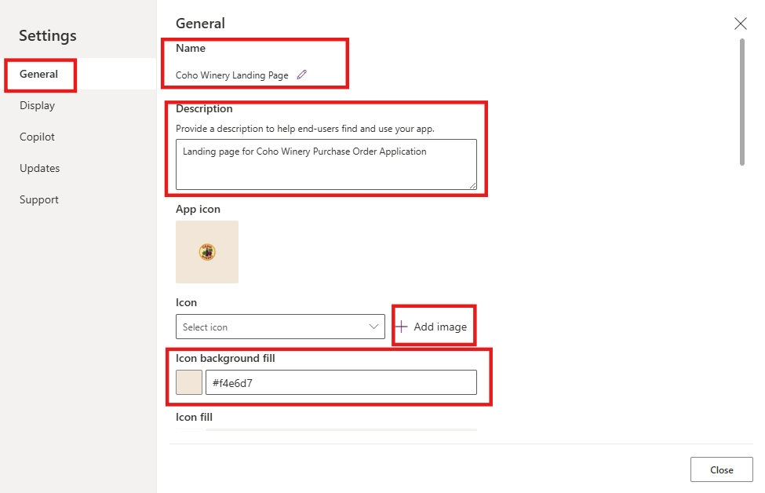
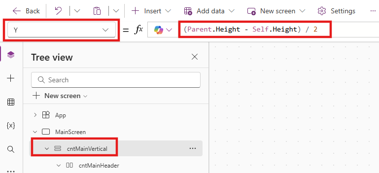
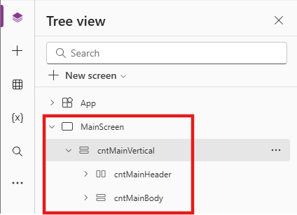
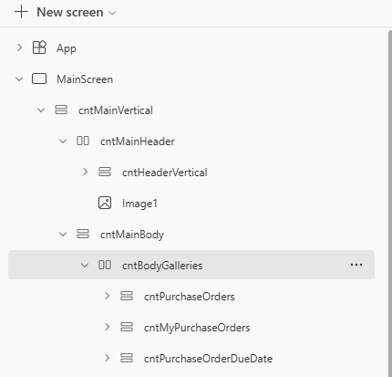
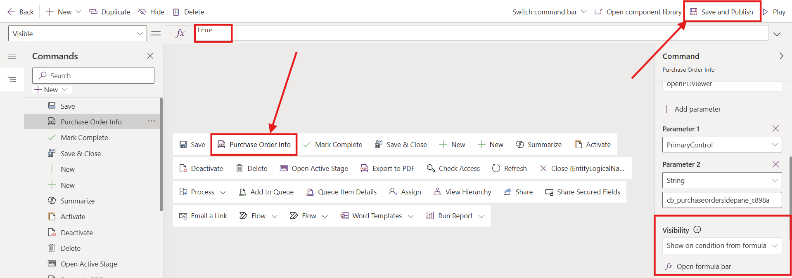
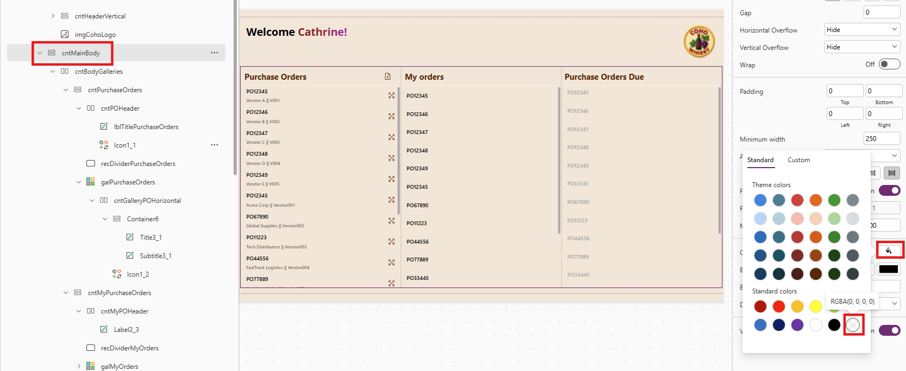
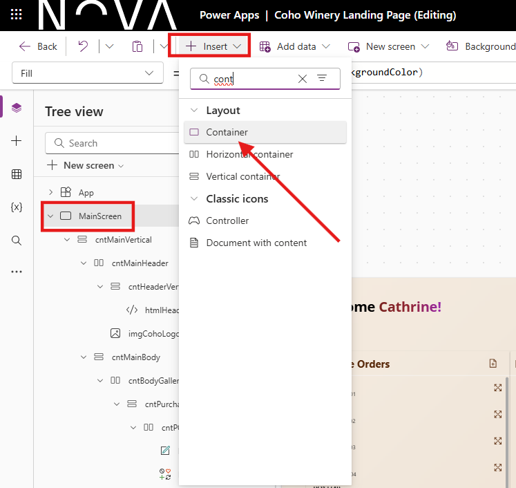

# Lab 2 - Create Beautiful Custom Pages

In this lab, you will learn how to **build** custom pages with a focus on **responsive design**, **styling** and accessing **Model-Driven App record details**

## Lab Overview 

### 🎯 Goal

- Build a Custom Page to use as a full page and a side pane within a Model-Driven App.
- Connect to your data sources and fetch record details with the Param() function in the Custom Page.
- Master responsive layouts so your page looks good everywhere.
- Add modern styling elements like shadows, rounded corners, blur effects, and SVGs to make apps pop
- Optimised Power Fx syntax for reusability, performance and maintainable applications

### ✅ Prerequisites

- Completion of [Lab 1 - Create a Model-Driven Power App](Lab1-CreateModelDrivenPowerApp.md)

### 💻 Scenario

Coho Winery are rolling out a new Purchase Order app to replace their manual Word-and-screenshot process. To improve the user experience, you have been asked to design two key pages: 

- **Landing Page** – a modern entry point where users can quickly navigate to key links, view PO data from the ERP system, and access important actions.
- **PO Document Side Pane** – a page that displays stored PDF versions of PO requests, giving finance and auditors instant access without leaving the app.

Together, these pages will provide both an attractive front door to the application and a practical way to view and manage PO request documents. 

### ⌛ Length

This lab will take approximately 60–75 minutes to complete. 

## ✍️ Exercise 1: Create a Landing Page and Configure Settings

We will begin by creating the first custom **Landing Page** that will be presented to the users. This page will set the tone for the app and gives users a clear "home base" to work from as the first thing they will see when opening the **Coho Winery Purchase Order** app.

1. Navigate to the [Power Apps Maker portal](https://make.powerapps.com) and ensure you are in the **Developer** environment you created in Lab 0.
2. Select **Solutions** from the left navigation pane.


3. Select the **Coho Winery** solution you created in Lab 0.


3. In the solution, select **New** -> **App** -> **Page** from the command bar.


4. The canvas designer page will load. Click on **Settings** in the ribbon (sometimes settings will be located behind the three dots).


 
5. On the **General** tab, edit the name of the page to be **Coho Winery Landing Page** by clicking the edit pen and clicking **Save**.


6. Update the **Description** of the custom page to `Landing page for Coho Winery Purchase Order Application`
7. Download [the Coho Winery Logo](Assets/Lab2/Coho-Winery.png) from the repository and save it to your computer.
8. Back in the custom page **Settings**, click on **+ Add image** and upload the **Coho-Winery.png** image.
9. Update the **Icon Background Fill** to `#f4e6d7`



10. Scroll to verify that the **Auto save** option is set to **On** (this will give you peace of mind that no changes will be lost 🧘)


11. Click on the **Display** tab and verify that the **Scale to fit** option is set to **Off**; this will ensure we retain a responsive layout.


> [!TIP]
> At this stage, there are two (optional) settings you can enable. First, scroll down on the **Display** tab to enable **multiple screens** if you would like to have more than one page. This can be used for navigation purposes, admin screens or other use cases where screen contents should be separated. Secondly, you can click on the **Updates** tab to enable **Modern Controls and Themes**. This will give you access to the latest controls and themes in Power Apps, so that you can create experiences that fit in naturally with the look and feel of Microsoft 365. You can click on **Close** once you are finished to exit the settings.


12. On the canvas designer, select **Play mode** by clicking the Play icon in the upper right corner to preview the page. Verify that the the page width and height expands according to your screen size.


13. On the canvas designer, click the **Publish** icon in the upper right corner and then **Publish this version** to save and publish the page.


14. Once the page has saved and published, click on **Back** and then **Leave** to return to the solution.


10. Verify that the **Coho Winery Landing Page** is listed in the solution. The new component should be of type **Page**.


11. Keep the **Coho Winery PP Solution** solution open, as we will continue to work on it in the next exercise.

## ✍️ Exercise 2: Build a Responsive Layout

Our goal is to ensure that our new **Coho Winery Landing Page** looks great, regardless of the screen size where it's being rendered, by understanding [containers](https://learn.microsoft.com/en-us/power-apps/maker/canvas-apps/controls/control-container). We will use a combination of vertical and horizontal containers to create a flexible layout that will adapt accordingly.

1. You should still be in the **Coho Winery** solution from Exercise 1; if not, navigate back to it.
2. Open the **Coho Winery Landing Page** by selecting it from the list of components in the solution.
3. Change the name of **Screen1** to **MainScreen**.

> [!TIP]
> You can rename any screen or control by either double clicking it, or clicking on the elipses (...) next to the control name and selecting **Rename**.


4. We will now begin to build the layout. On the canvas designer, select the **Insert** tab in the ribbon, expand **Layout** and then select **Vertical container**.


5. A new vertical container will be added to the screen. Rename it to **cntMainVertical** by selecting the container in the **Tree view** pane and clicking twice.


6. Select the container **cntMainVertical** and update the **X**, **Y**, **Width** and **Height** properties to the dynamic values listed below. The settings can either be updated from the formula dropdown bar or from the properties pane on the right side. Keep in mind, that the labels in the properties pane differ from the formula bar, but they represent the same property.

    | Property | Formula |
    | --- | --- |
    | **X** | `(Parent.Width - Self.Width) / 2` |
    | **Y** | `(Parent.Height - Self.Height) / 2` |
    | **Width** | `Parent.Width-(Parent.Width*0.05)` |
    | **Height** | `Parent.Height-(Parent.Height*0.05)` |
    | **RadiusTopLeft** | `4` |
    | **DropShadow** | `None` |




7. Insert a Horizontal container within *cntMainVertical* by clicking on *cntMainVertical*, selecting the **Insert** tab in the ribbon, expand **Layout** and then select **Horizontal container**. Rename it to **cntMainHeader**
8. Insert a Vertical container within *cntMainHeader*. Rename it to *cntHeaderVertical*.
9. Insert a Vertical container within *cntMainVertical*. Rename it to **cntMainBody**.
10. Your Tree view should now resemble the below:



11. We will now build out the header, by first adding a welcome message to the user. We'll also add the Coho Winery Logo to the page. To do this, we will work with [named formulas](https://learn.microsoft.com/en-us/power-platform/power-fx/reference/object-app#formulas-property). To begin, select **App** in the **Tree View** and then select **Formulas** from the dropdown.
12. Copy and paste the following code within the formula bar to create two named formulas: one to capture the font used for the title and one for the background color.

```
nfFont = "Inter, Open Sans";
nfBackgroundColor = "#f4e6d7";
```


> [!TIP]
> When working with Named Formulas, remember to always end each formula with semicolon ;

13. Select the **cntMainHeader** container underneath **cntMainVertical**.
14. Adjust the properties of the control as listed below. No changes are required if the properties already match the values below:

    | Property | Formula |
    | --- | --- |
    | **Height** | `100` |
    | **LayoutJustifyContent** | `LayoutJustifyContent.Start` |
    | **LayoutAlignItems** | `LayoutAlignItems.Start` |
    | **FillPortions** | `0` |


14. Insert an HTML Text control within the **cntMainHeader** container by selecting **+ Insert**, searching for **html** and clicking on **HTML text**.


15. Rename the HTML Text control to **htmlHeaderTitle**. 
16. Select **Font** on the properties of the **htmlHeaderTitle** and set the formula value to the **nfFont** Named Formula created earlier.


17. Set the **HTML text value** located on the properties to the following code. This will create a welcome message with a gradient effect on the user's first name.

``` HTML
$"<div style='font-size: 28px; font-family: Inter, Open Sans; font-weight: bold; color: black;'> 
  <!-- Welcome text stays black -->
  Welcome 
  
  <a style='font-size: 28px; font-family: Inter, Open Sans; font-weight: bold; 
            /* Grape gradient for name */
            background: linear-gradient(90deg, 
              #7f1d1d,  /* Deep red (Cabernet) */
              #9b1c31,  /* Wine red */
              #a21caf  /* Dark magenta */
            ); 
            -webkit-background-clip: text; 
            -webkit-text-fill-color: transparent;'> 
    {  First(Split(User().FullName," ")).Value }! 
  </a> 
</div>"
```


18. Adjust the following additional properties of the **htmlHeaderTitle** control to resemble the below:

    | Property | Formula |
    | --- | --- |
    | **Height** | `Parent.Height` |
    | **Width** | `Parent.Width` |

18. Select the **cntMainHeader** in the **Tree view**, click on **+ Insert** on the ribbon and serach for **image**. Click on the **Image** control under **Media**. Proceed to then add the **Coho-Winery** logo by uploading it into the designer and setting the **Image** property to the name of the image, in this case **Coho-Winery**.


19. You should now be able to see the image control next to the HTML text control, on the right side of the container.
20. Select the image control, rename to **imgCohoLogo** and set the Height property to `Parent.Height`. This will ensure that the image height is always the same as the parent container height.


21. Your **MainScreen** should now resemble the below screenshot.


22. Add Purchase Order Screen to the custom page by copying the YAML code located [here](Assets/Lab2/PurchaseOrderScreen.yml) 

23. With the **MainScreen** selected, paste the YAML code by selecting **CTRL + V** on your keyboard. A new screen called **Purchase Orders** should render, resembling the below. It's going to be used later, so disregard any errors for now.


24. Click on **Save** and then **Publish** to save your progress.
25. Leave the designer open if you plan to continue to the next Exercise.

## ✍️ Exercise 3: Build Responsive Galleries

1. With **cntMainBody** selected, insert a **Horizontal container**. Rename it **cntBodyGalleries**

2. Configure **cntBodyGalleries** to behave like a responsive 3-column row:

<pre>Power Fx 
LayoutDirection: LayoutDirection.Horizontal 
LayoutGap: 12 
PaddingLeft: 8 
PaddingRight: 8 
PaddingTop: 4 
PaddingBottom: 4 // Let the row take all remaining height 
FillPortions: 1 // Responsive behavior 
LayoutWrap: true // allows columns to wrap on narrow widths 
</pre>

3. Insert three *Vertical containers* inside **cntBodyGalleries** and rename them:

<Pre>
cntPurchaseOrders

cntMyPurchaseOrders

cntPurchaseOrderDueDate
</pre>

4. Set the same properties on each of the three column containers so they share space evenly and stretch:
// Apply to: cntPurchaseOrders, cntMyPurchaseOrders, cntPurchaseOrderDueDate 

<pre> Power Fx 

FillPortions: 1 // equal width columns 
LayoutDirection: LayoutDirection.Vertical 
LayoutGap: 8 
PaddingLeft: 10 
PaddingRight: 10 
PaddingTop: 8 
PaddingBottom: 8 
AlignInContainer: AlignInContainer.Stretch 
LayoutAlignItems: LayoutAlignItems.Stretch 
LayoutMinWidth: 260 // lets them wrap on narrow screens </pre>

5. Verify that your **Tree view** look like this:



6. In the **Tree view**, select **App** and **Formulas** from the App properties dropdown. 

7. In the **Formulas**, create a *Named Formula* for the collection **nfcolPurchaseOrders** by setting the formula: 

<br>

### nfcolPurchaseOrders Named Formula
<pre>
//Collection for the Purchase orders
colMorePurchaseOrder = 

    Table(
        {
            vendorId: "Vendor001",
            vendorName: "Acme Corp",
            manuallyProcessedInApp: false,
            poNumber: "PO12345",
            warehouseId: "WH001",
            result: "Success",
            LastModified: DateAdd(Today(), -5, TimeUnit.Days),
            Datasource: "Dataverse",
            deliveryMethod: "Courier",
            linesCount: 10
        },
        {
            vendorId: "Vendor002",
            vendorName: "Global Supplies",
            manuallyProcessedInApp: false,
            poNumber: "PO67890",
            warehouseId: "WH002",
            result: "Pending",
            LastModified: DateAdd(Today(), -3, TimeUnit.Days),
            Datasource: "SharePoint",
            deliveryMethod: "Email",
            linesCount: 5
        },
        {
            vendorId: "Vendor003",
            vendorName: "Tech Distributors",
            manuallyProcessedInApp: false,
            poNumber: "PO11223",
            warehouseId: "WH003",
            result: "Failed",
            LastModified: DateAdd(Today(), -7, TimeUnit.Days),
            Datasource: "Dataverse",
            deliveryMethod: "FTP",
            linesCount: 15
        },
        {
            vendorId: "Vendor004",
            vendorName: "FastTrack Logistics",
            manuallyProcessedInApp: false,
            poNumber: "PO44556",
            warehouseId: "WH004",
            result: "Success",
            LastModified: DateAdd(Today(), -1, TimeUnit.Days),
            Datasource: "SharePoint",
            deliveryMethod: "Courier",
            linesCount: 8
        },
        {
            vendorId: "Vendor005",
            vendorName: "Northern Lights",
            manuallyProcessedInApp: false,
            poNumber: "PO77889",
            warehouseId: "WH005",
            result: "Pending",
            LastModified: DateAdd(Today(), -2, TimeUnit.Days),
            Datasource: "Dataverse",
            deliveryMethod: "Email",
            linesCount: 20
        },
        // Additional Rows with Mixed Datasources
        {
            vendorId: "Vendor011",
            vendorName: "Skyline Supplies",
            manuallyProcessedInApp: false,
            poNumber: "PO33456",
            warehouseId: "WH011",
            result: "Success",
            LastModified: DateAdd(Today(), -6, TimeUnit.Days),
            Datasource: "Dataverse",
            deliveryMethod: "Courier",
            linesCount: 13
        },
        {
            vendorId: "Vendor012",
            vendorName: "NextGen Industries",
            manuallyProcessedInApp: false,
            poNumber: "PO77801",
            warehouseId: "WH012",
            result: "Failed",
            LastModified: DateAdd(Today(), -4, TimeUnit.Days),
            Datasource: "SharePoint",
            deliveryMethod: "Email",
            linesCount: 6
        },
        {
            vendorId: "Vendor013",
            vendorName: "Alpha Distributors",
            manuallyProcessedInApp: false,
            poNumber: "PO88912",
            warehouseId: "WH013",
            result: "Pending",
            LastModified: DateAdd(Today(), -9, TimeUnit.Days),
            Datasource: "Dataverse",
            deliveryMethod: "FTP",
            linesCount: 9
        },
        {
            vendorId: "Vendor014",
            vendorName: "Unified Logistics",
            manuallyProcessedInApp: false,
            poNumber: "PO99865",
            warehouseId: "WH014",
            result: "Success",
            LastModified: DateAdd(Today(), -8, TimeUnit.Days),
            Datasource: "SharePoint",
            deliveryMethod: "Courier",
            linesCount: 11
        },
        {
            vendorId: "Vendor015",
            vendorName: "Bright Horizons",
            manuallyProcessedInApp: false,
            poNumber: "PO12945",
            warehouseId: "WH015",
            result: "Failed",
            LastModified: DateAdd(Today(), -10, TimeUnit.Days),
            Datasource: "Dataverse",
            deliveryMethod: "Email",
            linesCount: 4
        }
    );


nfcolPurchaseOrders =
    Table(
        {
            vendorId: "V001",
            vendorName: "Vendor A",
            manuallyProcessedInApp: false,
            poNumber: "PO12345",
            warehouseId: "WH01",
            result: "Pending",
            LastModified: DateAdd(
                Now(),
                -2,
                TimeUnit.Days
            ),
            Datasource: "Dataverse",
            deliveryMethod: "Truck",
            linesCount: 10
        },
        {
            vendorId: "V002",
            vendorName: "Vendor B",
            manuallyProcessedInApp: false,
            poNumber: "PO12346",
            warehouseId: "WH02",
            result: "Approved",
            LastModified: DateAdd(
                Now(),
                -5,
                TimeUnit.Days
            ),
            Datasource: "Dataverse",
            deliveryMethod: "Air",
            linesCount: 5
        },
        {
            vendorId: "V003",
            vendorName: "Vendor C",
            manuallyProcessedInApp: true,
            poNumber: "PO12347",
            warehouseId: "WH03",
            result: "Rejected",
            LastModified: DateAdd(
                Now(),
                -10,
                TimeUnit.Days
            ),
            Datasource: "Sharepoint",
            deliveryMethod: "Sea",
            linesCount: 15
        },
        {
            vendorId: "V004",
            vendorName: "Vendor D",
            manuallyProcessedInApp: false,
            poNumber: "PO12348",
            warehouseId: "WH04",
            result: "Pending",
            LastModified: DateAdd(
                Now(),
                -1,
                TimeUnit.Days
            ),
            Datasource: "Dataverse",
            deliveryMethod: "Truck",
            linesCount: 20
        },
        {
            vendorId: "V005",
            vendorName: "Vendor E",
            manuallyProcessedInApp: true,
            poNumber: "PO12349",
            warehouseId: "WH05",
            result: "Approved",
            LastModified: Now(),
            Datasource: "Sharepoint",
            deliveryMethod: "Drone",
            linesCount: 8
        },
        {
            vendorId: "Vendor001",
            vendorName: "Acme Corp",
            manuallyProcessedInApp: false,
            poNumber: "PO12345",
            warehouseId: "WH001",
            result: "Success",
            LastModified: DateAdd(
                Now(),
                -5,
                TimeUnit.Days
            ),
            Datasource: "Dataverse",
            deliveryMethod: "Courier",
            linesCount: 10
        },
        {
            vendorId: "Vendor002",
            vendorName: "Global Supplies",
            manuallyProcessedInApp: false,
            poNumber: "PO67890",
            warehouseId: "WH002",
            result: "Pending",
            LastModified: DateAdd(
                Now(),
                -3,
                TimeUnit.Days
            ),
            Datasource: "Sharepoint",
            deliveryMethod: "Email",
            linesCount: 5
        },
        {
            vendorId: "Vendor003",
            vendorName: "Tech Distributors",
            manuallyProcessedInApp: false,
            poNumber: "PO11223",
            warehouseId: "WH003",
            result: "Failed",
            LastModified: DateAdd(
                Now(),
                -7,
                TimeUnit.Days
            ),
            Datasource: "Dataverse",
            deliveryMethod: "FTP",
            linesCount: 15
        },
        {
            vendorId: "Vendor004",
            vendorName: "FastTrack Logistics",
            manuallyProcessedInApp: false,
            poNumber: "PO44556",
            warehouseId: "WH004",
            result: "Success",
            LastModified: DateAdd(
                Now(),
                -1,
                TimeUnit.Days
            ),
            Datasource: "Sharepoint",
            deliveryMethod: "Courier",
            linesCount: 8
        },
        {
            vendorId: "Vendor005",
            vendorName: "Northern Lights",
            manuallyProcessedInApp: false,
            poNumber: "PO77889",
            warehouseId: "WH005",
            result: "Pending",
            LastModified: DateAdd(
                Now(),
                -2,
                TimeUnit.Days
            ),
            Datasource: "Dataverse",
            deliveryMethod: "Email",
            linesCount: 20
        },
        // Additional Rows
        {
            vendorId: "Vendor006",
            vendorName: "NextGen Supplies",
            manuallyProcessedInApp: false,
            poNumber: "PO33445",
            warehouseId: "WH006",
            result: "Success",
            LastModified: DateAdd(
                Now(),
                -6,
                TimeUnit.Days
            ),
            Datasource: "Dataverse",
            deliveryMethod: "Courier",
            linesCount: 12
        },
        {
            vendorId: "Vendor007",
            vendorName: "Alpha Distributors",
            manuallyProcessedInApp: false,
            poNumber: "PO55667",
            warehouseId: "WH007",
            result: "Failed",
            LastModified: DateAdd(
                Now(),
                -4,
                TimeUnit.Days
            ),
            Datasource: "Sharepoint",
            deliveryMethod: "Email",
            linesCount: 6
        },
        {
            vendorId: "Vendor008",
            vendorName: "Global Traders",
            manuallyProcessedInApp: false,
            poNumber: "PO88990",
            warehouseId: "WH008",
            result: "Pending",
            LastModified: DateAdd(
                Now(),
                -9,
                TimeUnit.Days
            ),
            Datasource: "Dataverse",
            deliveryMethod: "FTP",
            linesCount: 9
        },
        {
            vendorId: "Vendor009",
            vendorName: "Pro Logistics",
            manuallyProcessedInApp: false,
            poNumber: "PO99887",
            warehouseId: "WH009",
            result: "Success",
            LastModified: DateAdd(
                Now(),
                -8,
                TimeUnit.Days
            ),
            Datasource: "Sharepoint",
            deliveryMethod: "Courier",
            linesCount: 11
        },
        {
            vendorId: "Vendor010",
            vendorName: "Blue Horizons",
            manuallyProcessedInApp: false,
            poNumber: "PO12399",
            warehouseId: "WH010",
            result: "Failed",
            LastModified: DateAdd(
                Now(),
                -10,
                TimeUnit.Days
            ),
            Datasource: "Dataverse",
            deliveryMethod: "Email",
            linesCount: 4
        }
    );
    </pre>


8. In **Tree view**, select **cntPurchaseOrders**. Go to **Insert** → **Layout** → **Horizontal** container and rename it **cntPOHeader**.
9. With **cntPOHeader** selected, set these properties:

<pre>Power Fx 
DropShadow: DropShadow.None 
FillPortions: 0 
Height: Parent.Height 
LayoutDirection: LayoutDirection.Horizontal 
LayoutGap: 3 
LayoutJustifyContent: LayoutJustifyContent.SpaceBetween 
LayoutMinHeight: 30 
PaddingLeft: 10 
PaddingRight: 10
 </pre>

10. Inside **cntPOHeader**, insert a Label by selecting **+ Insert**, searching for "label" and selecting **Label**. Rename it to **lblTitlePurchaseOrders** and set:

<pre>Power Fx 
AlignInContainer: AlignInContainer.Stretch 
Alignment: Align.Justify 
AutoHeight: true 
Color: RGBA(92, 37, 4, 1) 
FillPortions: 1 
FontSize: 16 
FontWeight: FontWeight.Bold 
LayoutMinWidth: 100 
Text: "Purchase Orders" 
TextRole: 'Label.TextRole'.Heading2 
Wrap: false
OnSelect: Navigate(PurchaseOrders)  </pre>


11. Still in **cntPOHeader**, insert an Icon (Classic/Icon) -> **Add Document**. Rename it **icnAddDocument**. 


12. Set properties of the added *Document Icon*:

<pre>Power Fx 
Color: RGBA(92, 37, 4, 1) 
Height: Parent.Height 
HoverColor: ColorFade(Self.Color, -30%) 
HoverFill: RGBA(0,0,0,0) 
Icon: Icon.AddDocument 
LayoutMinHeight: Parent.Height 
PaddingBottom: 15 
PaddingLeft: 15 
PaddingRight: 15 
PaddingTop: 15 
PressedBorderColor: RGBA(0,0,0,0) 
PressedColor: ColorFade(Self.Color, -30%) 
PressedFill: RGBA(0,0,0,0) 
Width: 50 
// Use either A or B below for OnSelect // 
A) If you have a Named Formula nfcolPurchaseOrders: 
OnSelect: ClearCollect(colPurchaseOrders, nfcolPurchaseOrders) 
// B) If not, seed dummy data quickly: 
OnSelect: ClearCollect( colPurchaseOrders, Table( { poNumber:"PO-1001", vendorName:"Vintners AB", vendorId:"V001", LastModified: Now()-Time(1,0,0) }, { poNumber:"PO-1002", vendorName:"GrapeWorks", vendorId:"GW02", LastModified: Now()-Time(0,45,0) }, { poNumber:"PO-1003", vendorName:"Oak & Co", vendorId:"OK03", LastModified: Now()-Time(0,12,0) } ) ) </pre>

13. With **cntPurchaseOrders** selected, insert a Rectangle and rename it recDividerPurchaseOrders. 

14. Set rectangle divider properties:

<pre>Power Fx 
AlignInContainer: AlignInContainer.Stretch 
BorderColor: RGBA(166,166,166,1) 
BorderStyle: BorderStyle.None 
DisabledFill: RGBA(166,166,166,1) 
Fill: RGBA(245,245,245,1) 
FocusedBorderColor: RGBA(0,120,212,1) 
Height: 1 
HoverFill: RGBA(0,120,212,1) 
PressedFill: RGBA(0,120,212,1) </pre>

15. Insert a **Vertical Gallery** from **+ Insert**, search for gallery and select **Vertical gallery**, inside **cntPurchaseOrders**. Rename it **galPurchaseOrders** and set:

<pre>Power Fx 
BorderColor: RGBA(166,166,166,1) 
FocusedBorderColor: RGBA(0,120,212,1) 
FocusedBorderThickness: 2 
Items: colPurchaseOrders 
LayoutMinWidth: Parent.Width 
TemplateSize: 55 
Transition: Transition.Pop // optional: bubble selection to item container 
OnSelect: Select(Parent) </pre>

16. Inside **galPurchaseOrders**, insert a **Horizontal container** and rename it **cntGalleryPOHorizontal**. 

17. Set container properties for **cntGalleryPOHorizontal**:

<pre>Power Fx 
DropShadow: DropShadow.None 
Height: 48 
LayoutDirection: LayoutDirection.Horizontal 
LayoutJustifyContent: LayoutJustifyContent.SpaceBetween 
Width: Parent.Width </pre>

18. Inside **cntGalleryPOHorizontal**, insert a Vertical container and rename it **cntGalleryPOVertical**. 

19. Set **cntGalleryPOVertical** containter properties:

<pre>Power Fx 
DropShadow: DropShadow.None 
Height: 48 
LayoutDirection: LayoutDirection.Vertical 
LayoutMinHeight: Parent.Height 
PaddingLeft: 15 
PaddingRight: 10 
Flexible Width: true </pre>

20. Inside **cntGalleryPOVertical**, insert a **Label** and rename it **lblPurchaseOrderNumber**. Then insert another Label and rename it **lblPOVendorInfo**. 
21. Set their properties:

<pre>Power Fx  
**lblPurchaseOrderNumber** 
AutoHeight: true 
Color: RGBA(0,0,0,1) 
FillPortions: 1 
FontWeight: FontWeight.Semibold 
Height: 24 
LayoutMinHeight: Parent.Height/2 
TabIndex: -1 
Text: ThisItem.poNumber 
VerticalAlignment: VerticalAlign.Middle 
Width: 344 
Wrap: false 
X: 22

**lblPOVendorInfo**
 FillPortions: 1 
 FontSize: 9 
 FontWeight: FontWeight.Normal 
 Height: 28 
 LayoutMinHeight: Parent.Height/2 
 TabIndex: -1 
 Text: ThisItem.vendorName & " || " & ThisItem.vendorId 
 VerticalAlignment: VerticalAlign.Top 
 Width: 355 
 X: 5 
 Y: 20 
 </pre>

22. Back in **cntGalleryPOHorizontal**, insert an Icon (Classic/Icon), rename it **icnExpandPO**, and set:

<pre>Power Fx 
AlignInContainer: AlignInContainer.Stretch 
BorderColor: RGBA(0,0,0,0) 
Color: RGBA(92, 37, 4, 1) 
DisabledColor: RGBA(220,220,220,1) 
DisabledFill: RGBA(0,0,0,0) 
Height: Parent.Height 
HoverBorderColor: RGBA(0,0,0,0) 
HoverColor: ColorFade(Self.Color, -30%) 
HoverFill: RGBA(0,0,0,0) 
Icon: Icon.ExpandView
LayoutMinHeight: Parent.Height 
PaddingBottom: 15 
PaddingLeft: 15 
PaddingRight: 15 
PaddingTop: 15 
PressedBorderColor: RGBA(0,0,0,0) 
PressedColor: ColorFade(RGBA(0,120,212,1), -30%) 
PressedFill: RGBA(0,0,0,0) 
Width: 50 </pre>

23. Test it: Select **icnExpandPO** to load the sample data (or use your nfcolPurchaseOrders). You should see rows like:

PO-1001 — Vintners AB || V001

PO-1002 — GrapeWorks || GW02

PO-1003 — Oak & Co || OK03

<br>

> ### 💡 CONTAINER PROPERTIES
> The difficult part when working with responsive layouts are the different properties and making sure you have selected the correct nested container.  
> 
> You can always adjust the direction of the container after adding it to a screen. The other main properties you will be looking at are **X**, **Y**, **Width** and **Height**. These decide the placement, alignment and the size which makes them resize according to the user screen.
>




<!-- This is hidden in the rendered page, but anyone can view the source 

// 5. Name it cntHeaderHorizontal and adjust the Width to:


5. With the **cntMainVertical** container selected, set the following Power Fx formulas in the **Properties** dropdown to center it on the screen. The formulas will also ensure the main container remains aligned whenever the screen size is adjusted:
- **X**: `(Parent.Width - Self.Width) / 2`
- **Y**: `(Parent.Height - Self.Height) / 2`


6. With the **cntMainVertical** container still selected, insert a new **Horizontal container** inside it by clicking the **+** icon in the container, expanding **Layout** and then selecting **Horizontal container**.


7. Rename the new horizontal container to **cntHeaderHorizontal** in the **Tree view** pane.


8. With the **cntHeaderHorizontal** container selected, set the following Power Fx formula in the **Properties** dropdown to ensure the width of the second container always reflects the size of the Parent **cntMainVertical** container's width:
- **Width**: `Parent.Width`


9. In the cntHeaderHorizontal container, insert another
10. Nest horizontal containers within the main container
11. Create the navigation bar

-->


## ✍️ Exercise 4: Styling 

1. On the properties of **MainScreen** on the right side, click on the *paint bucket* for the background Fill 


2. Click on **Custom** and update HEX value to **f4e6d7** OR click on **Fill** and set the formula to:

<Pre> Power Fx
Fill: ColorValue(nfBackgroundColor)
</pre>


**Ideas:** 
- Add rounded corners to controls, containers and visuals for a modern look (between 5-10 border radius)
- Set a light drop shadow 


- Add effects that provides depth and custom design to your apps aligning with your brand


### Optional: **Add HTML background instead of a Fill color**

1. With **MainScreen** selected, insert HTMLtext control and right click to Reorder ->  **Send to Back**


2. Rename the HTML text to **htmlCohoBackground** and edit HTML text value to be:

``` HTML 

$"<div style='
width: {Parent.Width}px;
height: {Parent.Height}px;
padding: 0px 0px;
background: linear-gradient(135deg, #f4e6d7 0%, #e8d5c4 100%);
box-sizing: border-box;
overflow: hidden;
display: flex;
flex-direction: column;
justify-content: center;
align-items: center;
position: relative;
'>

<div style='text-align: center; position: relative; z-index: 2;'>
<h1 style='font-size: 2.5rem; color: rgba(44, 24, 16, 0.15); margin-bottom: 5px; font-family: Georgia, serif;'>Coho Winery</h1>
<p style='color: rgba(139, 69, 19, 0.12); font-size: 1rem; font-style: italic; font-family: Georgia, serif; letter-spacing: 2px; font-weight: 300; margin-bottom: 15px;'>est. 2025</p>
<p style='color: rgba(44, 24, 16, 0.13); font-size: 1.3rem; font-family: Georgia, serif; font-weight: 400; letter-spacing: 1px;'>Excellent Wine & Excellent Taste</p>
</div>
</div>"

```

**Note** 
*When creating the HTML code for Power Apps, use ' instead of " in the string, or else it wont work*


3. Set **Width** and **Height** to adjust according to screen size:

<pre> Power Fx 
Width: Parent.Width
Height: Parent.Height
</pre>

4. Set X and Y properties to control starting point of the control:

<pre> Power Fx 
X: 0
Y: 0
</pre>

5. Set Padding to (this avoids gaps between the content and the control box):

<pre> Power Fx 
Top: 0
Bottom: 0
Left: 0
Right:0
</pre>

6. Ensure that **Automatic Height** is **On** to avoid a scrollbar

*💡 Use $ to avoid excessive use of & as well as "" in the text, this enables you to only use {} when referring to dynamic content*

7. Set transparency of the Main Body Container **cntMainBody** to 100 by selecting **cntMainBody** in the **Tree View**, clicking on the *paint bucket on the right and chosing the transparent color option:


<br>

### Optional: **Add HTML blur to your page - Glass Morphism effect:**
1. Select **MainScreen** in the **Tree view**, click **+ Insert** and search for **Container** - Select "Container"



2. Rename the added container to **cntHTMLBlur** and Reorder - **Send to back**
3. With the **cntHTMLBlur** selected, insert an HTMLtext control by selecting **+ Insert**, search for "HTML" and click on **HTML Text**
4. Edit text value to be:

``` HTML 

$" <div style='
background: rgba(255, 255, 255, 0.2); /* Solid background */
border-radius: 16px;
box-shadow: 0 4px 4px rgba(0, 0, 0, 0.1);
backdrop-filter: blur(5px);
-webkit-backdrop-filter: blur(5px);
border: 1px solid rgba(255, 255, 255, 0.3);
width: {Self.Width-2}px;
height: {Self.Height-2}px;
padding: 10px; /* Adds space inside the box */
overflow: hidden; /* Prevents scrollbars */
box-sizing: border-box; /* Ensures padding is included in width/height */
position: absolute; /* Allows absolute positioning */
top: 0; /* Aligns to the top */
left: 0; /* Aligns to the left */
color: white; /* Default text color for fallback */
font-family: Poppins, sans-serif; /* Sets the font to Poppins */
'>"

```


5. Set **Width** and **Height** to adjust according to screen size:

<pre> Power Fx 
Width: Parent.Width
Height: Parent.Height
</pre>

6. Ensure that Automatic Height is **On** to avoid a scroll bar
7. Set Padding to (this avoids gaps between the content and the control box):

<pre> Power Fx 
Top: 0
Bottom: 0
Left: 0
Right:0
</pre>

*💡 Change the effect and looks of the blur on https://css.glass/*

8. If you have the HTML **htmlCohoBackground** added to your MainScreen, add it to the **cntHTMLBlur** container by holding and dragging it into the container and Reorder **Send to back** to see the blur above the Text. 

<!--- Another exercise

### Optional: Working with SVGs
1. Add an image control 
2. Build the SVG code (for icons Bootstrap is a great source for generating SVG code)
3. Alter the code to your needs with dynamic values using set variables

<pre> SVG code
"data:image/svg+xml," & EncodeUrl("<svg xmlns='http://www.w3.org/2000/svg' width='16' height='16' fill='" & varHexValue & "' class='bi bi-plus-lg' viewBox='0 0 16 16'>
  <path fill-rule='evenodd' d='M8 2a.5.5 0 0 1 .5.5v5h5a.5.5 0 0 1 0 1h-5v5a.5.5 0 0 1-1 0v-5h-5a.5.5 0 0 1 0-1h5v-5A.5.5 0 0 1 8 2'/>
</svg>")
</pre>

4. Use the correct encoding format for Power Apps:

<pre> Power Fx
"data:image/svg+xml," & EncodeUrl("
</pre>

--->

### Extra: Use templates

💡 You can start from a template when working with responsive layouts

**✅ Prerequisites** 
- Multiple screens in settings under the Display tab must be enabled to add several screens to your Coho Winery page


If you already have a new screen added, you could select **Templates** or **with Layout** to start with a responsive page


1. Click **New screen** on the ribbon and select a layout of your choosing
2. Have fun 


## ✍️ Exercise 3: Fetch Record Information
1. Add datasource (Dataverse, SharePoint etc.)
2. Select **App** in the left corner and click **Formulas**
3. Create a formula for referencing the record GUID and use the function GUID() to ensure correct type

<pre> Power Fx 
nfRecordItem =
    If(
        "," in Text(Param("recordId")),
        LookUp(Table, 'Unique GUID field' = GUID(Last(Split(Param("recordId"), ",")).Value)),
        LookUp(Table, 'Unique GUID field'  = GUID(Param("recordId")))
    ); </pre>

The record can also be wrapped in {} so that needs to be removed in some cases:

<pre> Power Fx 
GUID(Substitute(Substitute(Param("recordId"), "{", ""), "}", ""))</pre>

> **Note:** 
*Named Formulas needs to be closed using ;*

*Param() function gets the record GUID parsed from the JavaScript, and GUID() formats the output as GUID, not a string. We are also checking if there are several records selected by splitting the string after ","*

**Congratulations, you've finished Lab 2** 🥳