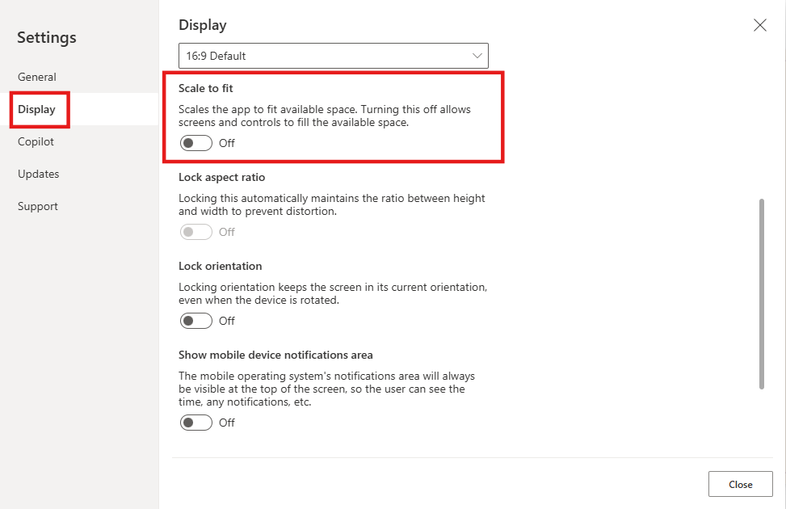
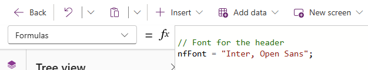
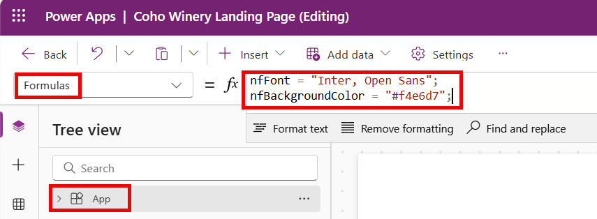

# Lab 2 - Create Beautiful Custom Pages

In this lab, you will learn how to **build** custom pages with a focus on **responsive design**, **styling** and accessing **Model-Driven App record details**

## Lab Overview 

### 🎯 Goal

- Build a Custom Page to use as a full page, side pane, and dialog inside a Model-Driven App.
- Connect to your data sources and fetch record details with the Param() function in the Custom Page.
- Master responsive layouts so your page looks good everywhere.
- Add modern styling elements like shadows, rounded corners, blur effects, and SVGs to make apps pop
- Optimised Power Fx syntax for reusability, performance and maintainable applications

### ✅ Prerequisites

- Completion of [Lab 1 - Create a Model-Driven Power App](Lab1-CreateModelDrivenPowerApp.md)

### 💻 Scenario

Coho Winery are rolling out a new Purchase Order app to replace their manual Word-and-screenshot process. To improve the user experience, you have been asked to design two key pages: 

- **Landing Page** – a modern entry point where users can quickly navigate to key links, view PO data from the ERP system, and access important actions.
- **PO Document Side Pane** – a page that displays stored PDF versions of PO requests, giving finance and auditors instant access without leaving the app.

Together, these pages will provide both an attractive front door to the application and a practical way to view and manage PO request documents. 

### ⌛ Length

This lab will take approximately 60–75 minutes to complete. 

## ✍️ Exercise 1: Create a Landing Page and Configure Settings


We will begin by creating the first custom **Landing Page** that will be presented to the users. This page will set the tone for the app and gives users a clear "home base" to work from as the first thing they will see when opening the **Coho Winery Purchase Order** app.

1. Navigate to the [Power Apps Maker portal](https://make.powerapps.com) and ensure you are in the **Developer** environment you created in Lab 0.
2. Select **Solutions** from the left navigation pane.


3. Select the **Coho Winery** solution you created in Lab 0.


3. In the solution, select **New** -> **App** -> **Page** from the command bar.


4. The canvas designer page will load. Click on **Settings** in the ribbon (sometimes settings will be located behind the three dots).


### On the **General** tab
    
5. Provide a description of the custom page:

*Landing page for Coho Winery Purchase Order Application*

6. Add an image - the Coho Winery Logo 


7. Set Icon Background Fill to **#f4e6d7**


8. Scroll to verify that the **Auto save** option is set to **On**. (This will give you peace of mind)


### On the **Display** tab

9. Click on the **Display** tab and verify that the **Scale to fit** option is set to **Off** (Ensures responsive layout).
10. Optional: Enable *multiple screens* if you would like to have more than one page


### On the **Updates** tab

11. Optional: Enable *Modern Controls and Themes* 
12. Click on **Close** when you are finished.

On the canvas designer, click the **Save** icon in the upper right corner. In the **Save as** dialog, enter **Coho Winery Landing Page** as the name and click on **Save**.


9. Once the page has saved, click on **Back** and then **Leave** to return to the solution.




10. Verify that the **Coho Winery Landing Page** is listed in the solution. The new component should be of type **Page**.


11. Keep the **Coho Winery PP Solution** solution open, as we will continue to work on it in the next exercise.


**Exercise 1 completed✅** - You should be able to click Play and see that the page width and height expands according to your screen

## ✍️ Exercise 2: Build a Responsive Layout

Our goal is to ensure that our new **Coho Winery Landing Page** looks great, regardless of the screen size where it's being rendered, by understanding [containers](https://learn.microsoft.com/en-us/power-apps/maker/canvas-apps/controls/control-container). We will use a combination of vertical and horizontal containers to create a flexible layout that will adapt accordingly.
>>>>>>> cfebe4df1d6e7b451c8d92e7636b6cee181d1791

1. Change name of screen to *MainScreen* 
2. Change background Fill to **f4e6d7** 
3. Navigate to **App** -> **Formulas** 
4. Create a Named formula for the font used in the app
1. You should still be in the **Coho Winery** solution from Exercise 1. If not, navigate back to it.
2. Open the **Coho Winery Landing Page** by selecting it from the list of components in the solution.
3. On the canvas designer, select the **Insert** tab in the ribbon, expand **Layout** and then select **Vertical container**.

<Pre> Power Fx
nfFont = "Inter, Open Sans";
</pre>



5. Insert a vertical container as the main container for the layout 
6. Name it *cntMainVertical*
7. Center it on the screen by setting the X & Y formulas and adjust the Width and Height to dynamic values using %

<pre> Power Fx 
X: (Parent.Width - Self.Width) / 2
Y: (Parent.Height - Self.Height) / 2
Width: Parent.Width-(Parent.Width*0.05)
Height: Parent.Height-(Parent.Height*0.05)
</pre>


4. A new vertical container will be added to the screen. Rename it to **cntMainVertical** in the **Tree view** pane.

8. Insert a Horizontal container within *cntMainVertical* by clicking on it. Rename it to **cntMainHeader**
9. Insert a Vertical container within *cntMainHeader* - Rename it to *cntHeaderVertical*
9. Insert a Vertical container within *cntMainVertical* by clicking on it. Rename it to **cntMainBody** - should be below the *cntMainHeader*
> [!TIP]
> You can rename any control by either double clicking it, or clicking on the elipses (...) next to the control name and selecting **Rename**.

💡 *This page sets the tone for the app and gives users a clear “home base” to work from as the first thing they will see when opening the MDA*
*you can also use a template when adding a new screen*


**Build the navigation bar**

4. Inside cntMainVertical - insert a horizontal container
5. Name it cntHeaderHorizontal and adjust the Width to:


5. With the **cntMainVertical** container selected, set the following Power Fx formulas in the **Properties** dropdown to center it on the screen. The formulas will also ensure the main container remains aligned whenever the screen size is adjusted:
- **X**: `(Parent.Width - Self.Width) / 2`
- **Y**: `(Parent.Height - Self.Height) / 2`


6. With the **cntMainVertical** container still selected, insert a new **Horizontal container** inside it by clicking the **+** icon in the container, expanding **Layout** and then selecting **Horizontal container**.


7. Rename the new horizontal container to **cntHeaderHorizontal** in the **Tree view** pane.



8. With the **cntHeaderHorizontal** container selected, set the following Power Fx formula in the **Properties** dropdown to ensure the width of the second container always reflects the size of the Parent **cntMainVertical** container's width:
- **Width**: `Parent.Width`


9. In the cntHeaderHorizontal container, insert another
10. Nest horizontal containers within the main container
11. Create the navigation bar

## ✍️ Exercise 3: Fetch Record Information
1. Add datasource (Dataverse, SharePoint etc.)
2. Select **App** in the left corner and click **Formulas**
3. Create a formula for referencing the record GUID and use the function GUID() to ensure correct type

<pre> Power Fx 
nfRecordItem =
    If(
        "," in Text(Param("recordId")),
        LookUp(Table, 'Unique GUID field' = GUID(Last(Split(Param("recordId"), ",")).Value)),
        LookUp(Table, 'Unique GUID field'  = GUID(Param("recordId")))
    ); </pre>

The record can also be wrapped in {} so that needs to be removed in some cases:

<pre> Power Fx 
GUID(Substitute(Substitute(Param("recordId"), "{", ""), "}", ""))</pre>

> **Note:** 
*Named Formulas needs to be closed using ;*

*Param() function gets the record GUID parsed from the JavaScript, and GUID() formats the output as GUID, not a string. We are also checking if there are several records selected by splitting the string after ","*

## ✍️ Exercise 4: Styling 
**Ideas:** 
- Add rounded corners to controls, containers and visuals for a modern look (between 5-10 border radius)
- Set a light drop shadow 

- Add effects that provides depth and custom design to your apps aligning with your brand


**4a: Add HTML background:**


1. Insert HTMLtext control and right click to Reorder ->  **Send to Back**


2. Edit HTML text value to be:

``` HTML 

$"<div style='
width: {Parent.Width}px;
height: {Parent.Height}px;
padding: 0px 0px;
background: linear-gradient(135deg, #f4e6d7 0%, #e8d5c4 100%);
box-sizing: border-box;
overflow: hidden;
display: flex;
flex-direction: column;
justify-content: center;
align-items: center;
position: relative;
'>

<div style='text-align: center; position: relative; z-index: 2;'>
<h1 style='font-size: 2.5rem; color: rgba(44, 24, 16, 0.15); margin-bottom: 5px; font-family: Georgia, serif;'>Coho Winery</h1>
<p style='color: rgba(139, 69, 19, 0.12); font-size: 1rem; font-style: italic; font-family: Georgia, serif; letter-spacing: 2px; font-weight: 300; margin-bottom: 15px;'>est. 2025</p>
<p style='color: rgba(44, 24, 16, 0.13); font-size: 1.3rem; font-family: Georgia, serif; font-weight: 400; letter-spacing: 1px;'>Excellent Wine & Excellent Taste</p>
</div>

</div>"

```

**Note** 
*When creating the HTML code for Power Apps, use ' instead of " in the string, or else it wont work*


3. Set Width and Height to adjust according to screen size:

<pre> Power Fx 
Width: Parent.Width
Height: Parent.Height
</pre>

4. Set X and Y properties to control starting point of the control:

<pre> Power Fx 
X: 0
Y: 0
</pre>

6. Set Padding to (this avoids gaps between the content and the control box):

<pre> Power Fx 
Top: 0
Bottom: 0
Left: 0
Right:0
</pre>

5. Ensure that Automatic Height is On to avoid a scrollbar

*💡 Use $ to avoid excessive use of & as well as "" in the text, this enables you to only use {} when referring to dynamic content*

**4c: Add HTML blur to your page - Glass Morphism effect:**
1. Insert HTMLtext control
2. Edit text value to be:

``` HTML 

$" <div style='
background: rgba(255, 255, 255, 0.2); /* Solid background */
border-radius: 16px;
box-shadow: 0 4px 4px rgba(0, 0, 0, 0.1);
backdrop-filter: blur(5px);
-webkit-backdrop-filter: blur(5px);
border: 1px solid rgba(255, 255, 255, 0.3);
width: {Self.Width-2}px;
height: {Self.Height-2}px;
padding: 10px; /* Adds space inside the box */
overflow: hidden; /* Prevents scrollbars */
box-sizing: border-box; /* Ensures padding is included in width/height */
position: absolute; /* Allows absolute positioning */
top: 0; /* Aligns to the top */
left: 0; /* Aligns to the left */
color: white; /* Default text color for fallback */
font-family: Poppins, sans-serif; /* Sets the font to Poppins */
'>

```


3. Add Horizontal or vertical containers above the HTML TEXT control if you want it to be the background
4. Set Width and Height to adjust according to screen size:

<pre> Power Fx 
Width: Parent.Width
Height: Parent.Height
</pre>

5. Ensure that Automatic Height is On to avoid a scroll bar
6. Set Padding to (this avoids gaps between the content and the control box):

<pre> Power Fx 
Top: 0
Bottom: 0
Left: 0
Right:0
</pre>

*💡 Change the effect and looks of the blur on https://css.glass/*


## Exercise 5: Working with YAML
1. Copy the container you have built
2. Add it to another screen


## Exercise 6: Working with SVGs
1. Add an image control 
2. Build the SVG code (for icons Bootstrap is a great source for generating SVG code)
3. Alter the code to your needs with dynamic values using set variables


<pre> SVG code
"data:image/svg+xml," & EncodeUrl("<svg xmlns='http://www.w3.org/2000/svg' width='16' height='16' fill='" & varHexValue & "' class='bi bi-plus-lg' viewBox='0 0 16 16'>
  <path fill-rule='evenodd' d='M8 2a.5.5 0 0 1 .5.5v5h5a.5.5 0 0 1 0 1h-5v5a.5.5 0 0 1-1 0v-5h-5a.5.5 0 0 1 0-1h5v-5A.5.5 0 0 1 8 2'/>
</svg>")

</pre>

4. Use the correct encoding format for Power Apps:

<pre> Power Fx
"data:image/svg+xml," & EncodeUrl("
</pre>

## 🌟 Extra Challenges

- Add dark mode 
- Add CSS styling 
- Add SVGs for design 
- Adjust styling of the container and alignment of items

**Congratulations, you've finished Lab 2** 🥳