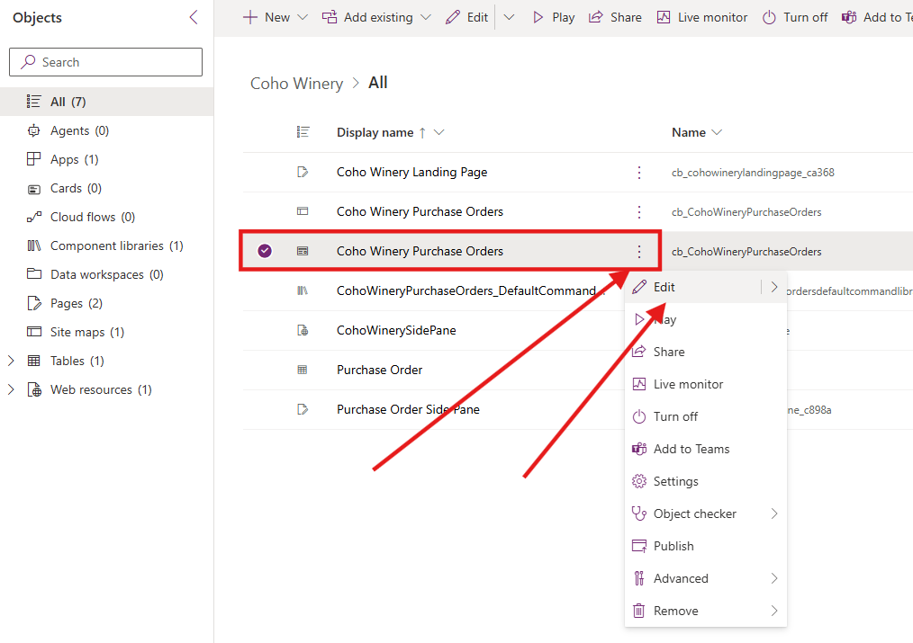
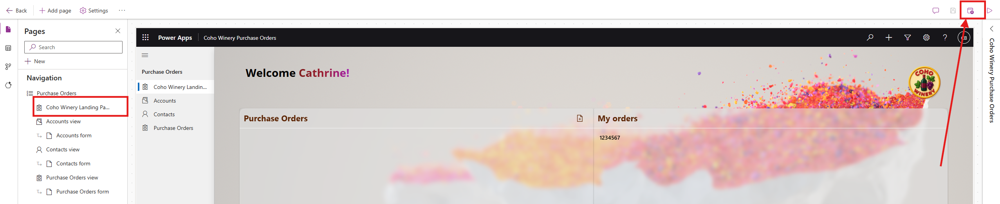
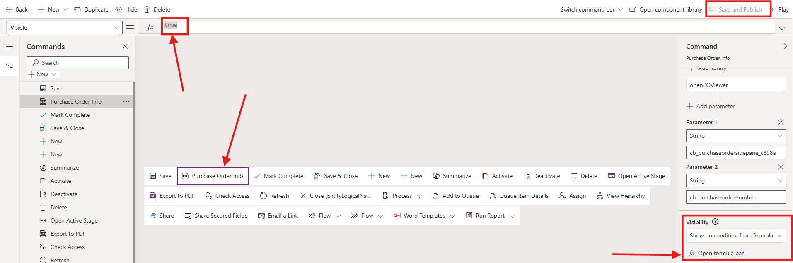
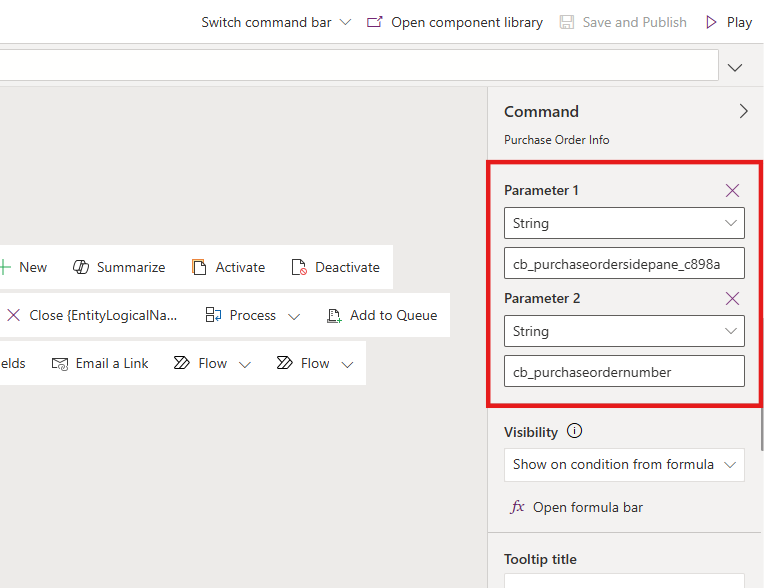

# Lab 3: Integrate Custom Pages in a Model-Driven Power App

In this lab, you will integrate the custom pages you built in **Lab 2** into the **Coho Winery Purchase Order Management** model-driven app as both a full page and a side pane. You’ll pass the current record context to the custom page and render responsive UI with modern styling.

## Lab Overview

### 🎯 Goal

Embed a custom page as both a full page and a side pane in the Coho Winery Purchase Orders model-driven app. The page will read context with Param("recordId") and display the correct PO PDF alongside key record details.

### ✅ Prerequisites

**Labs 1–3 completed** (solution setup, tables/data, custom pages and model-driven app).

### 📖 Scenario

Finance and auditors need to **open PO PDFs** directly in the app and see the related Purchase Order record in context. In this lab you’ll add a **responsive custom page** that operates as the landing page in **full page** mode, and a **Purchase Order Side Pane** custom page a side pane from a selected PO Main Form, and passing the current record’s ID so the correct Purchase order details loads in the side pane when it opens.

### ⌛ Length

45-60 minutes

### Assets You Will need

- Custom pages from Lab 2 (e.g., Landing page and Side Pane custom page)

- Purchase Order table (from Lab 1)

- The model-driven app (from Lab 1)

- New JS web resource: **CohoWinerySidePane.js** found in the [Assets - Lab 3 folder.](https://github.com/JJGriffin/Designing-Beautiful-Power-Apps-For-Makers/blob/8589cd47e5c755c7cebb951aaf28aba61597a3d6/Assets/Lab3/CohoWinerySidePane.js)

## Exercise 1: Embedding a Full page as part of the Model-driven Application
We will begin by adding the **Coho Winery Landing page** to the MDA.

1. Navigate to the [Power Apps Maker portal](https://make.powerapps.com) and ensure you are in the **Developer** environment you created in Lab 0.
2. Select **Solutions** from the left navigation pane.

3. Select the **Coho Winery** solution you created in Lab 0.

4. Select the **Coho Winery** model-driven app by clicking the **three dots** and **Edit**

5. In the App Designer, select **+ Add page** → **Custom page**.

6. Pick your landing page (**Coho Winery Landing Page**) by searching for *Coho*, select the page and click **Add**

7. **Save and Publish**.

> *Result after step 7*: Your custom page is now a full page in the sitemap. You can test the app by clicking **Play**.

## Exercise 2: Create the JavaScript Resource 

For this exercise, we will implement the JavaScript used to trigger the Side Pane on a Form. This will fetch the record details and pass them on to the custom page for us to work with. 

1. Navigate to the [Power Apps Maker portal](https://make.powerapps.com) and ensure you are in the **Developer** environment you created in Lab 0.
2. Select **Solutions** from the left navigation pane.

3. Select the **Coho Winery** solution you created in Lab 0.

4. Download the JavaScript file from **Assets** -><a href="Assets/Lab3/CohoWinerySidePane.js" download>Download the JavaScript file</a>

5. Add a new **Web Resource** for the Side Pane by clicking **+ New** → **More** → **Web resource**

6. Select **Choose file** and find the **CohoWinerySidePane** JavaScript

7. You should now see that the **Code** section has been populated with the JavaScript code from the file. Check the name of the Web Resource and click **Save**

8. Verify that the Web Resource **CohoWinerySidePane** is created in the solution.

## Exercise 3: Getting Started with Command Bar Configuration

To trigger the side pane with the custom page, you will have to configure a command bar button to execute the JavaScript with the custom page reference

1. If you don't have the solution for **Coho Winery** open already, select it from **Solutions** and open the **Coho Winery Purchase Orders** model-driven application by clicking on the name

 
3. **Locate the Purchase Order table** and the three dots on the right - **Select** `Edit Command bar`  

4. **Choose** to edit the command bar on the  `Main Form ` and click  `Edit `

5. Create a new command bar button by **Selecting** `+New` → `Command` on the ribbon to the left

6. Create a type of command for  `JavaScript` and click  `Continue`

9. **Provide a name** for the button → **Purchase Order Info** and choose an Icon → **PdfIconFile**
10. **Ensure action is** `Run JavaScript`  
11. Click **+ Add library**  → Search for *Coho* → Select **CohoWinerySidePane** → **Add**

12. **Set the function name** to `openPOViewer`  

> [TIP] You find the function name in the JavaScript File

13. **Verify the command bar settings** → you should see the following so far:

    | Property | Formula |
    | --- | --- |
    | **Label** | `Purchase Order Info` |
    | **Icon** | `Use Icon` → `PdfIconFile` |
    | **Action** | `Run JavaScript` |
    | **Library** | `coh_CohoWinerySidePane` |
    | **Function** | `openPOViewer` |

### Should resemble the below settings

 

14. **Save and publish** - Play your app to verify that the button is visible on the Purchase Order form
15. In the model-driven app, select the **Purchase Order** table from the navigation
16. Click `+ New` to open a Form and locate the `Purchase Order Info` command bar button on the ribbon.
17. Verify that the button is visible and clickable → The side pane should open on the right hand side with the message **Page not found**

> ### Working with commands
> Sometimes the command bar ribbon misbehaves and the button might *disappear* from the Form. In that case, you should navigate to the editor of the commands and select the button, in our case the **Purchase Order Info** button and click on **Open formula bar** under **visability**. Set the formula to *true* - **Save and Publish**

18. Close the browser window and get back to the configuration page for the command bar on the Purchase Order Form.

### Set parameters for passing information to the custom page
We are now setting the parameters for input to the JavaScript which will be passed on to the custom page

19. In the command bar editor, make sure that the `Purchase Order Info` command bar button is selected
20. Click on `+ Add parameter` → You should be able to see **Parameter 1** with a dropdown field showing **String** as the default value

21. **Edit Parameter 1 value:** → Schema name of the page - should be this format **coh_purchaseordersidepane_c898a**

### 💡 Find the page name 
> Navigate to your solution for **Coho Winery** and locate the **Purchase Order Side Pane** page. The **page name** will be visible in under the column **Name** and have the format **coh_purchaseordersidepane_c898a**
> 

22. Click **+ Add parameter**  →  Should be of type `string`
23. Set value of **Parameter 2** to the table column schema name for the **Purchase Order Number** in the **Purchase Order** table. Should be this format **coh_purchaseordernumber**. 

> ### Working with parameters 
> **Parameter 1** is the reference to the side pane custom page and **Parameter 2** fetches the **purchase order number** for the current record and shows it in the **Title**
>
> When creating and updating parameter values for commands, the order of the parameters matter. The order is decided by the order of input parameters in the JavaScript function
> 
> In our case, the JavaScript expect pageName (the schema name of the page) first, then the fieldName (Purchase Order Number table column) for the function **openPOViewer(pageName, fieldName)** to work 
>

### Test the command for side pane on the Form of a **Purchase order**
24. **Save and publish** - Play your app to verify that the button is visible on the Purchase Order Form
25. In the model-driven app, select the **Purchase Order** table from the navigation
26. Click `+ New` to open a new Form or select an existing record. 
27. Locate the `Purchase Order Info` command bar button on the ribbon and verify that the side pane opens

## 💡 Fetch Record Details in the Custom Page

We now want to get the current record details from the open and selected item in the Model-Driven app, and display related information in the Custom Page 

1. **Open Custom Page** and select the .app properties - OnStart
   Configure the syntax to get the GUID of the current record from the JavaScript:

   <pre> Power fx
   Set(
    RecordItem,
    If(
        IsBlank(Param("recordId")),
        First(Sessions),
        "," in Text(Param("recordId")),
        LookUp(
            Sessions,
            Sessions= GUID(
                Last(
                    Split(
                        Param("recordId"),
                        ","
                    )
                ).Value
            )
        ),
        LookUp(
            Sessions,
            Sessions = GUID(Param("recordId"))
        )
    )
);
</pre>

## 🌟 Extra Challenges

TBC

**Congratulations, you've finished Lab 3** 🥳