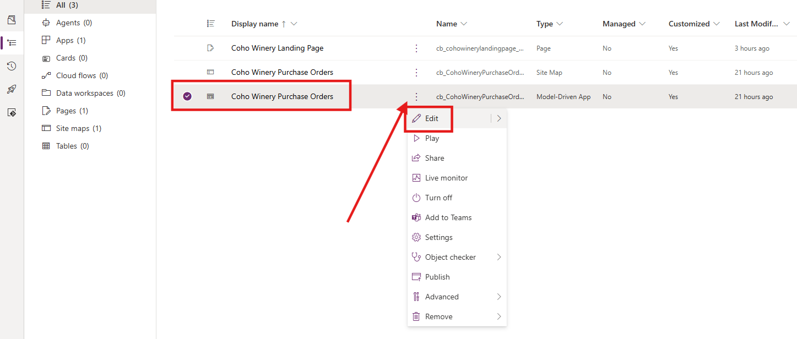
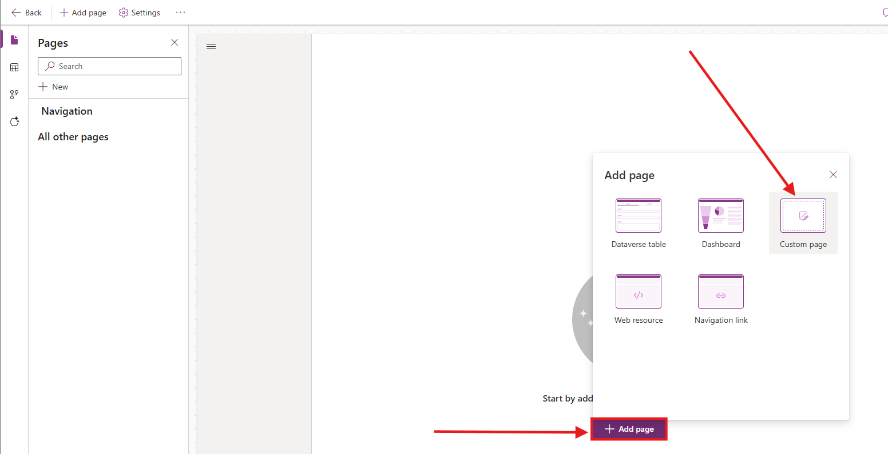
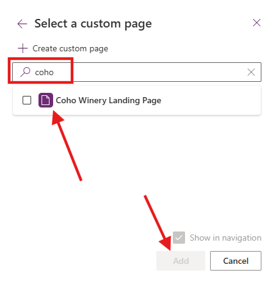
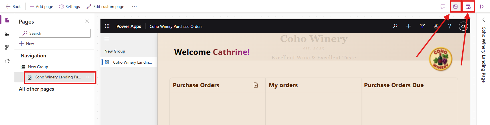
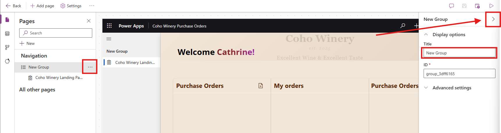

# Lab 3: Integrate Custom Pages in a Model-Driven Power App

In this lab, you will integrate the custom pages you built in Lab 2 into the Coho Winery Purchase Order Management model-driven app as both a full page and a side pane/dialog. You’ll pass the current record context to the custom page and render responsive UI with modern styling.

## Lab Overview

### 🎯 Goal
Embed a custom page as full page and Side Pane in the model-driven app for Coho Winery Purchase Order Application

### ✅ Prerequisites

Completed lab 1-3 

## Scenario

TBC

### ⌛ Length

TBC

### Assets You Will need

Custom pages from Lab 2 (e.g., Landing page and Side Pane custom page)

Purchase Order table (or your table of choice)

A model-driven app (from Lab 1)

New JS web resource: pt_coho.custompage.js

## Exercise 1: Embedding a Full page as part of the Model-driven Application
We will begin by addin the **Coho Winery Landing page** to the MDA.

1. Navigate to the [Power Apps Maker portal](https://make.powerapps.com) and ensure you are in the **Developer** environment you created in Lab 0.
2. Select **Solutions** from the left navigation pane.

3. Select the **Coho Winery** solution you created in Lab 0.

4. Select the **Coho Winery** model-driven app by clicking the **three dots** and **Edit**

5. In the App Designer, select **+Add page** → **Custom page**.

6. Pick your landing page (**Coho Winery Landing Page**) by searching for *Coho*, select the page and click **Add**

7. Save and Publish.

Result: Your custom page is now a full page in the sitemap. You can test the app by clicking **Play**.

8. Edit details in the navigation sitemap. Select the **three dots** next to the **New group** and expand the side pane to edit the **Title** to **Purchase Orders**

## Exercise 2: Create the JavaScript Resource 

For this exercise, we will implement the JavaScript used to trigger the Side Pane on a Form. This will fetch the record details and pass them on to the custom page for us to work with. 

1. 

## Exercise 2: ✨ Getting Started with Command Bar Configuration

To trigger the pop up dialog or side pane with the custom page, you will have to configure a command bar button to execute the JavaScript with the custom page reference

1. **Open your project solution** and locate the model-driven app which you will need to edit 

   
 
3. **Locate your table** and the three dots on the right - **Select** `Edit Command bar`  
   

4. **Choose** to edit the command bar for a form
5. **Select** `+New` → `Command` from the command bar on the left

9. **Provide a name** for the button on the right side  
10. **Select** `Run JavaScript`  
11. **Select or search** for the web resource as the library  
12. **Set the function name** to `JavaScriptFunction`  
13. **Set parameters**  
14. **Save and publish** – then **Play** the app to test

## 💡 Fetch Record Details in the Custom Page

We now want to get the current record details from the open and selected item in the Model-Driven app, and display related information in the Custom Page 

1. **Open Custom Page** and select the .app properties - OnStart
   Configure the syntax to get the GUID of the current record from the JavaScript:

   <pre> Power fx
   Set(
    RecordItem,
    If(
        IsBlank(Param("recordId")),
        First(Sessions),
        "," in Text(Param("recordId")),
        LookUp(
            Sessions,
            Sessions= GUID(
                Last(
                    Split(
                        Param("recordId"),
                        ","
                    )
                ).Value
            )
        ),
        LookUp(
            Sessions,
            Sessions = GUID(Param("recordId"))
        )
    )
);
</pre>

## 🌟 Extra Challenges

TBC

**Congratulations, you've finished Lab 3** 🥳