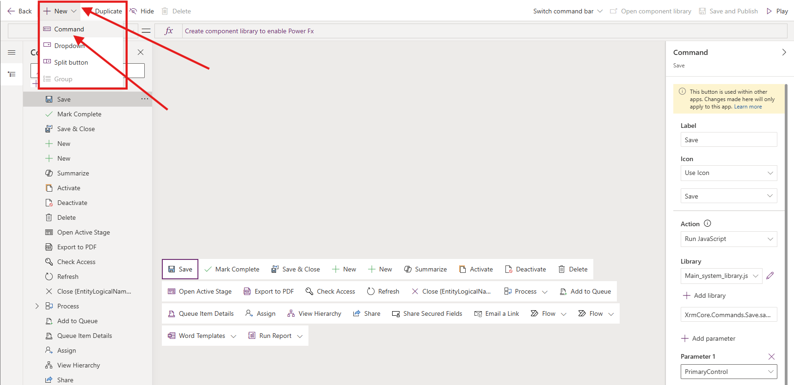
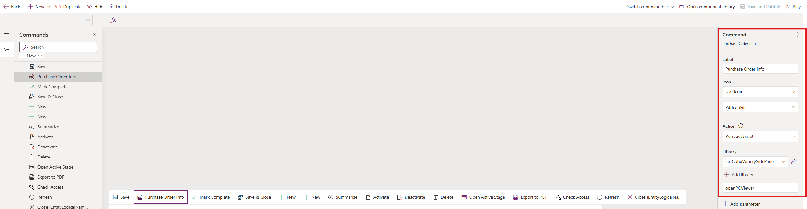
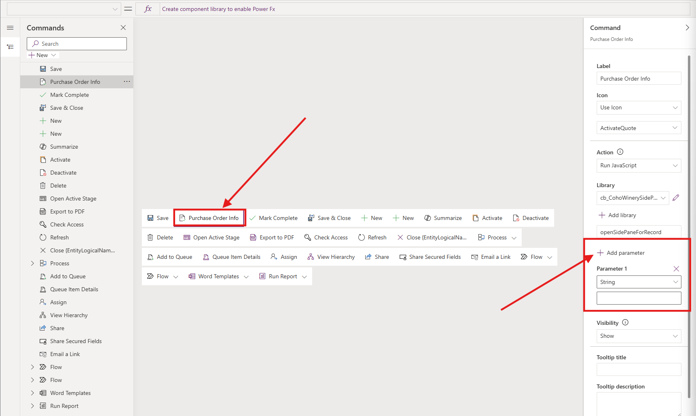

# Lab 3: Integrate Custom Pages in a Model-Driven Power App

In this lab, you will integrate the custom pages you built in Lab 2 into the Coho Winery Purchase Order Management model-driven app as both a full page and a side pane/dialog. You’ll pass the current record context to the custom page and render responsive UI with modern styling.

## Lab Overview

### 🎯 Goal
Embed a custom page as full page and Side Pane in the model-driven app for Coho Winery Purchase Order Application

### ✅ Prerequisites

Completed lab 1-3 

## Scenario

TBC

### ⌛ Length

TBC

### Assets You Will need

Custom pages from Lab 2 (e.g., Landing page and Side Pane custom page)

Purchase Order table (or your table of choice)

A model-driven app (from Lab 1)

New JS web resource: pt_coho.custompage.js

## Exercise 1: Embedding a Full page as part of the Model-driven Application
We will begin by adding the **Coho Winery Landing page** to the MDA.

1. Navigate to the [Power Apps Maker portal](https://make.powerapps.com) and ensure you are in the **Developer** environment you created in Lab 0.
2. Select **Solutions** from the left navigation pane.

3. Select the **Coho Winery** solution you created in Lab 0.

4. Select the **Coho Winery** model-driven app by clicking the **three dots** and **Edit**

I NEED TO CHANGE IMG

5. In the App Designer, select **+Add page** → **Custom page**.

6. Pick your landing page (**Coho Winery Landing Page**) by searching for *Coho*, select the page and click **Add**

7. Save and Publish.

Result: Your custom page is now a full page in the sitemap. You can test the app by clicking **Play**.

8. Edit details in the navigation sitemap. Select the **three dots** next to the **New group** and expand the side pane to edit the **Title** to **Purchase Orders**

## Exercise 2: Create the JavaScript Resource 

For this exercise, we will implement the JavaScript used to trigger the Side Pane on a Form. This will fetch the record details and pass them on to the custom page for us to work with. 

1. Navigate to the [Power Apps Maker portal](https://make.powerapps.com) and ensure you are in the **Developer** environment you created in Lab 0.
2. Select **Solutions** from the left navigation pane.

3. Select the **Coho Winery** solution you created in Lab 0.

4. Download the JavaScript file from **Assets** -><a href="Assets/Lab3/CohoWinerySidePane.js" download>Download the JavaScript file</a>

5. Add a new **Web Resource** for the Side Pane by clicking **+ New** → **More** → **Web resource**

6. Select **Choose file** and find the **CohoWinerySidePane** JavaScript

7. You should now see that the **Code** section has been populated with the JavaScript code from the file. Check the name of the Web Resource and click **Save**

8. Verify that the Web Resource **CohoWinerySidePane** is created in the solution.

## Exercise 3: Getting Started with Command Bar Configuration

To trigger the side pane with the custom page, you will have to configure a command bar button to execute the JavaScript with the custom page reference

1. If you don't have the solution for **Coho Winery** open already, select it from **Solutions** and open the **Coho Winery Purchase Orders** model-driven application by clicking on the name

 
3. **Locate the Purchase Order table** and the three dots on the right - **Select** `Edit Command bar`  
 

4. **Choose** to edit the command bar on the  `Main Form ` and click  `Edit `

5. Create a new command bar button by **Selecting** `+New` → `Command` on the ribbon to the left

6. Create a type of command for  `JavaScript ` and click  `Continue`

9. **Provide a name** for the button → **Purchase Order Info** and choose an Icon → **PdfIconFile**
10. **Ensure action is** `Run JavaScript`  
11. Click **+ Add library**  → Search for *Coho* → Select **CohoWinerySidePane** → **Add**

12. **Set the function name** to `openPOViewer`  

!TIP you find the function name in the JavaScript File

13. **Verify the command bar settings** → you should see the following so far:

 <pre>
    Label → `Purchase Order Info`

    Icon → `Use Icon` → `ActivateQuote`

    Action → `Run JavaScript`

    Library →  `coh_CohoWinerySidePane`

    Function →  `openPOViewer`
 </pre>
  
 

14. **Save and publish** - Play your app to verify that the button is visible on the Purchase Order form
15. In the model-driven app, select the **Purchase Order** table from the navigation
16. Click `+ New` to open a Form and locate the `Purchase Order Info` command bar button on the ribbon.
17. Verify that the button is visible and clickable → The side pane should open on the right hand side with the message **Page not found**

18. Close the browser window and get back to the configuration page for the command bar on the Purchase Order Form.

### Set parameters for passing information to the custom page
We are now setting the parameters for input to the JavaScript which will be passed on to the custom page

19. In the command bar editor, make sure that the `Purchase Order Info` command bar button is select in the ribbon.
20. Click on `+ Add parameter` → You should be able to see **Parameter 1** with a dropdown field showing **String** as the default value

21. **Edit Parameter 1 value:** → Schema name of the page

## 💡 Fetch Record Details in the Custom Page

We now want to get the current record details from the open and selected item in the Model-Driven app, and display related information in the Custom Page 

1. **Open Custom Page** and select the .app properties - OnStart
   Configure the syntax to get the GUID of the current record from the JavaScript:

   <pre> Power fx
   Set(
    RecordItem,
    If(
        IsBlank(Param("recordId")),
        First(Sessions),
        "," in Text(Param("recordId")),
        LookUp(
            Sessions,
            Sessions= GUID(
                Last(
                    Split(
                        Param("recordId"),
                        ","
                    )
                ).Value
            )
        ),
        LookUp(
            Sessions,
            Sessions = GUID(Param("recordId"))
        )
    )
);
</pre>

## 🌟 Extra Challenges

TBC

**Congratulations, you've finished Lab 3** 🥳