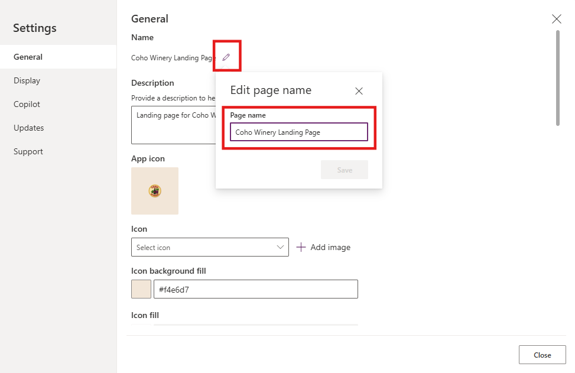
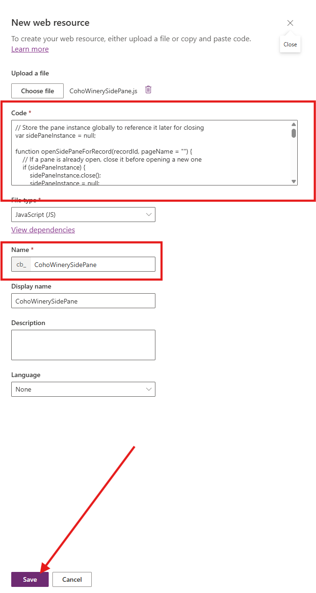
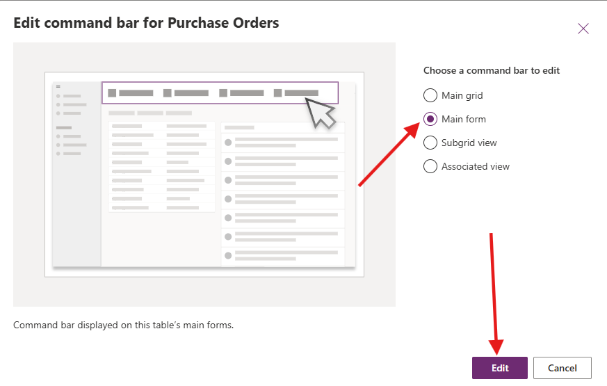
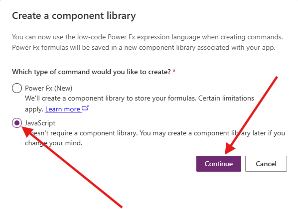
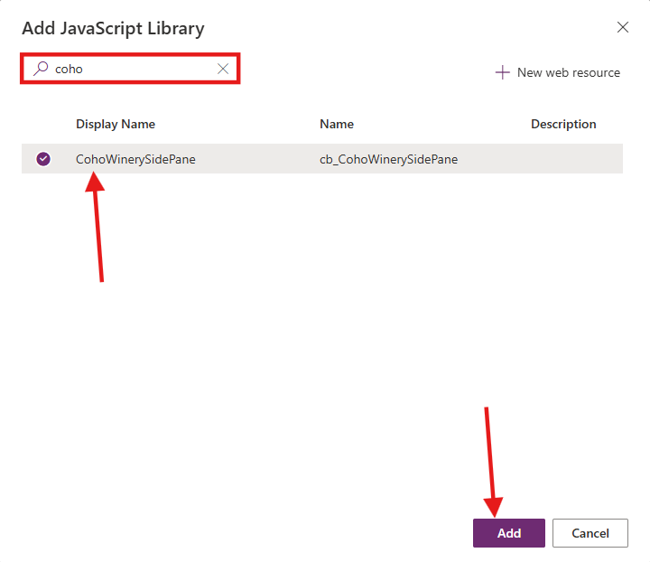
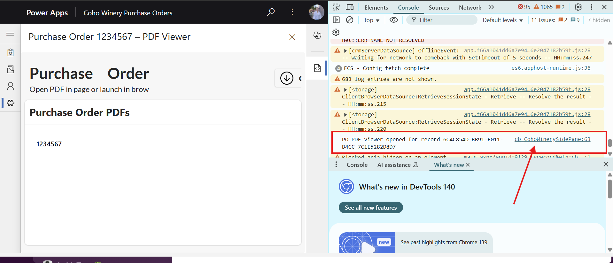

# Lab 3: Integrate Custom Pages in a Model-Driven Power App

In this lab, you will integrate the custom pages you built in **Lab 2** into the **Coho Winery Purchase Order Management** model-driven app as both a full page and a side pane. You’ll pass the current record context to the custom page and render responsive UI with modern styling.

## Lab Overview

### 🎯 Goal

- Embed the custom pages you built in Lab 2 into the model-driven app.
- Preparing the JavaScript web resource that will open the side pane from a command bar button on the Purchase Order form.
- Configure the command bar button to the Purchase Order form to open the side pane and pass the current record’s ID.
- Create an approval flow that triggers when a PO is approved or rejected from within the side pane.
- (Optional) Add JavaScript to the OnLoad event of the Purchase Order form to automatically open the side pane when the form loads.

### ✅ Prerequisites

**Labs 1–3 completed** (solution setup, tables/data, custom pages and model-driven app).

### 📖 Scenario

Finance and auditors need to **open PO PDFs** directly in the app and see the related Purchase Order record in context. In this lab you’ll add a **responsive custom page** that operates as the landing page in **full page** mode, and a **Purchase Order Side Pane** custom page a side pane from a selected PO Main Form, and passing the current record’s ID so the correct Purchase order details loads in the side pane when it opens.

### ⌛ Length

45 minutes

### Assets You Will need

- Custom pages from Lab 2 (e.g., Landing page and Side Pane custom page)

- Purchase Order table (from Lab 1)

- The model-driven app (from Lab 1)

- New JS web resource: **CohoWinerySidePane.js** found in the [Assets - Lab 3 folder.](/Assets/Lab3/CohoWinerySidePane.js)

## Exercise 1: Embedding a Full page as part of the Model-driven Application

We will begin by adding the **Coho Winery Landing page** to the MDA.

1. Navigate to the [Power Apps Maker portal](https://make.powerapps.com) and ensure you are in the **Developer** environment you created in Lab 0.
2. Select **Solutions** from the left navigation pane.

3. Select the **Coho Winery** solution you created in Lab 0.

4. Select the **Coho Winery Purchase Order Management** model-driven app by clicking the **three dots** and selecting **Edit**.

5. In the App Designer, select **+ Add page** → **Custom page**.

6. Pick your landing page (**Coho Winery Landing Page**) by searching for *Coho*, select the page and click **Add**.

7. **Save and Publish** your changes. 

8. Your custom page is now a full page in the sitemap. You can test the app by clicking **Play**. When you are finished, close the browser window and get back to the App Designer.
9. Close the App Designer by clicking **Back**.
10. Remain in the **Coho Winery** solution if you plan to continue to the next exercise.

## Exercise 2: Create the JavaScript Web Resource

For this exercise, we will implement the JavaScript used to trigger the Side Pane on a Form. This will fetch the record details and pass them on to the custom page for us to work with. 

1. Navigate to the [Power Apps Maker portal](https://make.powerapps.com) and ensure you are in the **Developer** environment you created in Lab 0.
2. Select **Solutions** from the left navigation pane.

 

3. Select the **Coho Winery** solution you created in Lab 0.

 

4. Download the JavaScript file from **Assets** -><a href="Assets/Lab3/CohoWinerySidePane.js" download>Download the JavaScript file</a>

5. Add a new **Web Resource** for the Side Pane by clicking **+ New** → **More** → **Web resource**

 

6. Select **Choose file** and find the **CohoWinerySidePane.js** JavaScript file

### Understanding the JavaScript
> We are passing two parameters to the JavaScript in order to fetch the record details and also the custom page name. 
>
> In the JavaScript there is a section where we are stripping the `recordId` of braces for better readability

<pre>JavaScript   
    const recordIdRaw = formContext.data.entity.getId();
    const recordId = (recordIdRaw || "").replace(/[{}]/g, "");
    if (!recordId) throw new Error("Record Id is empty.");
</pre>

 

7. You should now see that the **Code** section has been populated with the JavaScript code from the file. Check the **name** of the **Web Resource** and click **Save**

 

8. Verify that the Web Resource **CohoWinerySidePane** is created in the solution.

---

## Exercise 3: Getting Started with Command Bar Configuration

To trigger the side pane with the custom page, you will have to configure a command bar button to execute the JavaScript with the custom page reference

1. If you don't have the solution for **Coho Winery** open already, select it from **Solutions** and open the **Coho Winery Purchase Orders** model-driven application by clicking on the **name**

 
  

3. In the editor, **Locate the Purchase Order table** and the three dots on the right - **Select** `Edit Command bar`  

 

4. **Choose** to edit the command bar on the  `Main Form` and click  `Edit `

 

### Possibilities: Main Form and Grid View 
> You can trigger a *dialog* or *side pane* from both a View on the main grid and on a Form, but the input and parameters passed to the JavaScript function has to be altered to fit the different scenarios. For this exercise we are focusing on the Form.  

5. Create a new command bar button by selecting `+New` → `Command` on the ribbon to the left

 

6. Create a type of command for  `JavaScript` and click  `Continue`

9. **Provide a name** for the button → **Purchase Order Info** and choose an Icon → **PdfIconFile**
10. **Ensure action is** `Run JavaScript`  
11. Click **+ Add library**  → Search for *Coho* → Select **CohoWinerySidePane** → **Add**

12. **Set the function name** to `openPOViewer`  

> [TIP] You find the function name in the JavaScript File

13. **Verify the command bar settings** → you should see the following so far:

    | Property | Formula |
    | --- | --- |
    | **Label** | `Purchase Order Info` |
    | **Icon** | `Use Icon` → `PdfIconFile` |
    | **Action** | `Run JavaScript` |
    | **Library** | `coh_CohoWinerySidePane` |
    | **Function** | `openPOViewer` |

### Should resemble the below settings

 

14. **Save and publish** - Play your app to verify that the button is visible on the **Purchase Order form**
15. In the model-driven app, select the **Purchase Order** table from the navigation
16. Click `+ New` to open a Form or select an **excisting PO** and locate the `Purchase Order Info` command bar button on the ribbon.
17. Verify that the button is visible and clickable → The side pane should open on the right hand side with the message **Page not found**

> ### Working with commands
> Sometimes the command bar ribbon misbehaves and the button might *disappear* from the Form. In that case, you should navigate to the editor of the commands and select the button, in our case the **Purchase Order Info** button and click on **Open formula bar** under **visability**. Set the formula to *true* - **Save and Publish**
>

 

18. Close the browser window, and get back to the **Editor** for the command bar on the Purchase Order Form.

### Set parameters for passing information to the custom page
We are now setting the parameters for input to the JavaScript which will be passed on to the custom page

19. In the command bar editor, make sure that the `Purchase Order Info` command bar button is selected
20. Click on `+ Add parameter` → You should be able to see **Parameter 1** with a dropdown field showing **String** as the default value

21. **Edit Parameter 1 type:** → `PrimaryControl` - passing the Form Context to the JavaScript

### PrimaryControl
> PrimaryControl references to the Form Context of the record that is currently open. This is used to find the attributes and GUID of the record that will be passed on to the custom page using `Param("recordId")`. PrimaryControl is also the modern approach that has replace the deprecated `Xrm.Page` API. You can read more about that here: https://learn.microsoft.com/en-us/power-apps/developer/model-driven-apps/clientapi/clientapi-form-context 
>

 

### 💡 Find the page schema name 
> Navigate to your solution for **Coho Winery** and locate the **Purchase Order Side Pane** page. The **page name** will be visible in under the column **Name** and have the format **coh_purchaseordersidepane_c898a** - And no, you can't copy it from the solution... 
> 

22. Click **+ Add parameter**  →  Should be of type `string`
23. Set value of **Parameter 2** to the **schema name** of the page - should be this format **coh_purchaseordersidepane_c898a**

 

> ### Working with parameters 
> **Parameter 2** references the custom page you would like to open as a type of string - its passed as the second parameter
>
> When creating and updating parameter values for commands, the order of the parameters matter. The order is decided by the order of input parameters in the **JavaScript function**
> 
> In our case, the JavaScript expect `PrimaryControl` first, then the `pageName` (the schema name of the page) for the function **openPOViewer(PrimaryControl, pageName)** to work 
>

### Test the command for side pane on the Form of a **Purchase order**
24. **Save and publish** - Play your app to verify that the button is visible on the Purchase Order Form
25. In the model-driven app, select the **Purchase Order** table from the navigation
26. Click `+ New` to open a new Form or select an existing record. 
27. Locate the `Purchase Order Info` command bar button on the ribbon and verify that the side pane opens

### Developer tools 
> To get info about your custom page, JavaScript and trouble shooting, use the developer tools. Opens by clicking **CTRL+SHIFT+I** on your keyboard. Ehen you select the command bar button, the developer tools will shouw you the console logging output and give you some pointers on what is missing or working if that's the case. Look for the console logging in the JavaSxript to recognise what it would be named in the developer tool console
>

## 🌟 Extra Challenges

JavaScript OnLoad - automatic opening the Custom Page

**Congratulations, you've finished Lab 3** 🥳