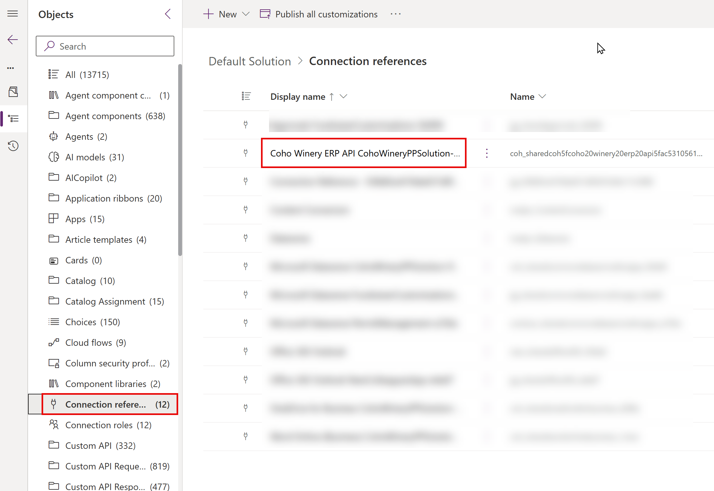
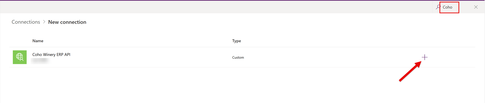

# Lab 4 - Deploy and Test the Solution

In this lab, you will deploy the solution you created in the previous lab to our **Production** environment created in **Lab 0** and test the solution to ensure it works as expected.

## Lab Overview

**🎯 Goal:**

- Export the solution as a managed solution from the **Development** environment.
- Import the managed solution into the **Production** environment.
- Test the solution in the **Production** environment.

**✅ Prerequisites** 

- Completion of [Lab 3 - Integrate Custom Pages in Model-Driven Power Apps](Lab3-IntegrateCustomPagesInModelDrivenPowerApps.md)

## Scenario

Having finalised your development activities for the new purchase order management solution, Coho Winery has requested that you deploy the solution to the Production environment, so that it can be used by the wider business.

## ✍️ Exercise 1: Export the Solution

It's always important to remember the correct type of solution to export, depending on the target environment type, per the official Microsoft recommendations:
- For any development environment, where potential changes must be made, you should always export the solution as **Unmanaged**.
- For any test, UAT or production environment, where no changes should be made to the solution, you should always export the solution as **Managed**.

Based on the scenario, you can probably guess which type of solution we will be exporting! 😉

1. Navigate to the [Power Apps Maker portal](https://make.powerapps.com) and ensure you are in the **Developer** environment you created in Lab 0.
2. Select **Solutions** from the left navigation pane.
3. Select the **Coho Winery** solution and click on **Export solution** from the command bar.

4. On the **Before you export** pane, click on **Publish**. The action may take a few minutes to complete. Once finished, click on **Next**.

>[!TIP]
> Always publish your customisations before exporting a solution to ensure all changes are included in the export.

5. On the **Managed solution dependencies** pane, click **Next**. All of these system solutions should exist in the target environment, so you can safely ignore any warnings

6. On the **Export this solution** pane, make sure **Managed** is selected and click on **Export**.

7. The export process may take a few minutes to complete. The banner will update to show when the solution is ready to download. Click on the **Download** link to download the solution file.

8. Save the solution file to your local machine.

9. Leave the Power Apps Maker portal open, as we will continue from here in the next exercise.

## ✍️ Exercise 2: Import the Solution

1. Within the Power Apps Maker portal, click on the environment selector in the top right corner and select the **Production** environment you created in Lab 0.

2. Select **Solutions** from the left navigation pane.

3. Click on **Import solution** from the command bar.

4. On the **Import a solution** pane, click on **Browse** and select the solution file you downloaded in Exercise 1. Click on **Next** to proceed.

5. Review the solution details, confirming that the name and version are correct, then click on **Next**.

6. You will be prompted to re-establish connections used for each data source in the solution. In most cases, the connections will be established automatically; if not, click on **Sign in** to rectify, ensuring that there is a green check mark next to each connection. Once verified, click on **Import** to proceed.

7. The import process may take a few minutes to complete. The banner will eventually update to show a warning that resembles the screenshot below. This is expected, because we have imported a solution containing a connection reference for a custom connector that does not yet exist. We will rectify this in the next step.

> [!TIP]
> To avoid this warning in a real-world scenario, it is recommended that any custom connectors are stored in a seperate solution, which is imported first. This ensures that the custom connector is already present in the environment before importing any solutions that depend on it and you will then be prompted to configure the connection on import.

8. To resolve the warning, first navigate to the **Default solution** on the **Solution** page

9. In the **Default** solution, select **Connection references** from the left navigation pane and then select the component containing the text **Coho Winery ERP API**. It's actual name will differ from the screenshot below.

10. On the **Edit** pane, click on the **Connection** dropdown and select **+ New connection**.

11. A new browser tab will open. On the **New connection** page, search for **Coho Winery** and click on the plus icon.

12. Enter the API key provided by your instructors and click on **Create**.

13. Once the connection has been created, close the tab and return to the **Default solution** tab. Click on the **Refresh** icon next to the **Connection** dropdown and select the connection you just created. Click on **Save** to proceed.

14. On the **Save changes to this connection reference** dialog, click on **Save changes** to confirm.

15. Click on the back arrow to return to the **Solutions** page.

16. Although the connection has now been established, the cloud flows that were imported are still switched off. Click on **Managed** and then navigate into the **Coho Winery PP Solution** solution.

17. Select **Cloud flows** from the left navigation pane, then select the **Create Purchase Order in ERP** flow and switch it on. This may take a few minutes to complete.

18. Verify that the **Generate Purchase Order Document** flow is also switched on and, if not, switch it on. Both flows should now be switched on as indicated below.

19. Remain in the **Coho Winery PP Solution** solution, as we will continue from here in the next exercise.

## ✍️ Exercise 3: Test the Solution

TBC

## 🌟 Extra Challenges

TBC

**Congratulations, you've finished Lab 4** 🥳